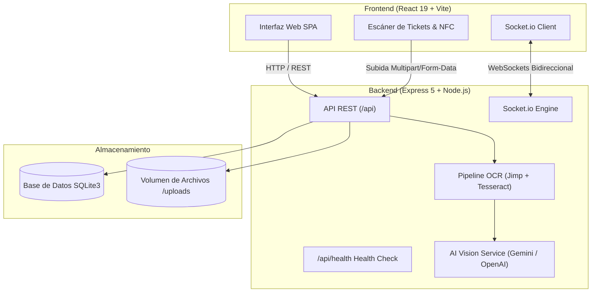

# 💰 Control-Gastos (PaySync Fullstack)

[](https://github.com/SebzSGC/Control-Gastos/actions)
[](https://nodejs.org/)
[](https://react.dev/)
[](https://expressjs.com/)
[](https://www.sqlite.org/)
[](https://www.docker.com/)
[](https://opensource.org/licenses/ISC)

> **PaySync** es una plataforma integral de gestión financiera colaborativa, control de suscripciones y división inteligente de gastos grupales (*Bill Splitting*) potenciada por **Visión Artificial (OCR Multimodal)**, **WebSockets en tiempo real** y **simulación de pagos por NFC**.

---

## 📑 Tabla de Contenidos
- [Características Principales](#-características-principales)
- [Arquitectura del Sistema](#-arquitectura-del-sistema)
- [Stack Tecnológico](#-stack-tecnológico)
- [Estructura del Proyecto](#-estructura-del-proyecto)
- [Variables de Entorno](#-variables-de-entorno)
- [Instalación y Puesta en Marcha Local](#-instalación-y-puesta-en-marcha-local)
  - [Opción 1: Ejecución Tradicional (Node.js)](#opción-1-ejecución-tradicional-nodejs)
  - [Opción 2: Ejecución con Docker & Compose](#opción-2-ejecución-con-docker--compose)
- [Despliegue en la Nube (Producción)](#-despliegue-en-la-nube-producción)
- [Endpoints Principales de la API](#-endpoints-principales-de-la-api)
- [Contribuir al Proyecto](#-contribuir-al-proyecto)
- [Licencia](#-licencia)

---

## ✨ Características Principales

1. **📸 Bill Splitter con Visión Artificial (OCR):**
   - Escanea y procesa facturas y tickets físicos.
   - Pipeline de preprocesamiento de imágenes con **Jimp** y extracción de texto con **Tesseract.js** (soporte para Español e Inglés).
   - Integración opcional con modelos de lenguaje multimodales (**Gemini / OpenAI**) para clasificar partidas y desglosar impuestos automáticamente.

2. **⚡ Sincronización en Tiempo Real:**
   - Actualización instantánea de saldos, deudas y nuevos gastos entre los participantes mediante **Socket.io**.
   - Notificaciones y banners reactivos de reconexión y estado de backend (*Cold Start Warning*).

3. **👥 División Inteligente y Liquidación de Deudas:**
   - Reparto equitativo, por porcentajes o por consumos individuales detallados.
   - Algoritmo de minimización de transacciones para saldar cuentas en el menor número de transferencias posibles.

4. **📲 Simulación de Pagos NFC:**
   - Módulos interactivos de escaneo y emisión de cobros/pagos emulando transferencias por proximidad (NFC).

5. **📊 Dashboard y Métricas de Suscripciones:**
   - Gráficos interactivos de distribución de consumo y categorías con **Recharts**.
   - Seguimiento proactivo de suscripciones recurrentes y recordatorios de fechas de corte.

---

## 🏛️ Arquitectura del Sistema



---

## 🛠️ Stack Tecnológico

| Capa | Tecnologías |
| :--- | :--- |
| **Frontend** | React 19, Vite, React Router DOM 7, TailwindCSS, Recharts, Lucide React, Socket.io-client |
| **Backend** | Node.js 18+, Express 5, SQLite3, Socket.io 4, Tesseract.js, Jimp, Multer, Cors |
| **DevOps & Cloud** | Docker (Multi-stage), Docker Compose, GitHub Actions, Nginx, PM2, Render, Vercel, Railway |

---

## 📂 Estructura del Proyecto

```plaintext
Control-Gastos/
├── .github/
│   └── workflows/
│       └── ci.yml                 # Pipeline automatizado de CI (Build, Test, Lints)
├── backend/
│   ├── services/                  # Servicios de OCR y Visión Artificial
│   ├── tests/                     # Tests de integración y validación de endpoints
│   ├── uploads/                   # Almacenamiento temporal de tickets (.gitkeep)
│   ├── Dockerfile                 # Imagen optimizada del Backend
│   ├── package.json               # Dependencias del servidor Node.js
│   └── server.js                  # Servidor Express, WebSockets y SQLite
├── frontend/
│   ├── public/                    # Recursos públicos y estáticos
│   ├── src/
│   │   ├── components/            # Modales (BillSplitter, NFC, Banners, Navbar)
│   │   ├── config/                # Centralización de variables de entorno (config.js)
│   │   ├── pages/                 # Vistas (Dashboard, Home, Profiles)
│   │   ├── App.jsx                # Enrutamiento principal
│   │   └── main.jsx               # Entrypoint React
│   ├── Dockerfile                 # Contenedor Nginx para producción del Frontend
│   ├── nginx.conf                 # Configuración de Nginx SPA y proxy API
│   ├── package.json               # Dependencias del cliente
│   ├── vercel.json                # Configuración de despliegue en Vercel
│   └── vite.config.js             # Configuración de bundler Vite
├── .dockerignore                  # Reglas de exclusión Docker
├── .env.example                   # Plantilla general de variables de entorno
├── .gitignore                     # Filtro riguroso de seguridad (sin credenciales ni .db)
├── deploy.sh                      # Script de despliegue automatizado para VPS
├── docker-compose.yml             # Orquestación unificada en un solo contenedor
├── docker-compose.decoupled.yml   # Orquestación desacoplada (Frontend Nginx + Backend Node)
├── ecosystem.config.js            # Configuración para PM2 (Cluster y watch en VPS)
├── fly.toml                       # Despliegue en Fly.io
├── package.json                   # Scripts raíz para orquestación de monorepo
├── railway.json                   # Despliegue en Railway
└── render.yaml                    # Infraestructura como código (IaC) para Render
```

---

## ⚙️ Variables de Entorno

Copia el archivo de ejemplo para configurar tus variables:

```bash
cp .env.example .env
```

### Configuración General

| Variable | Descripción | Valor por Defecto | Requerida |
| :--- | :--- | :--- | :---: |
| `PORT` | Puerto HTTP del backend Express | `3001` | No |
| `NODE_ENV` | Entorno de ejecución (`development` o `production`) | `development` | No |
| `DATABASE_PATH` | Ruta absoluta o relativa al archivo SQLite | `./backend/app_data.db` | No |
| `CORS_ORIGIN` | Orígenes permitidos (separados por coma o `*`) | `*` | No |
| `GEMINI_API_KEY` | Clave API de Google Gemini (Visión Inteligente) | *(Opcional)* | No |
| `OPENAI_API_KEY` | Clave API de OpenAI (Visión alternativa) | *(Opcional)* | No |
| `VITE_API_URL` | URL pública del API consumida por el Frontend | `/api` (o URL de Render) | En producción |
| `VITE_SOCKET_URL` | URL pública de WebSockets | `window.location.origin` | En producción |

---

## 🚀 Instalación y Puesta en Marcha Local

### Prerrequisitos
- **Node.js:** Versión 18.0.0 o superior instalada ([Descargar Node.js](https://nodejs.org/)).
- **Git:** Instalado en tu terminal.
- **Docker y Docker Compose:** *(Opcional, si prefieres correrlo en contenedores)*.

---

### Opción 1: Ejecución Tradicional (Node.js)

1. **Instalar todas las dependencias (Backend y Frontend):**
   ```bash
   npm run install:all
   ```

2. **Iniciar en modo desarrollo (dos terminales):**
   - **Terminal 1 (Backend):**
     ```bash
     npm run dev:backend
     ```
     El backend iniciará en: `http://localhost:3001` (con Health Check en `http://localhost:3001/api/health`).

   - **Terminal 2 (Frontend):**
     ```bash
     npm run dev:frontend
     ```
     El frontend iniciará en: `http://localhost:5173`.

3. **Compilar para producción:**
   ```bash
   npm run build
   ```

---

### Opción 2: Ejecución con Docker & Compose

Levanta la suite completa con un solo comando:

```bash
# Versión Unificada (Fullstack en un solo puerto)
docker compose up --build

# O versión desacoplada (Frontend en Nginx puerto 80 + Backend en puerto 3001):
docker compose -f docker-compose.decoupled.yml up --build
```

Abre en tu navegador `http://localhost:3001` (o `http://localhost:80` en versión desacoplada).

---

## ☁️ Despliegue en la Nube (Producción)

### Despliegue Frontend en Vercel
1. Conecta tu repositorio en [Vercel](https://vercel.com).
2. Selecciona como **Root Directory:** `frontend`.
3. Framework Preset: **Vite**.
4. Agrega la variable de entorno:
   - `VITE_API_URL`: URL pública de tu backend desplegado (ej. `https://control-gastos-api.onrender.com`).
   - `VITE_SOCKET_URL`: Misma URL del backend.

### Despliegue Backend en Render
1. Crea un nuevo **Web Service** en [Render](https://render.com).
2. Conecta este repositorio y selecciona:
   - **Root Directory:** `backend`
   - **Build Command:** `npm install`
   - **Start Command:** `npm start`
3. Agrega un **Persistent Disk** montado en `/app/data` y define la variable de entorno:
   - `DATABASE_PATH`: `/app/data/app_data.db`
   - `CORS_ORIGIN`: La URL de tu frontend en Vercel.

*(También puedes usar el archivo `render.yaml` incluido en la raíz para auto-aprovisionar la infraestructura con un clic).*

---

## 🔍 Endpoints Principales de la API

| Método | Endpoint | Descripción |
| :--- | :--- | :--- |
| `GET` | `/api/health` | Estado del servicio, salud de SQLite, uptime y memoria |
| `POST` | `/api/upload-bill` | Subida de imagen y procesamiento OCR / AI de facturas |
| `GET` | `/api/groups` | Obtiene los grupos de gastos del usuario |
| `POST` | `/api/groups` | Creación de nuevo grupo |
| `GET` | `/api/expenses` | Histórico y listado de gastos |
| `POST` | `/api/expenses` | Registro de gasto y cálculo automático de división |
| `POST` | `/api/settle` | Registro de liquidación de deuda entre usuarios |

---

## 🤝 Contribuir al Proyecto

Las contribuciones son bienvenidas:

1. Haz un Fork del proyecto (`gh repo fork` o desde GitHub).
2. Crea una rama para tu feature (`git checkout -b feature/NuevaFuncionalidad`).
3. Confirma tus cambios (`git commit -m "feat: Agrega nueva funcionalidad"`).
4. Sube la rama (`git push origin feature/NuevaFuncionalidad`).
5. Abre un **Pull Request**.

---

## 📄 Licencia

Este proyecto está distribuido bajo la licencia **ISC**. Consulta los archivos de paquete para más detalles.

---

Desarrollado con ❤️ para simplificar las finanzas compartidas.
