# 🧭 PaySync Knowledge Vault (Obsidian MOC)

Bienvenido a la base de conocimiento central de **PaySync** (Control-Gastos). Este sistema gestiona gastos compartidos, división inteligente de facturas (*Bill Splitting*) asistida por Visión Artificial (OCR), pagos simulados por NFC y sincronización en tiempo real vía WebSockets.

---

## 🗺️ Mapa de Navegación del Grafo (MOC Central)

```mermaid
flowchart TD
    MOC["🧭 [[00_MOC_PaySync]]"]
    MOC --> ARQ["🏛️ Arquitectura & Datos"]
    MOC --> BACK["🛠️ Backend & Servicios"]
    MOC --> FRONT["🎨 Frontend & UI"]
    MOC --> DEVOPS["🚀 DevOps & Cloud"]
    MOC --> QA["🧪 Calidad & Testing"]

    ARQ --> ARQ1["[[01_Arquitectura/Vision-General|Visión General & Stack]]"]
    ARQ --> ARQ2["[[01_Arquitectura/Diagrama-C4-Sistema|Diagrama C4 del Sistema]]"]
    ARQ --> ARQ3["[[01_Arquitectura/Base-de-Datos-ER|Modelo ER SQLite]]"]

    BACK --> BK1["[[02_Backend/API-REST-Endpoints|API REST Endpoints]]"]
    BACK --> BK2["[[02_Backend/WebSockets-Eventos|Eventos WebSockets Socket.io]]"]
    BACK --> BK3["[[02_Backend/Pipeline-OCR-Vision|Pipeline OCR & Multimodal]]"]
    BACK --> BK4["[[02_Backend/Algoritmo-Liquidacion|Algoritmo Liquidación Greedy]]"]

    FRONT --> FR1["[[03_Frontend/Arbol-Componentes|Árbol de Componentes React 19]]"]
    FRONT --> FR2["[[03_Frontend/Gestion-Estado|Gestión de Estado & Reactividad]]"]
    FRONT --> FR3["[[03_Frontend/Guia-Estilos-Tailwind|Sistema de Diseño & Tailwind]]"]

    DEVOPS --> DO1["[[04_DevOps-Despliegue/Guia-Docker-Compose|Docker & Docker Compose]]"]
    DEVOPS --> DO2["[[04_DevOps-Despliegue/Despliegue-Cloud|Estrategia Multi-Cloud]]"]
    DEVOPS --> DO3["[[04_DevOps-Despliegue/Variables-Entorno|Matriz Variables de Entorno]]"]

    QA --> QA1["[[05_Calidad-Testing/Plan-de-Pruebas|Plan de Pruebas & Test Suite]]"]
    QA --> QA2["[[05_Calidad-Testing/Matriz-de-Trazabilidad|Matriz Requisitos vs QA]]"]
```

---

## 📚 Secciones de la Bóveda

### 1. 🏛️ Arquitectura del Sistema
- [[01_Arquitectura/Vision-General|Visión General del Negocio y Stack Tecnológico]]: Panorama integral, pilares y decisiones técnicas.
- [[01_Arquitectura/Diagrama-C4-Sistema|Diagrama C4 y Arquitectura en Capas]]: Niveles de contexto, contenedores y componentes (Express 5, React 19, SQLite3, Socket.io).
- [[01_Arquitectura/Base-de-Datos-ER|Modelo de Datos y Esquema SQLite]]: Definición de tablas (`groups`, `profiles`, `expenses`, `bills`, `bill_items`, `bill_splits`, `active_bill_sessions`).

### 2. 🛠️ Backend y Servicios
- [[02_Backend/API-REST-Endpoints|Catálogo de Endpoints REST]]: Documentación técnica de rutas con contratos request/response y códigos HTTP.
- [[02_Backend/WebSockets-Eventos|Catálogo de Eventos WebSockets]]: Sincronización colaborativa en vivo con Socket.io (flujo comanda viva y diagramas de secuencia).
- [[02_Backend/Pipeline-OCR-Vision|Pipeline OCR Multimodal]]: Preprocesamiento Jimp + Tesseract.js (`spa+eng`) y fallback a LLM (Gemini 2.0/1.5 Flash y OpenAI GPT-4o-mini).
- [[02_Backend/Algoritmo-Liquidacion|Algoritmo de Liquidación de Deudas]]: Optimización de transacciones para saldar balances mínimos (*Min-Cash-Flow Greedy*).

### 3. 🎨 Frontend y Experiencia de Usuario
- [[03_Frontend/Arbol-Componentes|Jerarquía de Componentes y Páginas]]: Estructura modular de vistas (`src/components/dashboard/`, páginas y modales).
- [[03_Frontend/Gestion-Estado|Manejo del Estado y Reactividad]]: Context API (`ThemeContext`, `ToastContext`), sincronización con Sockets y persistencia local.
- [[03_Frontend/Guia-Estilos-Tailwind|Sistema de Diseño y Temas]]: Paletas de color, tipografía, estética Bento Grid y soporte Dark/Light Mode.

### 4. 🚀 DevOps, Contenedores e Infraestructura
- [[04_DevOps-Despliegue/Guia-Docker-Compose|Orquestación con Docker Compose]]: Despliegue unificado y desacoplado (Nginx + Node.js).
- [[04_DevOps-Despliegue/Despliegue-Cloud|Estrategia Multi-Cloud y Producción]]: Presets homologados para Render, Vercel, Railway, Fly.io y VPS con PM2 / Nginx.
- [[04_DevOps-Despliegue/Variables-Entorno|Matriz de Variables de Entorno]]: Configuración de secretos, puertos, CORS y persistencia de SQLite.

### 5. 🧪 Calidad, Auditoría y Testing
- [[05_Calidad-Testing/Plan-de-Pruebas|Estrategia y Plan de Testing]]: Pruebas unitarias de visión (`test_vision_pipeline.js`) y de integración REST (`test_api_endpoints.js`).
- [[05_Calidad-Testing/Matriz-de-Trazabilidad|Matriz de Requerimientos vs. Cobertura QA]]: Relación formal de requerimientos de negocio vs. pruebas automatizadas.

---

> [!TIP]
> **Navegación en Obsidian:** Puedes presionar `Ctrl + O` (o `Cmd + O`) en Obsidian para saltar rápidamente entre notas, o activar la vista de Grafo (`Ctrl + G`) para explorar las interconexiones en tiempo real.
