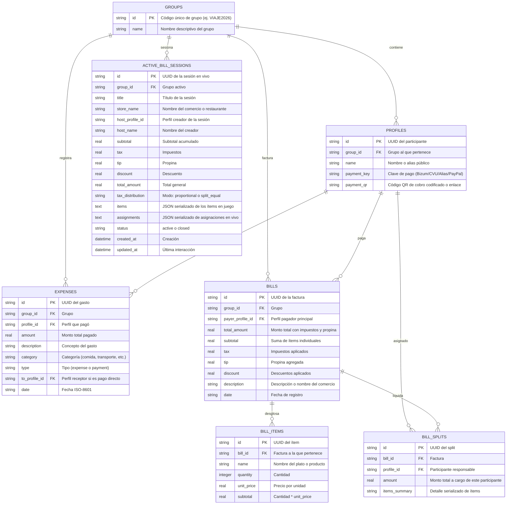

# 🗄️ Modelo de Base de Datos y Esquema SQLite

El sistema utiliza **SQLite3** como motor de base de datos relacional rápido, autocontenido y de baja latencia, configurado con `PRAGMA foreign_keys = ON;` y persistencia en volumen montable (`DATABASE_PATH`).

---

## 📊 Diagrama Entidad-Relación (Mermaid)



---

## ⚡ Índices de Rendimiento

Para optimizar las consultas a medida que crecen las transacciones de los grupos, se implementan los siguientes índices en disco:

```sql
CREATE INDEX IF NOT EXISTS idx_profiles_group ON profiles(group_id);
CREATE INDEX IF NOT EXISTS idx_expenses_group ON expenses(group_id);
CREATE INDEX IF NOT EXISTS idx_expenses_date ON expenses(date);
CREATE INDEX IF NOT EXISTS idx_bills_group ON bills(group_id);
CREATE INDEX IF NOT EXISTS idx_bill_items_bill ON bill_items(bill_id);
CREATE INDEX IF NOT EXISTS idx_bill_splits_bill ON bill_splits(bill_id);
CREATE INDEX IF NOT EXISTS idx_active_bill_sessions_group ON active_bill_sessions(group_id);
```

---

## 🔗 Navegación Rápida
- Regresar a: [[00_MOC_PaySync]]
- Siguiente: [[02_Backend/API-REST-Endpoints|Catálogo de Endpoints REST]]
