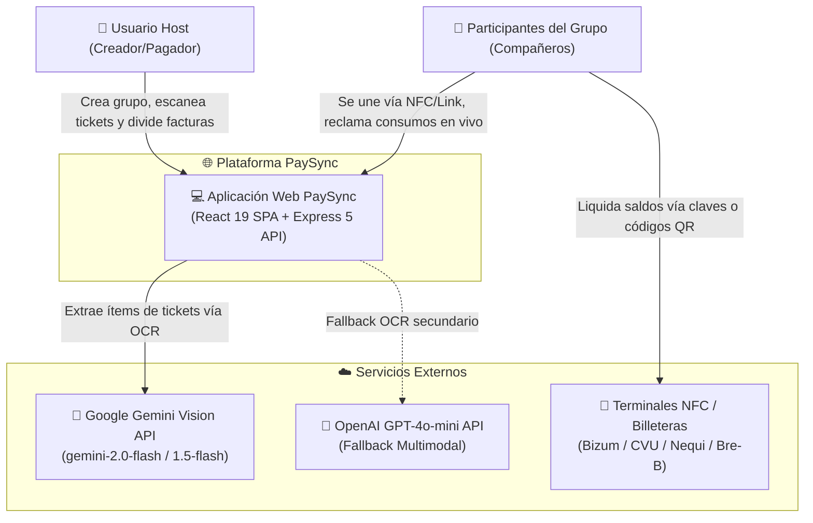
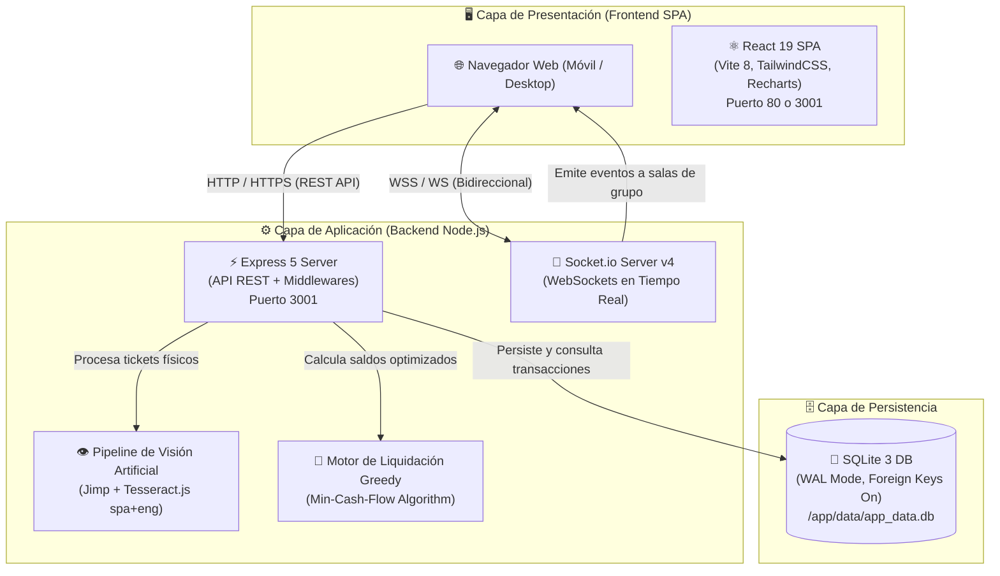
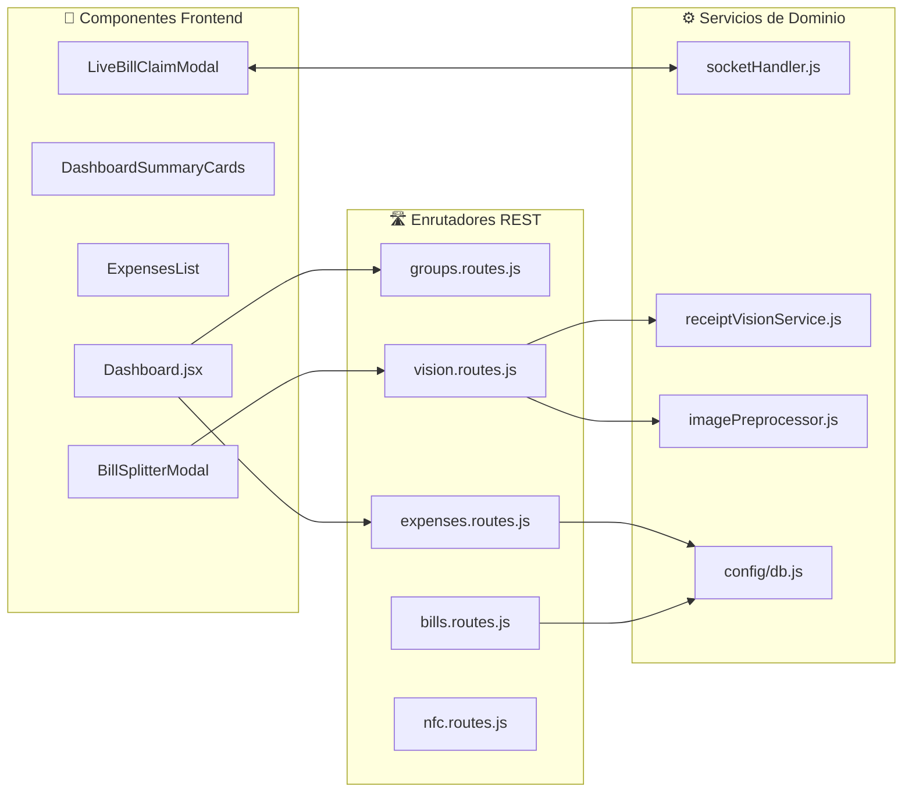

# 🏛️ Arquitectura del Sistema y Diagrama C4

El sistema **PaySync** está diseñado bajo una arquitectura web reactiva, modular y desacoplada, orientada al procesamiento en tiempo real de transacciones colaborativas y la digitalización inteligente de comprobantes de pago.

---

## 📐 Niveles del Modelo C4

### Nivel 1: Diagrama de Contexto del Sistema

Describe cómo interactúan los usuarios finales con la plataforma PaySync y sus integraciones externas (modelos de visión artificial y pasarelas de cobro).

---

### Nivel 2: Diagrama de Contenedores

Detalla los componentes lógicos que conforman la infraestructura de ejecución de PaySync.

---

### Nivel 3: Diagrama de Componentes (Backend & Frontend)

---

## 🔒 Políticas y Principios Arquitectónicos

1. **Persistencia Ligera y Confiable (SQLite3):**
   - Habilitación forzada de integridad referencial: `PRAGMA foreign_keys = ON;`.
   - Soporte para bases de datos en disco persistente o memoria en testing (`DATABASE_PATH=:memory:`).
   - Acceso mono-proceso (modo *fork* en PM2) para prevenir bloqueos por concurrencia de escritura en disco.

2. **Sincronización Reactiva sin Polling:**
   - La arquitectura evita consultas periódicas de sondeo (*polling*). Todos los cambios de estado (creación de gastos, adición de facturas y asignación de ítems en vivo) se propagan de forma instantánea a través de salas dedicadas de Socket.io (`socket.join(groupId)`).

3. **Arquitectura Desacoplable:**
   - Puede desplegarse como un monolito unificado (contenedor único donde Express sirve los estáticos compilados de React) o desacoplada (Frontend en Nginx o Vercel y Backend en Render/Railway/Fly.io).

---

## 🔗 Navegación Rápida
- Regresar a: [[00_MOC_PaySync]]
- Siguiente: [[01_Arquitectura/Base-de-Datos-ER|Modelo de Base de Datos y Esquema SQLite]]
- Relacionado: [[02_Backend/API-REST-Endpoints|Catálogo de Endpoints REST]] | [[02_Backend/WebSockets-Eventos|Catálogo de Eventos WebSockets]]
