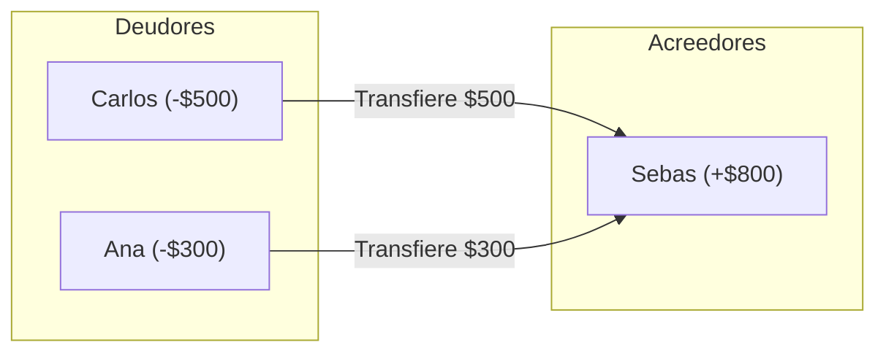

# 🧮 Algoritmo de Liquidación de Deudas

Uno de los mayores dolores de cabeza en grupos que comparten gastos es resolver quién le debe a quién sin generar una maraña interminable de micropagos cruzados. PaySync implementa un **algoritmo voraz (*greedy*) de minimización de flujos de efectivo**.

---

## 💡 Principio Matemático

1. **Cálculo de Balances Netos:**
   Para cada participante $i$:
   $$\text{Balance}_i = \text{Total Pagado por } i - \text{Total que le correspondía pagar}$$
   * Si $\text{Balance}_i > 0$: El participante es un **Acreedor** (le deben dinero).
   * Si $\text{Balance}_i < 0$: El participante es un **Deudor** (debe dinero).
   * La suma total de los balances en el grupo es siempre cero: $\sum \text{Balance}_i = 0$.

2. **Estrategia Greedy:**
   - Se empareja al **mayor deudor** con el **mayor acreedor**.
   - Se realiza una transferencia por el menor de los dos valores absolutos:
     $$T = \min(|\text{Deudor}_{\max}|, \text{Acreedor}_{\max})$$
   - Se actualizan ambos balances y se repite el proceso hasta que todos los saldos queden en cero.
   - **Resultado:** Se garantiza liquidar el grupo en un máximo de $N - 1$ transacciones (donde $N$ es el número de participantes).

---

## 📊 Ejemplo de Flujo de Transacciones

*En lugar de múltiples transferencias intermedias, se salda la cuenta en solo 2 transferencias directas.*

---

## 🔗 Navegación Rápida
- Regresar a: [[00_MOC_PaySync]]
- Siguiente: [[02_Backend/Pipeline-OCR-Vision|Pipeline OCR de Facturas]]
