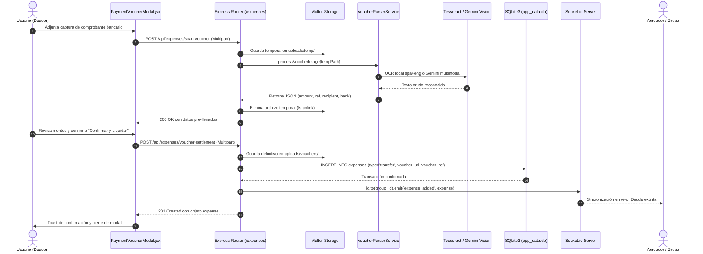

# Comprobantes de Pago Bancario y OCR Inteligente

El subsistema de comprobantes de pago de PaySync permite la extinción y liquidación automatizada de deudas dentro de un grupo a partir del análisis óptico de comprobantes bancarios emitidos por entidades financieras colombianas (Nequi, Bancolombia, Bre-B, Daviplata, Dale y Nu).

Este módulo articula un servicio especializado de extracción por expresiones regulares y heurísticas espaciales (`voucherParserService.js`), conmutación por falla hacia modelos de visión artificial multimodal (Gemini Vision / GPT-4o-mini), almacenamiento en disco mediante Multer, sincronización transaccional con el algoritmo Min-Cash-Flow y difusión en tiempo real vía WebSockets.

---

## 1. Arquitectura de Endpoints REST

La gestión de comprobantes se estructura en dos rutas principales expuestas en `backend/routes/expenses.routes.js`:

```
POST /api/expenses/scan-voucher         -> Escaneo efímero (pre-llenado en UI)
POST /api/expenses/voucher-settlement   -> Liquidación formal con persistencia
```

### 1.1 POST /api/expenses/scan-voucher

Permite a los clientes enviar una captura de comprobante bancario para análisis preliminar antes de formalizar la transacción. La imagen se almacena en un directorio temporal (`uploads/temp/`) y se destruye de inmediato en el bloque `finally` para evitar acumulación innecesaria en el almacenamiento del servidor.

- **Content-Type:** `multipart/form-data`
- **Límites de Carga:** Archivos de tipo `image/jpeg`, `image/png`, `image/webp` con peso máximo de 5 MB.
- **Parámetros de Entrada:**
  - `voucher` (File, obligatorio): Archivo binario de la captura de pantalla.
  - `rotation` (Number, opcional): Grados de rotación manual (0, 90, 180, 270) para corregir la orientación.
  - `x-gemini-key` (Header, opcional) o `apiKey` (Body, opcional): Clave de API para forzar inferencia multimodal por LLM.

- **Contrato de Respuesta (200 OK):**
```json
{
  "success": true,
  "amount": 45000,
  "reference": "M9876543",
  "recipient": "Maria Gomez",
  "bank": "nequi",
  "rawText": "¡Envío exitoso!\n¿Para quién?\nMaria Gomez\n¿Cuánto?\n$ 45.000\nReferencia\nM9876543",
  "engineUsed": "local-ocr"
}
```

- **Códigos de Estado HTTP:**
  - `200 OK`: Análisis completado exitosamente (incluso si algún campo no pudo deducirse, retornará valores en `0` o `null`).
  - `400 Bad Request`: Ausencia del archivo binario o transgresión del límite de tamaño / tipo MIME.
  - `500 Internal Server Error`: Falla crítica no recuperable en el motor de visión.

### 1.2 POST /api/expenses/voucher-settlement

Registra formalmente la liquidación de una deuda entre dos integrantes del grupo. Puede recibir los valores confirmados por el usuario o delegar la extracción al motor de OCR si el campo `amount` no fue provisto. Cuando se adjunta un archivo, este se persiste de forma definitiva en `uploads/vouchers/` con un nombre único basado en marca de tiempo y entropía criptográfica (`voucher-${Date.now()}-${randomHex}.png`).

- **Content-Type:** `multipart/form-data` o `application/json`
- **Parámetros de Entrada:**
  - `group_id` (String, requerido): Identificador de la sala o grupo.
  - `debtor_id` (String, requerido): Perfil que efectuó el pago (deudor que salda su obligación).
  - `creditor_id` (String, requerido): Perfil que recibe los fondos (acreedor).
  - `amount` (Number, condicional): Monto liquidado en Pesos Colombianos (COP). Si se omite o es menor o igual a cero, se deduce automáticamente mediante OCR a partir de la imagen adjunta.
  - `voucher` (File, opcional si el monto se envió de forma manual): Archivo físico del comprobante.
  - `voucher_ref` (String, opcional): Código único de comprobante o autorización bancaria.
  - `description` (String, opcional): Motivo del registro (por defecto: `"Pago de deuda liquidada con comprobante"`).

- **Contrato de Respuesta (201 Created):**
```json
{
  "success": true,
  "expense": {
    "id": "c7a86f91-8899-4d6b-8012-70b1356f9abc",
    "group_id": "VIAJE-COSTA-2026",
    "profile_id": "prof-debtor-01",
    "profile_name": "Daniel Deudor",
    "to_profile_id": "prof-creditor-02",
    "to_profile_name": "Carlos Acreedor",
    "amount": 50000,
    "description": "Pago de deuda liquidada con comprobante",
    "category": "transfer",
    "type": "transfer",
    "voucher_url": "/uploads/vouchers/voucher-1790451958360-321e1a7f.png",
    "voucher_ref": "M9876543",
    "date": "2026-09-26T14:15:00.000Z"
  },
  "detected": {
    "amount": 50000,
    "reference": "M9876543"
  }
}
```

---

## 2. Motor de Análisis: `voucherParserService.js`

El servicio `voucherParserService.js` implementa un flujo híbrido compuesto por tres capas:

1. Preprocesamiento digital de imagen (`imagePreprocessor.js` con Jimp).
2. Fallback de visión multimodal (Gemini Vision / OpenAI GPT-4o-mini).
3. Motor OCR local fuera de línea (Tesseract.js con diccionarios `spa+eng`) acoplado a un motor heurístico de expresiones regulares.

### 2.1 Identificación de Entidades Bancarias

El motor inspecciona el texto extraído buscando firmas contextuales características de las principales plataformas financieras de Colombia:

- **Nequi:** Detectado por palabras clave como `"nequi"`, `"enviaste"`, `"envio exitoso"`, `"envío exitoso"`, `"¿para quién?"`.
- **Bancolombia:** Detectado por `"bancolombia"`, `"valor transferido"`, `"transferencia exitosa"`, `"comprobante no."`, `"cuenta destino"`.
- **Daviplata:** Detectado por `"daviplata"`, `"pasar plata"`, `"davivienda"`, `"número de aprobación"`.
- **Bre-B / Transfiya:** Detectado por `"bre-b"`, `"breb"`, `"transfiya"`, `"redeban"`, `"id transacción"`.
- **Otras Entidades:** Clasificadas como `"other"`.

### 2.2 Extracción de Referencia y Código de Autorización

El sistema busca el código único de transacción siguiendo una jerarquía estricta:

1. **Patrón Nequi M-Code:** Búsqueda prioritaria de la letra `M` seguida de 7 a 9 dígitos (`/\b(M\d{7,9})\b/i`).
2. **Encabezados Estructurados:** Localización de prefijos como `Comprobante No.`, `Referencia:`, `Ref:`, `Aprobación:`, `Autorización:`, `ID Transacción:`, `CUS:`, `Folio:`. Si el valor no se halla en la misma línea, se analiza la línea contigua descartando fechas u horas.
3. **Filtros de Exclusión:** Se descartan cadenas que correspondan a números celulares colombianos (10 dígitos que inicien con 3) o fechas con formato ISO o convencional (`DD/MM/YYYY`).

### 2.3 Sanitización y Ponderación de Montos en COP

La extracción monetaria en Colombia enfrenta retos como la confusión entre puntos de mil (`$ 45.000`) y comas decimales (`$ 120.000,00`).

La función `cleanNumericAmount()` implementa las siguientes reglas:
- Si la cadena termina en `[.,]\d{2}`, se tratan los últimos dos dígitos como centavos decimales y los separadores previos se remueven.
- Si no existen centavos explícitos, se eliminan todos los caracteres no numéricos y se parsea como entero en Pesos Colombianos.
- **Filtro de Descarte Inmediato:** Se omiten líneas que contengan las frases: `"costo de"`, `"tarifa"`, `"comisión"`, `"disponible"`, `"saldo"`, `"cuenta origen"`, `"ahorros *"`, `"celular"`, `"a cel"`.
- **Sistema de Puntuación de Candidatos:**
  - **Prioridad 100:** Montos adyacentes a palabras clave de transferencia (`"valor transferido"`, `"valor:"`, `"monto:"`, `"enviaste"`, `"total"`, `"¿cuánto?"`).
  - **Prioridad 90:** Montos ubicados en la línea inmediatamente inferior a un encabezado explícito.
  - **Prioridad 50:** Cadenas precedidas por el símbolo `$` o la sigla `COP`.
  - **Prioridad 20:** Números aislados mayores o iguales a $100 que no coincidan con números celulares ni sellos de tiempo.

El candidato seleccionado es aquel con la tupla más alta en `(prioridad DESC, monto DESC)`.

---

## 3. Fallback Multimodal hacia Gemini Vision

Cuando se detecta una variable de entorno `GEMINI_API_KEY` o un encabezado de cliente `x-gemini-key`, el servicio preprocesa la imagen mediante `preprocessImage()` en modo ligero (sin binarización destructiva, manteniendo escala de grises y redimensionamiento hasta 1800 px) y ejecuta la llamada a la API REST de Google Gemini:

```javascript
const VOUCHER_PROMPT = `Eres un auditor financiero especializado en lectura de comprobantes de pago bancarios en Colombia (Nequi, Bancolombia, Bre-B, Daviplata, Dale).
Analiza el comprobante adjunto y extrae estrictamente en formato JSON:
{
  "bank": "nequi|bancolombia|daviplata|bre-b|other",
  "amount": 50000,
  "reference": "Codigo o numero de aprobacion/comprobante o null",
  "recipient": "Nombre de quien recibio el dinero o null"
}
REGLAS:
1. amount debe ser un numero positivo en Pesos Colombianos (COP).
2. Ignora saldos disponibles, costos de transaccion o telefonos celulares para el monto.
3. Devuelve EXCLUSIVAMENTE el JSON valido sin markdown.`;
```

Modelos consultados en cascada ante errores de cuota o indisponibilidad:
1. `gemini-flash-lite-latest`
2. `gemini-flash-latest`
3. `gemini-2.5-flash-lite`

Si la llamada remota falla o se agotan las cuotas de servicio, el flujo conmuta de forma transparente hacia Tesseract.js local (`spa+eng`).

---

## 4. Sincronización Transaccional y Algoritmo Min-Cash-Flow

En PaySync, una liquidación mediante comprobante se modela como un registro en la tabla `expenses` con atributos especiales:

```sql
INSERT INTO expenses (
  id, group_id, profile_id, amount, description, 
  category, type, to_profile_id, voucher_url, voucher_ref, date
) VALUES (?, ?, ?, ?, ?, 'transfer', 'transfer', ?, ?, ?, ?);
```

### 4.1 Impacto en la Matriz de Balances Netos

El [[02_Backend/Algoritmo-Liquidacion|Algoritmo de Liquidación Greedy]] calcula el balance neto de cada participante $i$ aplicando la fórmula:

$$Balance_i = TotalPagado_i - GastoEquitativo_i + TransferenciasRecibidas_i - TransferenciasEnviadas_i$$

Al registrar un pago con comprobante donde `profile_id = Deudor` y `to_profile_id = Acreedor`:
- El balance del deudor se incrementa en $+Monto$ (su deuda disminuye o su saldo a favor aumenta).
- El balance del acreedor se reduce en $-Monto$ (su saldo por cobrar disminuye).

Cuando el deudor cancela la totalidad de su obligación calculada, la ejecución posterior de `GET /api/groups/:id/settlement` recalcula las transferencias mínimas pendientes, resultando en un saldo residual de `$0` entre ambos perfiles.

### 4.2 Emisión Reactiva WebSockets

Tras completarse el `INSERT` en la base de datos SQLite, el controlador recupera los nombres de ambos participantes y emite el evento global `expense_added` sobre la sala privada del grupo:

```javascript
const io = req.app.get('io');
if (io) {
  io.to(group_id).emit('expense_added', expense);
}
```

Todos los navegadores y dispositivos conectados a esa sala reciben la notificación instantánea, actualizando las tarjetas de balance, la lista de movimientos y el gráfico de liquidación sin recargar la página.

---

## 5. Diagrama de Secuencia del Flujo de Comprobante



---

## 6. Navegación Conceptual
- Ver catálogo general de rutas: [[02_Backend/API-REST-Endpoints]]
- Ver optimización de balances: [[02_Backend/Algoritmo-Liquidacion]]
- Ver interfaz visual del comprobante: [[03_Frontend/Generador-QR-Bre-B]]
- Regresar al índice: [[00_MOC_PaySync]]
