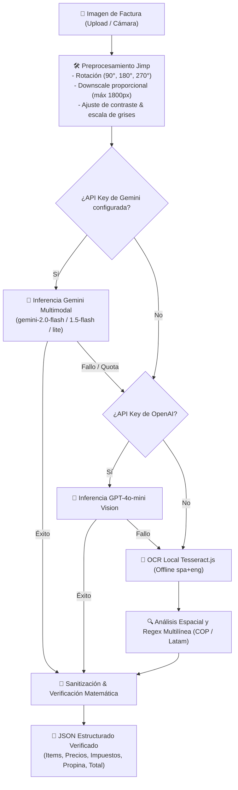

# 👁️ Pipeline de Visión Artificial y OCR Multimodal

La digitalización de facturas en PaySync utiliza una arquitectura de **procesamiento por etapas en cascada** (*waterfall pipeline*), combinando preprocesamiento digital de imágenes, modelos de visión multimodal de última generación (LLMs) y un motor de OCR local fuera de línea con validación matemática estricta.

---

## 🏗️ Flujo de Procesamiento en Cascada

---

## 1. 🛠️ Preprocesamiento con Jimp (`imagePreprocessor.js`)

Los tickets de compra capturados por cámaras de teléfonos presentan frecuentemente problemas de orientación, sombras, alta resolución innecesaria y poco contraste en papel térmico.

1. **Downscale Adaptativo:**
   - Si la anchura o altura supera los `1800px`, se redimensiona proporcionalmente (`scaleToFit`). Esto reduce el consumo de memoria RAM (evita *Out-Of-Memory* en servidores ligeros) y acelera la transmisión de red al LLM.
2. **Corrección de Orientación:**
   - Soporte para rotación angular arbitraria o por metadatos EXIF (`rotation % 360`).
3. **Optimización para OCR Tradicional:**
   - Conversión a escala de grises (`greyscale()`), incremento de contraste (`contrast(0.2)`) y normalización de histograma (`normalize()`) para aislar los caracteres impresos sobre el papel térmico.

---

## 2. 🤖 Modelos Multimodales en la Nube

### Google Gemini Vision
- **Modelos prioritarios:** `gemini-2.0-flash`, `gemini-1.5-flash`, `gemini-1.5-flash-8b`.
- **Descubrimiento Dinámico:** Si un modelo específico devuelve error de cuota o no está disponible en la región del API key, el servicio consulta dinámicamente el catálogo de modelos disponibles vía `GET /v1beta/models` y selecciona automáticamente la variante más ligera y rápida.
- **Formato Estricto:** Se invoca con `response_mime_type: 'application/json'` y `temperature: 0.1` para garantizar determinismo matemático.

### OpenAI Vision (Fallback Secundario)
- Emplea `gpt-4o-mini` con modo JSON (`response_format: { type: "json_object" }`) en caso de agotamiento de cuota en Google Cloud.

---

## 3. 📖 Motor Offline Tesseract.js (`spa + eng`)

Cuando no se configuran credenciales en la nube o el servidor opera en modo local/air-gapped:
- Utiliza los archivos `spa.traineddata` y `eng.traineddata` almacenados localmente en `backend/`.
- Aplica expresiones regulares adaptadas a formatos de factura de Colombia y Latinoamérica:
  - Detección de separadores de miles con punto (`25.000` = `25000`).
  - Reconocimiento de prefijos de cantidad (`2x`, `3 *`, etc.).
  - Filtro de metadatos de ticket innecesarios (`NIT`, `TEL`, `FECHA`, `MESA`, `RESOLUCION`).
  - Extracción de propina voluntaria (`PROPINA`, `SERVICIO`), IVA e impuesto al consumo.

---

## 4. 🧮 Sanitización y Verificación Matemática (`sanitizeAndVerifyBillData`)

Independientemente del motor de extracción, todos los datos pasan por una capa de reconciliación determinista:
- **Autocorrección de Cantidades:** Si la cantidad de un producto es 0 o nula, se ajusta a 1.
- **Autocálculo de Precios Faltantes:** Si falta el precio unitario, se deduce mediante `unitPrice = Math.round(subtotal / quantity)`.
- **Balance del Total:** Se verifica si `subtotal + tip + tax - discount == total`.
- **Bandera de Verificación:** Si los cálculos coinciden con un margen menor a $1 COP / unidad monetaria, se marca `mathVerified: true` y confianza `high`.

---

## 🔗 Navegación Rápida
- Regresar a: [[00_MOC_PaySync]]
- Siguiente: [[02_Backend/Algoritmo-Liquidacion|Algoritmo de Liquidación de Deudas]]
- Relacionado: [[05_Calidad-Testing/Plan-de-Pruebas|Plan de Pruebas y Cobertura QA]] | [[02_Backend/API-REST-Endpoints|Endpoints REST]]
