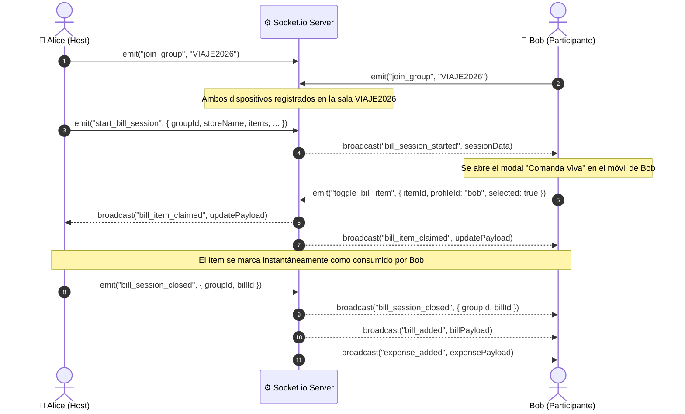

# 📡 Catálogo de Eventos WebSockets (Socket.io)

PaySync integra **Socket.io v4** para ofrecer sincronización bidireccional en tiempo real entre múltiples dispositivos conectados a un mismo grupo de gastos o mesa de restaurante.

Cada grupo de gastos actúa como una **sala aislada** (*room*) identificada por su `group_id`. Esto asegura que las notificaciones de gastos, divisiones de cuentas o uniones NFC únicamente se transmitan a los integrantes correspondientes.

---

## 🔄 Flujo de Interacción Colaborativa (Sequence Diagram)



---

## 📤 Eventos Cliente ➔ Servidor (Emitidos por el Frontend)

### 1. `join_group`
Registra la conexión actual en la sala del grupo para recibir eventos específicos.
* **Payload:** `groupId` (string sanitizado, ej. `"VIAJE2026"`).

### 2. `nfc_joined`
Notifica a los integrantes de la sala que un nuevo usuario se unió físicamente mediante escaneo NFC (*Tap-to-Join*).
* **Payload:**
```json
{
  "groupId": "VIAJE2026",
  "profileName": "Sebas"
}
```

### 3. `toggle_bill_item` / `toggle_item_assignment` / `bill_item_claimed`
Permite a un participante reclamar o desmarcar un ítem de la factura en curso dentro de una sesión de comanda viva.
* **Payload:**
```json
{
  "groupId": "VIAJE2026",
  "sessionId": "session-uuid-123",
  "itemId": "item-abc-1",
  "itemName": "Hamburguesa Doble",
  "profileId": "prof-user-2",
  "profileName": "Carlos",
  "selected": true
}
```

### 4. `start_bill_session` / `bill_session_started`
Inicia una comanda viva tras digitalizar un ticket físico, notificando a todos los móviles del grupo para que empiecen a seleccionar lo que consumieron.
* **Payload:** Objeto de sesión con `groupId`, `title`, `storeName`, `hostProfileId`, `items`, `tax`, `tip`.

### 5. `bill_session_closed`
Cierra la sesión activa en SQLite y notifica el final de la repartición.
* **Payload:** `{ "groupId": "VIAJE2026", "sessionId": "session-uuid-123" }`.

---

## 📥 Eventos Servidor ➔ Cliente (Recibidos por el Frontend)

| Evento | Origen / Disparador | Payload Principal | Acción en Frontend |
| :--- | :--- | :--- | :--- |
| `peer_joined_nfc` | `nfc_joined` del cliente | `{ message, profileName, groupId, timestamp }` | Muestra un toast de bienvenida en los móviles del grupo. |
| `bill_session_started` | Creador abre sesión de factura | Objeto completo `sessionData` | Abre banner/modal de "Comanda Viva" en tiempo real. |
| `bill_item_claimed` / `bill_assignments_updated` | Participante selecciona o quita un ítem | `{ itemId, profileId, selected, assignments, timestamp }` | Actualiza avatares en los platos seleccionados reactivamente. |
| `bill_session_closed` | Host finaliza la división | `{ groupId, sessionId }` | Cierra modal y limpia estado de sesión en vivo. |
| `expense_added` | Registro de gasto o liquidación de factura | Objeto completo `expense` | Inserta en lista de movimientos y recalcula balances. |
| `expense_deleted` | Borrado de un gasto (`DELETE /api/expenses/:id`) | `{ id, group_id }` | Remueve el gasto de la lista y actualiza los saldos. |
| `bill_added` | Cierre y guardado formal de una factura | Objeto completo `bill` con splits | Añade la factura a la pestaña de facturas y emite toast. |
| `profile_added` | Creación de nuevo perfil en la sala | `{ id, group_id, name, payment_key, payment_qr }` | Añade el participante al listado de selección. |
| `profile_updated` | Actualización de perfil o clave de cobro | `{ id, name, payment_key, payment_qr }` | Sincroniza nombres y llaves bancarias (CVU/Bizum/Alias). |

---

## 🛡️ Robustez y Resiliencia de la Conexión

- **Reconexión Automática:** El cliente de React inicializa Socket.io con `reconnectionAttempts: 5` y timeout de 10 segundos.
- **Sincronización Híbrida (WebSockets + REST):** En caso de reconexión tras pérdida de señal móvil, el frontend consulta `GET /api/bill-sessions/active/:groupId` para recuperar el estado exacto persistido en SQLite.
- **Sanitización de Salas:** Todas las cadenas de grupo pasan por `sanitizeGroupId()` para evitar inyecciones en nombres de canales de socket.

---

## 🔗 Navegación Rápida
- Regresar a: [[00_MOC_PaySync]]
- Siguiente: [[02_Backend/Pipeline-OCR-Vision|Pipeline OCR de Visión Artificial]]
- Relacionado: [[01_Arquitectura/Diagrama-C4-Sistema|Diagrama C4 y Arquitectura]] | [[03_Frontend/Gestion-Estado|Manejo del Estado y Reactividad]]
