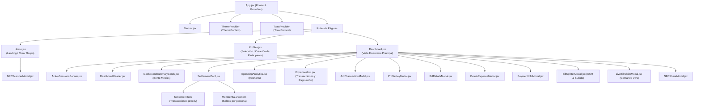

# 🎨 Árbol y Jerarquía de Componentes Frontend (React 19)

El frontend de PaySync está modularizado bajo una arquitectura por capas basada en páginas (*Pages*), componentes orquestadores de dominio (*Dashboard Components*) y modales independientes (*Modals*).

---

## 🌳 Diagrama del Árbol de Componentes (Mermaid)

---

## 📂 Desglose de Componentes del Dashboard (`src/components/dashboard/`)

Durante la fase de modularización, la vista monolítica original de `Dashboard.jsx` se dividió en componentes atómicos y reutilizables expuestos a través de un archivo barril `index.js`:

### 1. `DashboardHeader.jsx`
- **Responsabilidad:** Encabezado contextual de la sala activa.
- **Funcionalidades:** Muestra el nombre del grupo, el selector de participante activo (*Me Profile*), y la botonera de acciones rápidas (+ Añadir Gasto, 🧾 Dividir Cuenta, 📡 Compartir vía NFC).

### 2. `DashboardSummaryCards.jsx`
- **Responsabilidad:** Cuadrícula de métricas clave con estética *Bento Grid*.
- **Indicadores:**
  - **Gasto Total:** Suma global de todas las compras y facturas del grupo.
  - **Cuota Equitativa (*Fair Share*):** Gasto promedio por persona ($Total / N$).
  - **Mi Balance:** Estado financiero del usuario activo (`Acreedor`, `Deudor`, `Al día`), con códigos de color dinámicos (verde esmeralda / carmesí).

### 3. `SettlementCard.jsx`
- **Responsabilidad:** Visualización del plan óptimo de liquidación minimizado por el [[02_Backend/Algoritmo-Liquidacion|Algoritmo Greedy]].
- **Subcomponentes:**
  - `SettlementItem`: Tarjetas de transferencia individual (deudor paga acreedor con botón para abrir `PaymentInfoModal`).
  - `MemberBalanceItem`: Balances desglosados de cada participante en el grupo.

### 4. `SpendingAnalytics.jsx`
- **Responsabilidad:** Inteligencia visual del consumo del grupo mediante la librería `recharts`.
- **Gráficos Integrados:**
  - **Distribución por Categorías:** Gráfico de pastel interactivo (Alimentación, Transporte, Alojamiento, Ocio, etc.).
  - **Historial Temporal:** Gráfico de barras acumulativo cronológico por fecha de gasto.

### 5. `ExpensesList.jsx`
- **Responsabilidad:** Registro histórico de movimientos financieros.
- **Capacidades:** Pestañas de filtrado (*Todos*, *Gastos*, *Transferencias*), indicador de desgloses de facturas con botón para abrir `BillDetailsModal` y acción de eliminación vía `DeleteExpenseModal`.

### 6. `ActiveSessionsBanner.jsx`
- **Responsabilidad:** Alerta contextual animada cuando otro usuario del grupo ha escaneado una factura y está abierta una sesión de [[02_Backend/WebSockets-Eventos|Comanda Viva]].

---

## 🪟 Catálogo de Modales

| Componente Modal | Rol Funcional |
| :--- | :--- |
| `AddTransactionModal.jsx` | Formulario rápido para asentar un gasto individual o una transferencia directa entre integrantes. |
| `BillSplitterModal.jsx` | Carga de imagen de factura con cámara/archivo, preprocesamiento Jimp y orquestación con el [[02_Backend/Pipeline-OCR-Vision|Pipeline OCR]]. |
| `LiveBillClaimModal.jsx` | Interfaz interactiva para selección multiusuario de platos en tiempo real. |
| `ProfileKeyModal.jsx` | Edición de clave bancaria (Bizum, CVU, Alias, Nequi) y generación/carga de código QR. |
| `PaymentInfoModal.jsx` | Ficha de cobro del acreedor con copiado al portapapeles y despliegue del código QR de pago. |
| `DeleteExpenseModal.jsx` | Diálogo de confirmación para revocar un gasto erróneo. |
| `NFCScannerModal.jsx` | Interfaz Web NFC para lectura de tarjetas o terminales cercanas. |
| `NFCShareModal.jsx` | Interfaz Web NFC para emulación/escritura de enlaces de invitación directa. |

---

## 🔗 Navegación Rápida
- Regresar a: [[00_MOC_PaySync]]
- Siguiente: [[03_Frontend/Gestion-Estado|Manejo del Estado y Reactividad]]
- Relacionado: [[03_Frontend/Guia-Estilos-Tailwind|Sistema de Diseño y TailwindCSS]]
