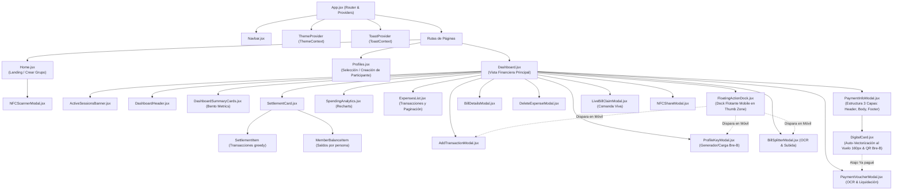
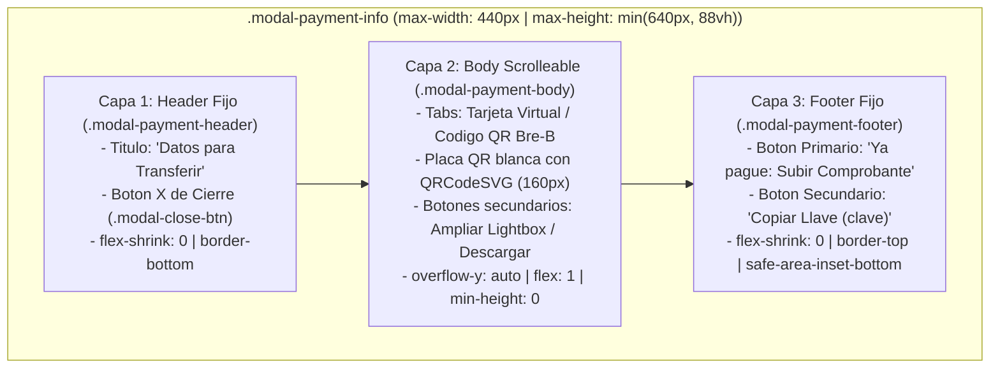

# Árbol y Jerarquía de Componentes Frontend (React 19)

El frontend de PaySync está modularizado bajo una arquitectura por capas basada en páginas (*Pages*), componentes orquestadores de dominio (*Dashboard Components*), elementos ergonómicos móviles (*Floating Action Dock*) y modales independientes con soporte adaptable de Bottom Sheet.

---

## Diagrama del Árbol de Componentes (Mermaid)

```mermaid
flowchart TD
    App["App.jsx (Router & Providers)"] --> Nav["Navbar.jsx"]
    App --> Theme["ThemeProvider (ThemeContext)"]
    App --> Toast["ToastProvider (ToastContext)"]
    
    App --> Pages["Rutas de Páginas"]
    Pages --> Home["Home.jsx\n(Landing / Crear Grupo)"]
    Pages --> ProfilesPage["Profiles.jsx\n(Selección / Creación de Participante)"]
    Pages --> Dash["Dashboard.jsx\n(Vista Financiera Principal)"]

    Home --> NFCScanM["NFCScannerModal.jsx"]
    
    Dash --> Banner["ActiveSessionsBanner.jsx"]
    Dash --> Header["DashboardHeader.jsx"]
    Dash --> SummaryCards["DashboardSummaryCards.jsx (Bento Metrics)"]
    Dash --> SettCard["SettlementCard.jsx"]
    Dash --> Analytics["SpendingAnalytics.jsx (Recharts)"]
    Dash --> ExpList["ExpensesList.jsx (Transacciones y Paginación)"]
    Dash --> FloatingDock["FloatingActionDock.jsx\n(Dock Flotante Mobile en Thumb Zone)"]

    SettCard --> SettItem["SettlementItem (Transacciones greedy)"]
    SettCard --> BalItem["MemberBalanceItem (Saldos por persona)"]

    Dash --> ModalAdd["AddTransactionModal.jsx"]
    Dash --> ModalProf["ProfileKeyModal.jsx (Generador/Carga Bre-B)"]
    Dash --> ModalBillD["BillDetailsModal.jsx"]
    Dash --> ModalDel["DeleteExpenseModal.jsx"]
    Dash --> ModalPay["PaymentInfoModal.jsx\n(Estructura 3 Capas: Header, Body, Footer)"]
    Dash --> ModalVoucher["PaymentVoucherModal.jsx (OCR & Liquidación)"]
    Dash --> ModalSplit["BillSplitterModal.jsx (OCR & Subida)"]
    Dash --> ModalLive["LiveBillClaimModal.jsx (Comanda Viva)"]
    Dash --> ModalNFC["NFCShareModal.jsx"]

    ModalPay --> DigCard["DigitalCard.jsx\n(Auto-Vectorización al Vuelo 160px & QR Bre-B)"]
    DigCard -.->|Atajo Ya pagué| ModalVoucher

    FloatingDock -.->|Dispara en Móvil| ModalAdd
    FloatingDock -.->|Dispara en Móvil| ModalProf
    FloatingDock -.->|Dispara en Móvil| ModalSplit
```

---

## Desglose de Componentes del Dashboard (`src/components/dashboard/`)

Durante la fase de modularización y posterior rediseño minimalista fluido, la vista de `Dashboard.jsx` se dividió en componentes desacoplados exportados uniformemente desde el barril `src/components/dashboard/index.js`:

### 1. `DashboardHeader.jsx`
- **Responsabilidad:** Encabezado contextual de la sala activa.
- **Funcionalidades:** Muestra el título de la sala, el selector de participante activo (*Me Profile*), la clave de acceso compartible y la botonera de acciones rápidas de escritorio (+ Añadir Gasto, Dividir Cuenta, Compartir vía NFC).

### 2. `DashboardSummaryCards.jsx`
- **Responsabilidad:** Cuadrícula de métricas clave con estética *Bento Grid*.
- **Indicadores Numéricos Estables:**
  - Utiliza `tabular-nums` para evitar oscilaciones de diseño ante sincronizaciones en tiempo real.
  - **Gasto Total:** Suma global de todas las compras y facturas del grupo.
  - **Cuota por Persona:** División equitativa del gasto total entre los participantes del grupo ($Total / N$).
  - **Tu Estado Personal:** Posición financiera directa del usuario activo (`Te deben a favor`, `Debes abonar al grupo`, `¡Estás al día, cuota saldada!`). Ver [[03_Frontend/Guia-Copywriting-UX|Guía de Copywriting UX]].

### 3. `SettlementCard.jsx`
- **Responsabilidad:** Visualización intuitiva del plan de liquidación minimizado por el [[02_Backend/Algoritmo-Liquidacion|Algoritmo Greedy]].
- **Lenguaje Natural Adoptado:** En lugar de tecnicismos como *min-cash-flow* o *base justa*, comunica de manera cercana:
  - Header: *"A cada uno le toca: $..."* y *"La forma más rápida de quedar a mano con la menor cantidad de transferencias."*
  - Estado sin deudas: *"¡Cuentas al Día! No hay deudas pendientes entre los miembros del grupo."*
  - Ficha de deuda: Distintivo claro *"Debes"* y botones directos *"Pagar"* y *"Subir Comprobante"*.
- **Subcomponentes:**
  - `SettlementItem`: Fichas de transferencia individual entre miembros con acceso rápido a datos de pago y comprobante.
  - `MemberBalanceItem`: Balances individuales desglosados (*Aportó*, *Recibió* y balance neto) con botón *"Ver QR / Número"*.

### 4. `SpendingAnalytics.jsx`
- **Responsabilidad:** Inteligencia visual del consumo del grupo mediante la librería `recharts`.
- **Gráficos Integrados:**
  - **Distribución por Categorías:** Gráfico de pastel interactivo (Alimentación, Transporte, Alojamiento, Ocio, etc.).
  - **Historial Temporal:** Gráfico de barras acumulativo cronológico por fecha de gasto.

### 5. `ExpensesList.jsx`
- **Responsabilidad:** Registro histórico de movimientos financieros.
- **Capacidades:** Pestañas de filtrado (*Todos*, *Gastos*, *Transferencias*), indicador de comprobantes bancarios adjuntos (`voucher_url`), visor de desgloses con botón para abrir `BillDetailsModal` y acción de eliminación vía `DeleteExpenseModal`.

### 6. `ActiveSessionsBanner.jsx`
- **Responsabilidad:** Alerta contextual animada cuando otro usuario del grupo ha escaneado una factura y está abierta una sesión de [[02_Backend/WebSockets-Eventos|Comanda Viva]].

### 7. `FloatingActionDock.jsx`
- **Responsabilidad:** Dock flotante de navegación y acciones rápidas optimizado para el uso ergonómico con una sola mano en dispositivos móviles (*Thumb-Zone Ergonomics*).
- **Acciones Mapeadas:**
  - **`+ Gasto` (Central Prominente):** Botón circular con gradiente esmeralda sobreelevado que abre `AddTransactionModal.jsx` con micro-feedback `active:scale-[0.92]`.
  - **`Mi Llave / QR` (Lateral Izquierdo):** Acceso directo para abrir `ProfileKeyModal.jsx` y visualizar o configurar alias bancarios y códigos QR de cobro.
  - **`Dividir Factura` (Lateral Derecho):** Dispara `BillSplitterModal.jsx` para procesamiento con cámara u OCR.
- **Comportamiento Responsivo:**
  - Oculto en pantallas de escritorio (`md:hidden`).
  - Posicionamiento `fixed` en el borde inferior con margen adaptativo `env(safe-area-inset-bottom)`.
  - Superficie con desenfoque de cristal (`backdrop-blur-md`) y bordes milimétricos.

---

## Catálogo de Modales y Adaptación Bottom Sheet

Todos los componentes modales incorporan soporte responsivo híbrido: se presentan como ventanas modales centradas en pantallas de escritorio y se convierten automáticamente en **Bottom Sheets con tirador táctil (`.sheet-drag-handle`)** y animación elástica (`slideUpBottomSheet`) en pantallas móviles (`< 768px`):

| Componente Modal | Rol Funcional | Modo Desktop | Modo Mobile (< 768px) |
| :--- | :--- | :--- | :--- |
| `AddTransactionModal.jsx` | Registro rápido de gastos o transferencias individuales. | Modal Centrado | Bottom Sheet con tirador táctil |
| `BillSplitterModal.jsx` | Subida de ticket, Jimp + OCR y [[02_Backend/Pipeline-OCR-Vision|Pipeline Multimodal]]. | Modal Amplio (90vh) | Bottom Sheet de pantalla completa scrollable |
| `LiveBillClaimModal.jsx` | Reclamación interactiva de platos en tiempo real vía [[02_Backend/WebSockets-Eventos|WebSockets]]. | Modal Amplio | Bottom Sheet interactivo con selección táctil |
| `ProfileKeyModal.jsx` | Edición de clave bancaria (Bre-B, Nequi), vectorización con jsQR y carga oficial. Ver [[03_Frontend/Generador-QR-Bre-B#1-configuracion-de-llave-y-carga-de-qr-profilekeymodaljsx|Generador QR Bre-B]]. | Modal Centrado | Bottom Sheet con tirador táctil |
| `PaymentInfoModal.jsx` | Ficha de cobro con arquitectura de 3 capas (`.modal-payment-info`), botones fijos y auto-vectorización al vuelo en `DigitalCard.jsx`. Ver [[03_Frontend/Generador-QR-Bre-B#3-visualizacion-e-interaccion-digitalcardjsx-y-paymentinfomodaljsx|Generador QR Bre-B]]. | Modal Centrado (max 440px x min(640px, 88vh)) | Bottom Sheet con tirador táctil, max 90vh y safe area |
| `PaymentVoucherModal.jsx` | Carga de comprobante de pago bancario, pre-escaneo OCR y liquidación automática. Ver [[03_Frontend/Generador-QR-Bre-B#4-ergonomia-mobile-first-paymentvouchermodaljsx|PaymentVoucherModal]]. | Modal Centrado | Bottom Sheet con tirador táctil y tarjeta de deuda |
| `DeleteExpenseModal.jsx` | Diálogo de confirmación para eliminar una transacción registrada. | Modal Compacto | Bottom Sheet de acción rápida |
| `BillDetailsModal.jsx` | Visualización detallada de items de una factura ya consolidada. | Modal Centrado | Bottom Sheet con scroll inercial |
| `NFCScannerModal.jsx` | Lectura de tarjetas o terminales mediante Web NFC API. | Modal Centrado | Bottom Sheet con animación de radar |
| `NFCShareModal.jsx` | Emulación y escritura de enlaces de sala mediante Web NFC API. | Modal Centrado | Bottom Sheet táctil |

---

## Arquitectura de 3 Capas: PaymentInfoModal.jsx y DigitalCard.jsx

El componente `PaymentInfoModal.jsx` (localizado en `src/components/dashboard/PaymentInfoModal.jsx`) actúa como el orquestador modal para la tarjeta virtual y el código QR de cobro (`DigitalCard.jsx`). Resuelve los retos ergonómicos y de usabilidad móvil mediante una arquitectura desacoplada de 3 capas gobernada por la clase `.modal-payment-info`:

```mermaid
flowchart TD
    subgraph Container[".modal-payment-info (max-width: 440px | max-height: min(640px, 88vh))"]
        H["Capa 1: Header Fijo (.modal-payment-header)\n- Titulo: 'Datos para Transferir'\n- Boton X de Cierre (.modal-close-btn)\n- flex-shrink: 0 | border-bottom"]
        B["Capa 2: Body Scrolleable (.modal-payment-body)\n- Tabs: Tarjeta Virtual / Codigo QR Bre-B\n- Placa QR blanca con QRCodeSVG (160px)\n- Botones secundarios: Ampliar Lightbox / Descargar\n- overflow-y: auto | flex: 1 | min-height: 0"]
        F["Capa 3: Footer Fijo (.modal-payment-footer)\n- Boton Primario: 'Ya pague: Subir Comprobante'\n- Boton Secundario: 'Copiar Llave (clave)'\n- flex-shrink: 0 | border-top | safe-area-inset-bottom"]
    end
    H --> B
    B --> F
```

### 1. Estructura de 3 Capas y Clase `.modal-payment-info`

- **Capa 1 - Header Fijo (`.modal-payment-header`):**
  - Mantiene el título contextual (`modal-payment-title`) y el botón accesible de cierre (`modal-close-btn`) anclados rígidamente en la parte superior.
  - Inmune al scroll del contenido gracias a `flex-shrink: 0` y delimitado por `border-bottom: 1px solid var(--border-subtle)`.
- **Capa 2 - Body Scrolleable (`.modal-payment-body`):**
  - Configurado con `flex: 1`, `min-height: 0` y `overflow-y: auto`.
  - Aloja el selector de pestañas (`.digital-card-tabs`), la superficie biomórfica de la tarjeta (`.digital-card-surface`), la placa blanca de alto contraste para el QR (`.qr-code-plate`), los detalles del titular y la botonera utilitaria secundaria (`.qr-tools-row`).
  - Aísla completamente el desplazamiento vertical, impidiendo que el crecimiento del contenido empuje la cabecera o el pie hacia afuera.
- **Capa 3 - Footer Fijo (`.modal-payment-footer`):**
  - Desacoplado rígidamente del scroll (`flex-shrink: 0`, `background: var(--bg-surface)`, `border-top: 1px solid var(--border-subtle)`).
  - Alberga las acciones de máxima jerarquía: `'Ya pague: Subir Comprobante'` y `'Copiar Llave'`.
- **Adaptación Responsiva Móvil (`@media (max-width: 640px)`):**
  - Transforma el modal centrado en una hoja inferior (*Bottom Sheet*) con `max-height: 90vh !important`.
  - Bordes superiores redondeados (`border-top-left-radius: 20px; border-top-right-radius: 20px;`).
  - Tirador táctil superior `.sheet-drag-handle` (36px x 4px) visible para arrastre gestual.
  - Margen de seguridad inferior adaptativo: `padding: 0.85rem 1.25rem calc(0.85rem + env(safe-area-inset-bottom, 0px)) 1.25rem;`.

### 2. Auto-Vectorización al Vuelo en DigitalCard.jsx

Cuando un usuario consulta los datos de pago de un compañero que únicamente subió una imagen rasterizada de su código QR bancario (almacenada como ruta física en `/uploads/qr/...`), `DigitalCard.jsx` ejecuta un proceso de decodificación y re-vectorización en tiempo real:

1. **Detección Condicional y Hook `useEffect`:**
   - Si `profile.payment_qr` existe pero `isVectorQrPayload(profile.payment_qr)` es falso (es decir, es una URL de imagen rasterizada), se activa el hook reactivo.
2. **Decodificación Asíncrona en Memoria:**
   - Resuelve la URL absoluta mediante `getUploadUrl(profile.payment_qr)`.
   - Ejecuta `decodeQrFromImage(qrUrl)` (módulo [[03_Frontend/Generador-QR-Bre-B#2-motor-de-vectorizacion-automatica-y-decodificacion-qrdecoderjs|qrDecoder.js]]), dibujando la imagen en un lienzo `HTMLCanvasElement` temporal y analizando los módulos binarios con `jsQR`.
3. **Manejo Seguro del Ciclo de Vida:**
   - Utiliza una bandera de montaje (`isMounted = true` con función de limpieza a `false`) para evitar advertencias de fuga de memoria o asignaciones de estado sobre componentes desmontados.
4. **Conmutación a Vector SVG Puro (`QRCodeSVG`):**
   - Al resolverse exitosamente la decodificación, el estado almacena la trama en `liveVectorPayload`.
   - Se calcula determinísticamente `const effectiveVectorPayload = initialIsVector ? profile.payment_qr : liveVectorPayload;`.
   - Si `isVector` es verdadero, la interfaz conmuta instantáneamente de la etiqueta `` al componente vectorial `<QRCodeSVG value={effectiveVectorPayload} size={160} level="M" />`.
5. **Fallback Rasterizado Acotado:**
   - Si la imagen original no puede decodificarse por baja resolución o ruido, la imagen rasterizada se proyecta acotada a `maxHeight: 180px`, preservando la estabilidad visual de la interfaz.

### 3. Garantía de Visibilidad Permanente para Botones de Acción

El diseño garantiza que los botones primarios no dependan del desplazamiento vertical del usuario:

- **Botón 'Ya pagué: Subir Comprobante':**
  - Despacha `handleGoToVoucher()`, ejecutando `onOpenVoucherModal(profile)` para abrir directamente `PaymentVoucherModal.jsx` con el contexto del destinatario.
  - Permanece permanentemente visible al pie del modal sin importar la altura de la tarjeta o el tamaño de la pantalla.
- **Botón 'Copiar Llave':**
  - Permite copiar la llave Bre-B/Nequi al portapapeles con un solo toque y despliega retroalimentación Toast inmediata.
- **Ventaja Ergonómica en Dispositivos Móviles:**
  - Al estar anclados en `.modal-payment-footer`, ambos botones se localizan siempre dentro de la zona de pulgar (*Thumb Zone*), erradicando el esfuerzo de realizar scroll para confirmar o copiar tras revisar el QR.

---

## Navegación Rápida
- Regresar a: [[00_MOC_PaySync]]
- Estándares de Texto y Copy: [[03_Frontend/Guia-Copywriting-UX|Guía de Copywriting y Lenguaje Natural UX]]
- Módulo de Pagos Bre-B: [[03_Frontend/Generador-QR-Bre-B|Generador y Visualizador de Códigos QR Bre-B]]
- Estilos y Tokens: [[03_Frontend/Guia-Estilos-Tailwind|Sistema de Diseño y TailwindCSS]]
- Estado y Reactividad: [[03_Frontend/Gestion-Estado|Manejo del Estado]]
- Arquitectura General: [[01_Arquitectura/Vision-General|Visión General del Sistema]]
