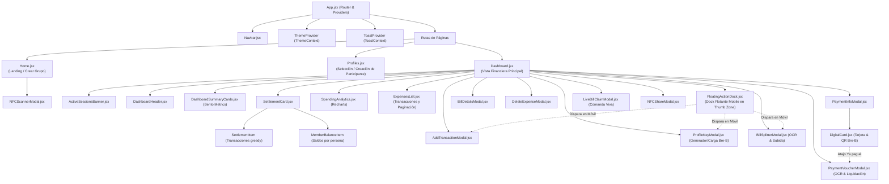

# Árbol y Jerarquía de Componentes Frontend (React 19)

El frontend de PaySync está modularizado bajo una arquitectura por capas basada en páginas (*Pages*), componentes orquestadores de dominio (*Dashboard Components*), elementos ergonómicos móviles (*Floating Action Dock*) y modales independientes con soporte adaptable de Bottom Sheet.

---

## Diagrama del Árbol de Componentes (Mermaid)

```mermaid
flowchart TD
    App["App.jsx (Router & Providers)"] --> Nav["Navbar.jsx"]
    App --> Theme["ThemeProvider (ThemeContext)"]
    App --> Toast["ToastProvider (ToastContext)"]
    
    App --> Pages["Rutas de Páginas"]
    Pages --> Home["Home.jsx\n(Landing / Crear Grupo)"]
    Pages --> ProfilesPage["Profiles.jsx\n(Selección / Creación de Participante)"]
    Pages --> Dash["Dashboard.jsx\n(Vista Financiera Principal)"]

    Home --> NFCScanM["NFCScannerModal.jsx"]
    
    Dash --> Banner["ActiveSessionsBanner.jsx"]
    Dash --> Header["DashboardHeader.jsx"]
    Dash --> SummaryCards["DashboardSummaryCards.jsx (Bento Metrics)"]
    Dash --> SettCard["SettlementCard.jsx"]
    Dash --> Analytics["SpendingAnalytics.jsx (Recharts)"]
    Dash --> ExpList["ExpensesList.jsx (Transacciones y Paginación)"]
    Dash --> FloatingDock["FloatingActionDock.jsx\n(Dock Flotante Mobile en Thumb Zone)"]

    SettCard --> SettItem["SettlementItem (Transacciones greedy)"]
    SettCard --> BalItem["MemberBalanceItem (Saldos por persona)"]

    Dash --> ModalAdd["AddTransactionModal.jsx"]
    Dash --> ModalProf["ProfileKeyModal.jsx (Generador/Carga Bre-B)"]
    Dash --> ModalBillD["BillDetailsModal.jsx"]
    Dash --> ModalDel["DeleteExpenseModal.jsx"]
    Dash --> ModalPay["PaymentInfoModal.jsx"]
    Dash --> ModalVoucher["PaymentVoucherModal.jsx (OCR & Liquidación)"]
    Dash --> ModalSplit["BillSplitterModal.jsx (OCR & Subida)"]
    Dash --> ModalLive["LiveBillClaimModal.jsx (Comanda Viva)"]
    Dash --> ModalNFC["NFCShareModal.jsx"]

    ModalPay --> DigCard["DigitalCard.jsx (Tarjeta & QR Bre-B)"]
    DigCard -.->|Atajo Ya pagué| ModalVoucher

    FloatingDock -.->|Dispara en Móvil| ModalAdd
    FloatingDock -.->|Dispara en Móvil| ModalProf
    FloatingDock -.->|Dispara en Móvil| ModalSplit
```

---

## Desglose de Componentes del Dashboard (`src/components/dashboard/`)

Durante la fase de modularización y posterior rediseño minimalista fluido, la vista de `Dashboard.jsx` se dividió en componentes desacoplados exportados uniformemente desde el barril `src/components/dashboard/index.js`:

### 1. `DashboardHeader.jsx`
- **Responsabilidad:** Encabezado contextual de la sala activa.
- **Funcionalidades:** Muestra el título de la sala, el selector de participante activo (*Me Profile*), la clave de acceso compartible y la botonera de acciones rápidas de escritorio (+ Añadir Gasto, Dividir Cuenta, Compartir vía NFC).

### 2. `DashboardSummaryCards.jsx`
- **Responsabilidad:** Cuadrícula de métricas clave con estética *Bento Grid*.
- **Indicadores Numéricos Estables:**
  - Utiliza `tabular-nums` para evitar oscilaciones de diseño ante sincronizaciones en tiempo real.
  - **Gasto Total:** Suma global de todas las compras y facturas del grupo.
  - **Cuota Equitativa (*Fair Share*):** Gasto promedio por persona ($Total / N$).
  - **Mi Balance:** Estado financiero del usuario activo (`Acreedor`, `Deudor`, `Al día`), con micro-badges dinámicos.

### 3. `SettlementCard.jsx`
- **Responsabilidad:** Visualización del plan óptimo de liquidación minimizado por el [[02_Backend/Algoritmo-Liquidacion|Algoritmo Greedy]].
- **Subcomponentes:**
  - `SettlementItem`: Fichas de transferencia individual (deudor paga acreedor con botón para abrir `PaymentInfoModal`).
  - `MemberBalanceItem`: Balances individuales desglosados de cada participante en el grupo.

### 4. `SpendingAnalytics.jsx`
- **Responsabilidad:** Inteligencia visual del consumo del grupo mediante la librería `recharts`.
- **Gráficos Integrados:**
  - **Distribución por Categorías:** Gráfico de pastel interactivo (Alimentación, Transporte, Alojamiento, Ocio, etc.).
  - **Historial Temporal:** Gráfico de barras acumulativo cronológico por fecha de gasto.

### 5. `ExpensesList.jsx`
- **Responsabilidad:** Registro histórico de movimientos financieros.
- **Capacidades:** Pestañas de filtrado (*Todos*, *Gastos*, *Transferencias*), indicador de comprobantes bancarios adjuntos (`voucher_url`), visor de desgloses con botón para abrir `BillDetailsModal` y acción de eliminación vía `DeleteExpenseModal`.

### 6. `ActiveSessionsBanner.jsx`
- **Responsabilidad:** Alerta contextual animada cuando otro usuario del grupo ha escaneado una factura y está abierta una sesión de [[02_Backend/WebSockets-Eventos|Comanda Viva]].

### 7. `FloatingActionDock.jsx`
- **Responsabilidad:** Dock flotante de navegación y acciones rápidas optimizado para el uso ergonómico con una sola mano en dispositivos móviles (*Thumb-Zone Ergonomics*).
- **Acciones Mapeadas:**
  - **`+ Gasto` (Central Prominente):** Botón circular con gradiente esmeralda sobreelevado que abre `AddTransactionModal.jsx` con micro-feedback `active:scale-[0.92]`.
  - **`Mi Llave / QR` (Lateral Izquierdo):** Acceso directo para abrir `ProfileKeyModal.jsx` y visualizar o configurar alias bancarios y códigos QR de cobro.
  - **`Dividir Factura` (Lateral Derecho):** Dispara `BillSplitterModal.jsx` para procesamiento con cámara u OCR.
- **Comportamiento Responsivo:**
  - Oculto en pantallas de escritorio (`md:hidden`).
  - Posicionamiento `fixed` en el borde inferior con margen adaptativo `env(safe-area-inset-bottom)`.
  - Superficie con desenfoque de cristal (`backdrop-blur-md`) y bordes milimétricos.

---

## Catálogo de Modales y Adaptación Bottom Sheet

Todos los componentes modales incorporan soporte responsivo híbrido: se presentan como ventanas modales centradas en pantallas de escritorio y se convierten automáticamente en **Bottom Sheets con tirador táctil (`.sheet-drag-handle`)** y animación elástica (`slideUpBottomSheet`) en pantallas móviles (`< 768px`):

| Componente Modal | Rol Funcional | Modo Desktop | Modo Mobile (< 768px) |
| :--- | :--- | :--- | :--- |
| `AddTransactionModal.jsx` | Registro rápido de gastos o transferencias individuales. | Modal Centrado | Bottom Sheet con tirador táctil |
| `BillSplitterModal.jsx` | Subida de ticket, Jimp + OCR y [[02_Backend/Pipeline-OCR-Vision|Pipeline Multimodal]]. | Modal Amplio (90vh) | Bottom Sheet de pantalla completa scrollable |
| `LiveBillClaimModal.jsx` | Reclamación interactiva de platos en tiempo real vía [[02_Backend/WebSockets-Eventos|WebSockets]]. | Modal Amplio | Bottom Sheet interactivo con selección táctil |
| `ProfileKeyModal.jsx` | Edición de clave bancaria (Bre-B, CVU, Nequi) y generación vectorial o carga de imagen QR. Ver [[03_Frontend/Generador-QR-Bre-B#1-configuración-de-llave-y-generador-vectorial-profilekeymodaljsx|Generador QR Bre-B]]. | Modal Centrado | Bottom Sheet con tirador táctil |
| `PaymentInfoModal.jsx` | Ficha de cobro del acreedor con copiado de alias y visualización QR mediante `DigitalCard.jsx`. | Modal Centrado | Bottom Sheet con tirador táctil |
| `PaymentVoucherModal.jsx` | Carga de comprobante de pago bancario, pre-escaneo OCR y liquidación automática. Ver [[03_Frontend/Generador-QR-Bre-B#3-ergonomía-mobile-first-paymentvouchermodaljsx|PaymentVoucherModal]]. | Modal Centrado | Bottom Sheet con tirador táctil y tarjeta de deuda |
| `DeleteExpenseModal.jsx` | Diálogo de confirmación para eliminar una transacción registrada. | Modal Compacto | Bottom Sheet de acción rápida |
| `BillDetailsModal.jsx` | Visualización detallada de items de una factura ya consolidada. | Modal Centrado | Bottom Sheet con scroll inercial |
| `NFCScannerModal.jsx` | Lectura de tarjetas o terminales mediante Web NFC API. | Modal Centrado | Bottom Sheet con animación de radar |
| `NFCShareModal.jsx` | Emulación y escritura de enlaces de sala mediante Web NFC API. | Modal Centrado | Bottom Sheet táctil |

---

## Navegación Rápida
- Regresar a: [[00_MOC_PaySync]]
- Módulo de Pagos Bre-B: [[03_Frontend/Generador-QR-Bre-B|Generador y Visualizador de Códigos QR Bre-B]]
- Estilos y Tokens: [[03_Frontend/Guia-Estilos-Tailwind|Sistema de Diseño y TailwindCSS]]
- Estado y Reactividad: [[03_Frontend/Gestion-Estado|Manejo del Estado]]
- Arquitectura General: [[01_Arquitectura/Vision-General|Visión General del Sistema]]
