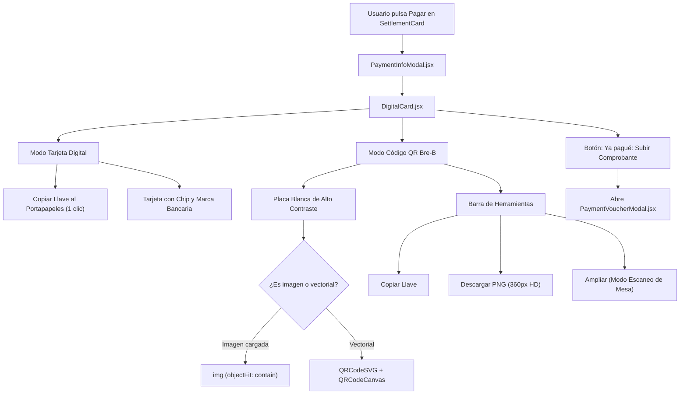
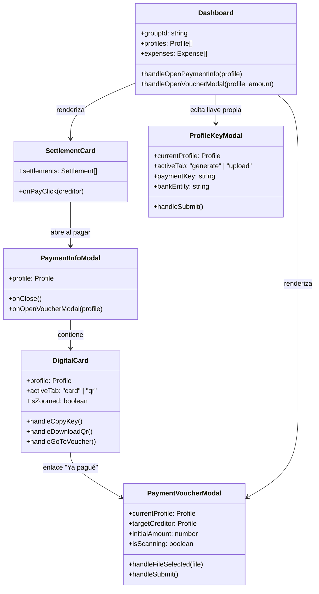

# Generador y Visualizador de Códigos QR Bre-B

La arquitectura de cobros y pagos inmediatos en PaySync integra el estándar interoperable colombiano **Bre-B**, combinando generación vectorial dinámica de códigos QR, soporte para capturas de pantalla oficiales emitidas por entidades bancarias, visualización de alta legibilidad en tarjetas digitales y un flujo ergonómico de liquidación adaptado a dispositivos móviles.

Este documento detalla los componentes del cliente web desarrollados en React 19 y Tailwind CSS para la configuración, renderizado e interacción con llaves y códigos QR de pago.

---

## 1. Configuración de Llave y Generador Vectorial: `ProfileKeyModal.jsx`

El componente modal `ProfileKeyModal.jsx` permite a cada participante de un grupo configurar su identidad de recaudo. Emplea un patrón de renderizado condicional con clave única (`key={currentProfile?.id}`) para garantizar el reinicio limpio de estado interno sin requerir sincronizaciones complejas vía `useEffect`.

### 1.1 Modalidad Dual: Vectorial vs Imagen Oficial

La interfaz ofrece dos pestañas conmutables mediante botones tipo pastilla (`tab-pill-btn`):

1. **Modo Generar QR Bre-B (`activeTab === 'generate'`):**
   - Construye una URI estandarizada conforme a las especificaciones del sistema de pagos inmediatos:
     $$\text{URI} = \text{bre-b://}\{\text{entidad}\}/\{\text{llave}\}$$
   - Soporta cuatro tipologías de llave colombiana:
     - **Celular:** Número de 10 dígitos (ej. `3001234567`).
     - **Cédula / Documento:** Identificación nacional (ej. `1020304050`).
     - **Correo Electrónico:** Dirección de correo válida.
     - **Llave Alfanumérica:** Código alfanumérico registrado en el directorio central de Bre-B.
   - Entidades financieras homologadas: Bre-B Interoperable, Bancolombia, Nequi, Daviplata, Dale y Nu Colombia.
   - **Renderizado Reactivo Vectorial:** Integra `QRCodeSVG` de la biblioteca `qrcode.react`:
     ```jsx
     <QRCodeSVG
       value={generatedQrPayload}
       size={150}
       level="M"
       fgColor="#0f172a"
       bgColor="#ffffff"
     />
     ```
     La vista previa se actualiza en tiempo real a medida que el usuario teclea su número o cambia de entidad financiera.

2. **Modo Subir Imagen de QR (`activeTab === 'upload'`):**
   - Diseñado para usuarios que disponen de la imagen oficial generada directamente desde su aplicación bancaria (capturas oficiales de Nequi, Bancolombia QR o Daviplata).
   - Zona interactiva de arrastrar y soltar (*drag-and-drop dropzone*) con validación de tipo MIME (`image/jpeg`, `image/png`, `image/webp`) y límite de 5 MB.
   - Carga multipart hacia el servidor mediante `POST /api/profiles/:id/upload-qr`.
   - Incluye campo de texto complementario para llave de pago de respaldo, facilitando el copiado manual a usuarios sin cámara disponible.

### 1.2 Persistencia de Datos de Pago

Al confirmar el formulario, los datos se almacenan en SQLite a través del endpoint `PUT /api/profiles/:id`:
- Si se utilizó el generador, el campo `payment_qr` almacena la URI vectorial `bre-b://...`.
- Si se utilizó la carga de imagen, el campo `payment_qr` almacena la ruta relativa del archivo en el servidor (`/uploads/qr/qr-...png`).

---

## 2. Visualización e Interacción: `DigitalCard.jsx` y `PaymentInfoModal.jsx`

El componente `DigitalCard.jsx` actúa como la interfaz interactiva central cuando un participante necesita transferir dinero a otro miembro del grupo. Se presenta encapsulado dentro del diálogo `PaymentInfoModal.jsx`.



### 2.1 Modo Tarjeta Digital (`activeTab === 'card'`)
- Estética biomórfica de tarjeta financiera con degradado oscuro, patrón decorativo geométrico, indicador de tecnología sin contacto (*contactless waves*) y representación gráfica de microchip de seguridad.
- Llave de pago en tipografía monoespaciada tabular (`num-tabular`) con botón integrado para copiar al portapapeles (`navigator.clipboard.writeText`) y retroalimentación mediante notificación Toast.
- Distintivo dinámico de entidad (por ejemplo, identificando números celulares de 10 dígitos como cuenta Nequi/Bre-B).

### 2.2 Modo Código QR Bre-B (`activeTab === 'qr'`)
- **Placa de Alto Contraste:** El código QR se posiciona sobre un contenedor blanco rígido (`#ffffff`) con esquinas redondeadas y sombra difusa (`0 8px 24px rgba(0,0,0,0.15)`). Esta configuración maximiza la tasa de éxito de lectura en pantallas OLED o en condiciones de baja luminosidad ambiente.
- **Doble Renderizado Vectorial y Canvas:**
  - Renderiza `QRCodeSVG` para una nitidez vectorial perfecta e independiente de la densidad de píxeles del monitor.
  - Mantiene un nodo oculto `QRCodeCanvas` (`display: none`, tamaño de 360 px y corrección de error nivel `M`) utilizado para la exportación directa a formato de imagen PNG sin necesidad de realizar peticiones adicionales al servidor.
- **Barra de Acciones Rápidas:**
  - **Copiar Llave:** Copia el identificador al portapapeles.
  - **Descargar:** Exporta el código QR en archivo PNG en alta definición (`QR_BreB_[Nombre].png`) o descarga el archivo oficial si fue subido previamente.
  - **Ampliar (Lightbox):** Abre una capa superpuesta a pantalla completa (`fixed inset-0`) con fondo oscurecido y desenfoque por software (`backdrop-filter: blur(8px)`). Presenta el código QR a un tamaño ampliado de 250 px, idóneo para ser escaneado directamente desde la pantalla por otros comensales sentados a distancia en una mesa.

### 2.3 Acceso Rápido hacia Liquidación

En la base de la tarjeta digital se ubica el botón destacado:
```
[ Ya pagué: Subir Comprobante ]
```
Este acceso directo transfiere el contexto del perfil receptor (`profile`), emite el callback `onOpenVoucherModal(profile)` y cierra la tarjeta para desplegar sin fricción el modal de comprobantes.

---

## 3. Ergonomía Mobile-First: `PaymentVoucherModal.jsx`

El registro de un comprobante de pago es una operación ejecutada predominantemente desde dispositivos móviles tras realizar la transferencia en la app del banco.

Por este motivo, `PaymentVoucherModal.jsx` implementa una arquitectura híbrida:

- **En Escritorio (> 640px):** Diálogo modal flotante centrado con ancho restringido a 540 px.
- **En Móviles (<= 640px):** Hoja inferior deslizante (*Bottom Sheet*) anclada al borde inferior de la pantalla, con tirador superior táctil (`.sheet-drag-handle`) adaptado a la zona de alcance del pulgar (*Thumb Zone*).

### 3.1 Tarjeta Informativa de Flujo de Deuda

Antes de solicitar el archivo, el modal presenta un resumen consolidado de la obligación:

```
[ Usuario (Tú) ]  --->  [ Destinatario ]    (Llave: 3109876543)
Deuda pendiente sugerida:                    $ 50.000 COP
```

Esta información contextual garantiza que el usuario confirme a quién y cuánto dinero correspondía saldar antes de cargar el comprobante.

### 3.2 Pre-Escaneo Óptico Automatizado

Al seleccionar o soltar una captura de pantalla sobre la zona de carga:
1. El archivo se valida localmente (formatos JPEG, PNG, WebP y tamaño menor a 10 MB).
2. Se genera una vista previa instantánea con `URL.createObjectURL(file)`.
3. Se activa el estado `isScanning` mostrando un indicador giratorio (`Loader2 animate-spin`) con la leyenda:
   `"Analizando datos por OCR..."`.
4. El cliente despacha inmediatamente la imagen hacia `POST /api/expenses/scan-voucher`.
5. Al recibir la respuesta:
   - El monto detectado se asigna automáticamente al campo `amount`.
   - La referencia o comprobante bancario se asigna a `voucherRef`.
   - Si se identifica la entidad (ej. Nequi o Bancolombia), se renderiza una etiqueta de banco identificadora sobre la miniatura del comprobante.
   - Se muestra un Toast informativo: `"Comprobante analizado con éxito"`.

### 3.3 Verificación Manual No Bloqueante

La arquitectura favorece la autonomía del usuario. Aunque el OCR complete la extracción de forma automática:
- Los campos de texto permanecen abiertos y editables.
- Si el OCR no detecta el monto debido a reflejos o distorsiones, el sistema notifica al usuario con un Toast preventivo y le permite ingresar el valor numérico manualmente en Pesos Colombianos.
- Se puede sustituir o eliminar la captura con los botones "Cambiar" o "Eliminar" sin abandonar el modal.

### 3.4 Confirmación y Liquidación en Tiempo Real

El envío del formulario realiza una petición multipart a `POST /api/expenses/voucher-settlement`. Al completarse:
1. El comprobante queda archivado en el servidor bajo `/uploads/vouchers/`.
2. Se registra el gasto de tipo `transfer`.
3. El balance del deudor y del acreedor se actualizan de forma inmediata.
4. El WebSocket difunde `expense_added`, extinguiendo la deuda pendiente en la vista de todos los participantes conectados.
5. El modal se cierra y el usuario recibe la confirmación: `"Deuda liquidada y comprobante guardado"`.

---

## 4. Jerarquía de Componentes Frontend



---

## 5. Navegación Conceptual
- Ver especificación de endpoints y OCR: [[02_Backend/Comprobantes-Pago-OCR]]
- Ver catálogo general de componentes: [[03_Frontend/Arbol-Componentes]]
- Ver guía de estilos y clases utilitarias: [[03_Frontend/Guia-Estilos-Tailwind]]
- Regresar al índice: [[00_MOC_PaySync]]
