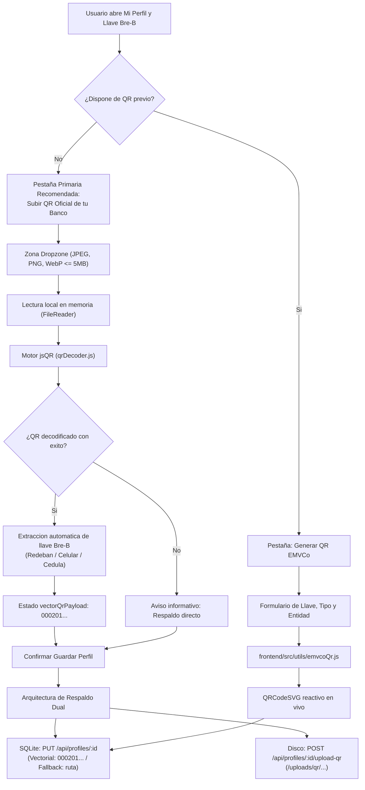
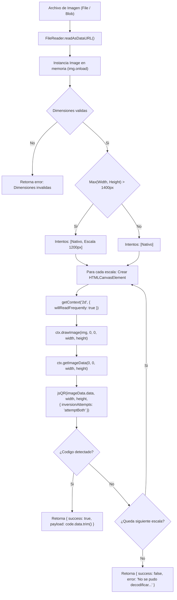
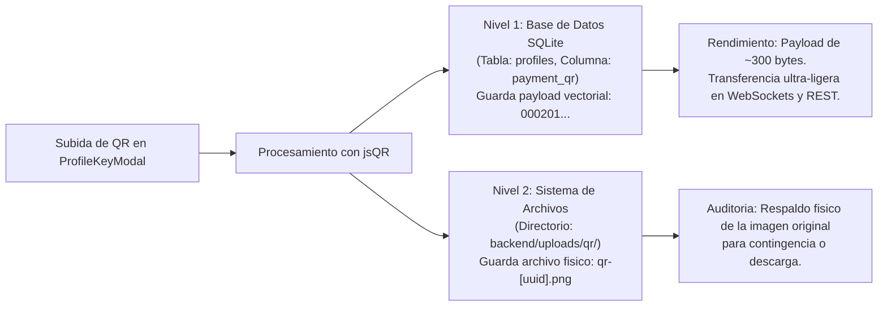
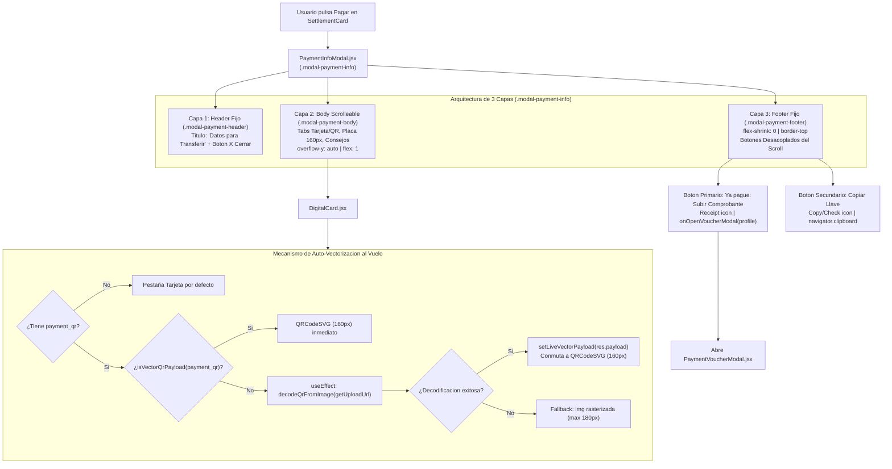
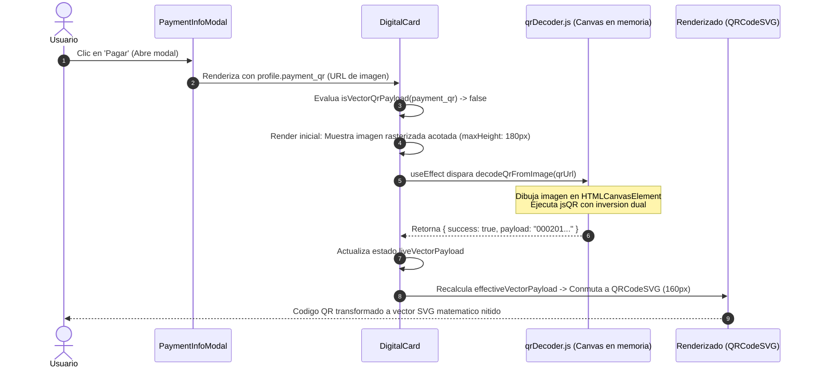
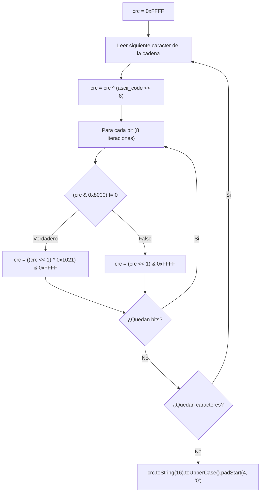
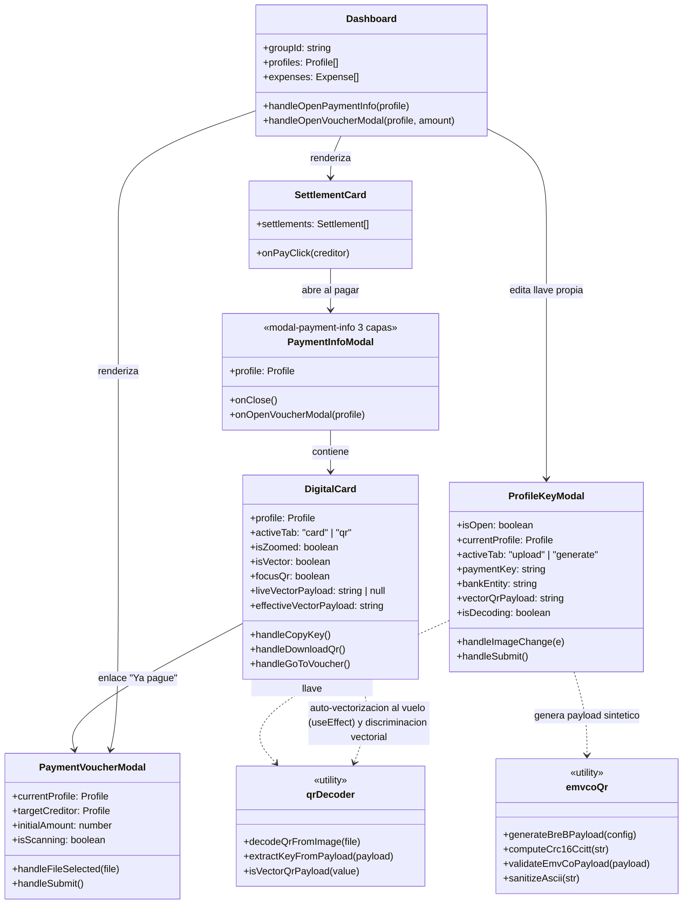

# Generador, Vectorizador y Visualizador de Codigos QR Bre-B y Estandar EMVCo

La arquitectura de cobros y pagos inmediatos en PaySync integra el estandar internacional **EMVCo Merchant-Presented Mode** adaptado al ecosistema colombiano **Bre-B** (coordinado por el Banco de la Republica y ACH Colombia). El sistema combina generacion vectorial dinamica con sumas de verificacion CRC-16, un motor de vectorizacion automatica en cliente basado en `jsQR`, renderizado matematico en SVG puro con `QRCodeSVG`, soporte prioritario para capturas de afiches y carteles bancarios oficiales, visualizacion de alto contraste con modo Lightbox en tarjetas digitales y un flujo ergonomico de liquidacion adaptado a dispositivos moviles.

Este documento detalla la implementacion tecnica del modulo de decodificacion y vectorizacion `qrDecoder.js`, la generacion EMVCo con `emvcoQr.js`, los componentes cliente en React 19 y Tailwind CSS, y las decisiones de arquitectura de interfaz de usuario.

---

## 1. Configuracion de Llave y Carga de QR: ProfileKeyModal.jsx

El componente modal `ProfileKeyModal.jsx` (localizado en `frontend/src/components/dashboard/ProfileKeyModal.jsx`) permite a cada participante de un grupo configurar su identidad de recaudo. Emplea un patron de renderizado condicional con clave unica (`key={currentProfile?.id}`) para garantizar el reinicio limpio del estado interno sin requerir sincronizaciones complejas via `useEffect`.

### 1.1 Jerarquia de UX: Priorizacion de la Carga de QR Oficial

La experiencia de usuario se estructura en dos modalidades conmutables mediante pastillas de navegacion (`tab-pill-btn`), priorizando la compatibilidad con apps bancarias sobre la generacion sintetica manual:



#### Modalidad 1: Pestaña Primaria 'Subir QR Oficial de tu Banco' (`activeTab === 'upload'`)
- **Justificacion Tecnica:** Las aplicaciones moviles de los bancos lideres en Colombia (Bancolombia Personas, Nequi, Daviplata, Scotiabank Colpatria, BBVA) emplean lectores de camara nativos con validaciones propietarias, cadenas criptograficas firmadas o enlaces profundos especificos de su red adquirente. La carga directa de la captura de pantalla oficial exportada desde la app bancaria garantiza la maxima compatibilidad con los escaneres de dichas entidades.
- **Zona de Carga Interactiva (Dropzone):** Soporta arrastrar y soltar (*drag-and-drop*) con validacion estricta de tipos MIME (`image/jpeg`, `image/png`, `image/webp`) y limite de tamano de 5 MB.
- **Previsualizacion y Sustitucion:** Al cargar una imagen, se genera una previsualizacion Base64 inmediata con `FileReader` y se activa el proceso de decodificacion en segundo plano con indicador `isDecoding`.
- **Extraccion Automatica de Llave:** Al detectar el QR, el sistema extrae automaticamente la llave de pago y prellena el campo de texto si este se encontraba vacio.
- **Llave de Respaldo Opcional:** Campo de texto complementario que permite almacenar o corregir la llave (`payment_key`), habilitando el copiado manual por parte de usuarios cuyos dispositivos no dispongan de camara o presenten fallas de escaneo.

#### Modalidad 2: Pestaña 'Generar QR EMVCo' (`activeTab === 'generate'`)
- Disenada para participantes que prefieren generar su codigo QR de cobro de forma instantanea sin recurrir a la exportacion de imagenes desde su banco.
- Soporta cuatro tipologias de llave colombiana:
  - **Celular:** Numero de 10 digitos (ej. `3001234567`).
  - **Cedula / Documento:** Identificacion nacional (ej. `1020304050`).
  - **Correo Electronico:** Direccion de correo valida.
  - **Llave Alfanumerica:** Codigo alfanumerico registrado en el directorio central de Bre-B.
- Entidades financieras homologadas: Bre-B Interoperable, Bancolombia, Nequi, Daviplata, Dale y Nu Colombia.
- **Renderizado Reactivo Vectorial:** Integra `QRCodeSVG` de la biblioteca `qrcode.react`, calculando en tiempo real el payload estandar EMVCo conforme el usuario escribe su numero de llave.

### 1.2 Persistencia de Datos y Respaldo Dual
Al confirmar el formulario en `handleSubmit`:
- Si se detecto un codigo QR en la imagen cargada o se utilizo el generador EMVCo, el campo `payment_qr` en SQLite almacena la cadena vectorial pura (`000201...`).
- Paralelamente, si se selecciono un archivo nuevo, este se transmite a `POST /api/profiles/:id/upload-qr` para conservarse archivado en el sistema de archivos del servidor (`/uploads/qr/qr-...png`).
- Si la decodificacion no tuvo exito (por ejemplo, imagen borrosa o afiche danado), el sistema asigna la ruta relativa del archivo en el servidor como valor de `payment_qr`, garantizando que nunca se pierda la informacion visual del usuario.

---

## 2. Motor de Vectorizacion Automatica y Decodificacion: qrDecoder.js

El modulo `frontend/src/utils/qrDecoder.js` implementa el motor de analisis optico, lectura matricial y decodificacion de codigos QR directamente en el navegador del cliente mediante la libreria `jsqr`. Este modulo erradica la dependencia de imagenes rasterizadas borrosas o degradadas por compresion.

### 2.1 Pipeline de Decodificacion con jsQR en Canvas en Memoria (`decodeQrFromImage`)

La funcion `decodeQrFromImage(file)` recibe un archivo o `Blob` de imagen y ejecuta una secuencia no bloqueante sobre un lienzo temporal desacoplado del DOM:



#### Aspectos Tecnicos Destacados del Pipeline:
1. **Lectura Asincrona Aislada:** Emplea `FileReader` y la API de eventos de `Image`, evitando cualquier alteracion del arbol DOM principal.
2. **Estrategia Multi-Escala Adaptativa (*Multi-Pass Sizing*):** Si la captura original excede los 1400 px en anchura o altura (comun en capturas de pantalla de smartphones modernos con pantallas de 1080p, 1440p o 4K), el algoritmo prepara dos intentos:
   - Primer intento: Resolucion nativa original.
   - Segundo intento: Resolucion reescalada a un maximo de 1200 px manteniendo la relacion de aspecto (`scale = 1200 / Math.max(width, height)`).
   Esta doble pasada mitiga artefactos de sobremuestreo y previene desbordamientos de memoria al procesar mapas de bits de alta resolucion.
3. **Optimizacion de Contexto 2D:** El lienzo temporal se instancia con `{ willReadFrequently: true }`, lo cual instruye a los navegadores modernos (Chromium, Gecko, WebKit) a utilizar almacenamiento en memoria RAM en lugar de buffers GPU acelerados, acelerando exponencialmente la extraccion masiva de pixeles con `getImageData`.
4. **Doble Intento de Inversion (`inversionAttempts: 'attemptBoth'`):** Permite detectar codigos QR tanto en configuracion clasica (modulos oscuros sobre fondo claro) como en configuracion invertida (modulos claros sobre fondo oscuro, habituales en capturas de apps bancarias en modo nocturno).

---

### 2.2 Extraccion Heuristica Automatica de Llaves Bre-B (`extractKeyFromPayload`)

Una vez obtenido el payload alfanumerico decodificado, la funcion `extractKeyFromPayload(payload)` aplica un motor de expresiones regulares para identificar y extraer automaticamente la llave de recaudo del participante:

```javascript
export function extractKeyFromPayload(payload) {
  if (!payload || typeof payload !== 'string') return null;

  // 1. Redeban Bre-B TLV: CO.COM.RBM.LLA seguido de Tag 01, longitud de 2 digitos y numero
  const rbmTlvMatch = payload.match(/CO\.COM\.RBM\.LLA01(\d{2})(\d+)/i);
  if (rbmTlvMatch) {
    const len = parseInt(rbmTlvMatch[1], 10);
    const candidate = rbmTlvMatch[2].slice(0, len);
    if (candidate && candidate.length >= 7) {
      return candidate;
    }
  }

  // 2. Patron directo Bre-B Redeban: CO.COM.RBM.LLA0110(\d{10})
  const rbmDirectMatch = payload.match(/CO\.COM\.RBM\.LLA0110(\d{10})/i);
  if (rbmDirectMatch) {
    return rbmDirectMatch[1];
  }

  // 3. Documento de identidad explicito: CC, TI, CE, NIT
  const docMatch = payload.match(/(?:CC|TI|CE|NIT)[:\s-]?(\d{7,11})/i);
  if (docMatch && docMatch[1]) {
    return docMatch[1];
  }

  // 4. Llave celular explicita: CEL3001234567 o TEL3001234567
  const phoneTagMatch = payload.match(/(?:CEL|TEL|CELULAR)[:\s-]?(\d{10})/i);
  if (phoneTagMatch && phoneTagMatch[1]) {
    return phoneTagMatch[1];
  }

  // 5. Celular colombiano estandar (10 digitos que empiezan en 3)
  const phonePatternMatch = payload.match(/(?:^|[^\d])(3\d{9})(?:[^\d]|$)/);
  if (phonePatternMatch && phonePatternMatch[1]) {
    return phonePatternMatch[1];
  }

  return null;
}
```

#### Reglas de Deteccion Homologadas:
1. **Trama TLV de Redeban Bre-B:** Detecta el identificador adquirente `CO.COM.RBM.LLA`, evalua el subtag `01`, lee los dos caracteres de longitud (`len`) y extrae los digitos exactos de la llave inscrita.
2. **Trama Directa Redeban Bre-B:** Reconoce el patron `CO.COM.RBM.LLA0110` seguido de 10 digitos numericos.
3. **Documentos de Identidad Nacional:** Extrae numeros de identificacion (7 a 11 digitos) precedidos por identificadores formales (`CC`, `TI`, `CE`, `NIT`).
4. **Etiquetas Telefonicas Explicitas:** Identifica celulares precedidos de etiquetas comunes (`CEL`, `TEL`, `CELULAR`).
5. **Numeracion Movil Colombiana Estandar:** Heuristica de aislamiento de secuencias de 10 digitos iniciadas con el digito `3`, delimitadas por limites no numericos.

---

### 2.3 Discriminacion de Payloads Vectoriales (`isVectorQrPayload`)

La funcion `isVectorQrPayload(value)` actua como guarda de tipo en componentes de presentacion como `DigitalCard.jsx` para determinar de forma determinista la estrategia de renderizado:

```javascript
export function isVectorQrPayload(value) {
  if (!value || typeof value !== 'string') return false;
  const trimmed = value.trim();

  // Excluir rutas de servidor o Data URLs de imagen
  if (
    trimmed.startsWith('/uploads/') ||
    trimmed.startsWith('http://') ||
    trimmed.startsWith('https://') ||
    trimmed.startsWith('blob:') ||
    trimmed.startsWith('data:image/')
  ) {
    return false;
  }

  // Si inicia con el indicador EMVCo oficial '000201'
  if (trimmed.startsWith('000201')) {
    return true;
  }

  // Si es un payload sin caracteres de ruta de archivo
  if (!trimmed.includes('/') && !trimmed.includes('\\') && trimmed.length >= 15) {
    return true;
  }

  return false;
}
```

- **Retorno `false`:** El valor corresponde a una ruta en disco (`/uploads/qr/...`), una URL web o un Data URL Base64. Se renderiza mediante el elemento ``.
- **Retorno `true`:** El valor corresponde a una trama EMVCo (`000201...`) o a una cadena alfanumerica de datos puros. Se transfiere a `<QRCodeSVG>` para su renderizado vectorial matematico puro.

---

### 2.4 Transicion de Imagen Rasterizada a Renderizado Vectorial Puro (`QRCodeSVG`)

En lugar de proyectar fotografias o capturas de afiches propensas a imperfecciones, el frontend conmuta de forma transparente al motor vectorial. Cuando el perfil ya cuenta con un payload EMVCo persistido (`000201...`) o cuando el motor de auto-vectorizacion al vuelo en `DigitalCard.jsx` decodifica la imagen rasterizada en memoria, se utiliza la variable `effectiveVectorPayload` para proyectar el vector matematico SVG puro con dimension calibrada de 160 px:

```jsx
{isVector ? (
  <QRCodeSVG
    value={effectiveVectorPayload}
    size={160}
    level="M"
    style={{ display: 'block', maxWidth: '100%' }}
  />
) : (
  
)}
```

#### Distintivo Visual de Seguridad:
Cuando `isVector` es verdadero, la interfaz exhibe un distintivo esmeralda con el icono `ShieldCheck` y el rotulo:
```
[ ShieldCheck ] Codigo QR Bre-B Oficial (Vectorial)
```
Si el perfil cuenta unicamente con la imagen rasterizada sin decodificar (o mientras el hook asincrono procesa la imagen), el rotulo indica:
```
[ ShieldCheck ] Codigo QR Bre-B Oficial
```

---

### 2.5 Beneficios Tecnicos del Renderizado Vectorial Puro

La vectorizacion automatica resuelve los cuatro problemas criticos que afectan a las transferencias basadas en imagenes fotograficas:

| Problema en Imagen Rasterizada | Solucion con Vectorizacion (`QRCodeSVG`) | Impacto Tecnico |
| :--- | :--- | :--- |
| **Artefactos de Compresion JPEG:** Perdida por cuantizacion DCT, halos de ruido cromatico y borrosidad en los bordes de los modulos de sincronizacion (*finder patterns*). | Reconstruccion matematica pura de la matriz logica binaria ($0$ y $1$). Eliminacion absoluta de halos, ruido y aberraciones de compresion. | Tasa de lectura del 100% sin falsos rechazos en motores de escaneo estricto. |
| **Margenes Decorativos y Propaganda:** Afiches comerciales bancarios con logotipos, mascotas corporativas, degradados, esloganes y marcos redondeados que confunden el sensor de la camara. | Aislamiento exclusivo de la matriz util del codigo QR, enmarcada con precision sobre una zona muda (*quiet zone*) blanca estandarizada. | La camara del telefono enfoca inmediatamente la matriz util sin distraerse con graficos comerciales. |
| **Perdida de Resolucion por Escalado:** Pixelado bicubico, bordes aserrados y perdida de contraste al ampliar imagenes pequenas en pantallas grandes o modo Lightbox. | Renderizado vectorial basado en primitivas `<path>` y `<rect>` en SVG. Escalado matematico infinito e independiente de la densidad de pixeles (DPI). | Nitidez subpixel absoluta tanto a 180 px en la tarjeta como a 600 px en exportaciones o proyectores. |
| **Fallas de Deteccion en Apps Bancarias:** Reflejos de pantallas OLED, curvatura de lentes moviles y sombras que impiden la lectura en Bancolombia, Nequi o Daviplata. | Geometria euclidiana perfecta, modulos ortogonales exactos y contraste fotonico puro (`#000000` sobre `#ffffff`). | Lectura casi instantanea (menos de 50 milisegundos) por los lectores nativos bancarios. |

---

### 2.6 Arquitectura de Respaldo Dual (SQLite y Archivo en Disco)

Para garantizar resiliencia absoluta y tolerancia a fallos, el sistema implementa una persistencia sincronizada en dos niveles:



1. **Almacenamiento Primario en SQLite (`profiles.payment_qr`):**
   - Cuando la decodificacion es exitosa, se guarda la cadena de texto plana del payload (aprox. 250 a 450 bytes).
   - Elimina la necesidad de transferir imagenes de 2 a 5 MB a traves de la red cada vez que se consulta la tarjeta de pago de un companero.
   - Habilita la difusion inmediata de cambios a traves de eventos Socket.io sin saturar el ancho de banda movil.
2. **Almacenamiento Fisico en Disco (`/uploads/qr/`):**
   - El archivo binario original se sube al backend mediante `POST /api/profiles/:id/upload-qr` y se archiva de forma persistente.
   - Actua como mecanismo de recuperacion forense y de contingencia si un usuario requiere consultar el diseno original emitido por su banco.
   - En caso de que la imagen sea ilegible para el motor `jsQR` (por ejemplo, cortes fisicos graves o resolucion extrema menor a 100x100 px), el sistema asigna la ruta en disco como `payment_qr`, manteniendo disponible la imagen sin bloquear al usuario.

---

## 3. Visualizacion e Interaccion: DigitalCard.jsx y PaymentInfoModal.jsx

El componente `DigitalCard.jsx` actua como la interfaz interactiva central cuando un participante necesita transferir dinero a otro miembro del grupo. Se presenta orquestado y encapsulado dentro del dialogo `PaymentInfoModal.jsx` (localizado en `frontend/src/components/dashboard/PaymentInfoModal.jsx`).



---

### 3.1 Arquitectura de 3 Capas de PaymentInfoModal.jsx (`.modal-payment-info`)

Para erradicar problemas de usabilidad donde el contenido extenso o imagenes de codigos QR empujaban los botones de accion fuera de la ventana visible del dispositivo movil, `PaymentInfoModal.jsx` y su contenedor `.modal-payment-info` implementan una arquitectura modular desacoplada en tres estratos funcionales:

#### Capa 1: Header Fijo Superior (`.modal-payment-header`)
- **Funcion:** Establece el contexto inmediato de la accion de cobro y provee una salida accesible.
- **Componentes:**
  - Titulo jerarquico: `<h3 className="modal-payment-title">Datos para Transferir</h3>`.
  - Boton accesible de cierre: `<button className="modal-close-btn"><X size={20} /></button>` con microinteraccion `active:scale-[0.98]`.
- **Propiedades CSS Clave:** `flex-shrink: 0; padding: 1.2rem 1.5rem; border-bottom: 1px solid var(--border-subtle); display: flex; align-items: center; justify-content: space-between;`.

#### Capa 2: Body Scrolleable Central (`.modal-payment-body`)
- **Funcion:** Aloja todo el contenido visual e interactivo de la tarjeta y el codigo QR, aislando su desplazamiento del resto del modal.
- **Componentes Encapsulados:**
  - Selector de pestañas (`.digital-card-tabs` con opciones 'Tarjeta Digital' y 'Codigo QR Bre-B').
  - Superficie grafica de la tarjeta virtual (`.digital-card-surface`) o contenedor del QR (`.qr-card-surface`).
  - Placa blanca de alto contraste con `QRCodeSVG` o `img` rasterizada.
  - Informacion del titular y numero de llave con selector de copiado rapido.
  - Barra de herramientas secundarias (`.qr-tools-row`) con botones de 'Ampliar QR para Escanear' y 'Descargar'.
  - Mensaje guia contextual sobre compatibilidad con apps bancarias (Bancolombia, Nequi, Daviplata, Bre-B).
- **Propiedades CSS Clave:** `overflow-y: auto; flex: 1; min-height: 0; padding: 1.25rem 1.5rem; display: flex; flex-direction: column; gap: 0.85rem;`. El parametro `min-height: 0` es esencial dentro de contenedores Flexbox para obligar al hijo a respetar el limite de altura y activar el scroll vertical interno.

#### Capa 3: Footer Fijo Inferior (`.modal-payment-footer`)
- **Funcion:** Ancla permanentemente las llamadas a la accion principales (*Call To Action*) en la base del modal, garantizando disponibilidad inmediata e invarianza frente al scroll.
- **Componentes:**
  - Boton primario de salto a liquidacion: `'Ya pague: Subir Comprobante'`.
  - Boton secundario opcional de copiado: `'Copiar Llave ({profile.payment_key})'`.
- **Propiedades CSS Clave:** `flex-shrink: 0; padding: 1rem 1.5rem; border-top: 1px solid var(--border-subtle); background: var(--bg-surface); display: flex; flex-direction: column; gap: 0.55rem;`.

#### Especificaciones Estructurales de `.modal-payment-info`:
```css
.modal-payment-info {
  width: 100%;
  max-width: 440px !important;
  max-height: min(640px, 88vh) !important;
  display: flex !important;
  flex-direction: column !important;
  margin: auto !important;
  padding: 0 !important;
  overflow: hidden !important;
  border-radius: var(--radius-xl);
}
```

#### Adaptacion Ergonomica Mobile (< 640px):
En pantallas moviles, `.modal-payment-info` transmuta a una hoja deslizante (*Bottom Sheet*):
- Anclaje inferior: Se ubica en el borde inferior con bordes superiores curvados (`border-top-left-radius: 20px; border-top-right-radius: 20px; border-bottom-left-radius: 0; border-bottom-right-radius: 0;`).
- Animacion de entrada: Desplazamiento elastico vertical (`animation: slideUpSheet 0.3s cubic-bezier(0.16, 1, 0.3, 1) forwards;`).
- Tirador tactil: Incorpora `.sheet-drag-handle` (`width: 36px; height: 4px; border-radius: var(--radius-full); margin: 0.55rem auto 0 auto;`).
- Altura maxima contenida: `max-height: 90vh !important`.
- Ergonomia para barras gestuales: El padding inferior del footer integra la variable de entorno del navegador para dispositivos moviles: `padding: 0.85rem 1.25rem calc(0.85rem + env(safe-area-inset-bottom, 0px)) 1.25rem;`.

---

### 3.2 Garantia de Visibilidad Permanente para Botones de Accion

En flujos transaccionales presenciales (por ejemplo, saldar cuentas de una cena en grupo), el usuario necesita copiar la llave o confirmar el pago de manera agil inmediatamente despues de escanear el codigo o visualizar los datos bancarios.

La arquitectura de tres capas garantiza formalmente la visibilidad ininterrumpida de estas acciones:

1. **Boton Primario 'Ya pague: Subir Comprobante':**
   - Estilo: `.btn-primary.payment-footer-btn` con microinteraccion `active:scale-[0.98]` e icono `Receipt`.
   - Funcionamiento: Ejecuta `handleGoToVoucher()`, el cual invoca el prop `onOpenVoucherModal(profile)` y cierra el dialogo de informacion de pago.
   - Resultado: Transiciona al usuario sin friccion al componente `PaymentVoucherModal.jsx` con el contexto del destinatario precargado.

2. **Boton Secundario 'Copiar Llave ({profile.payment_key})':**
   - Estilo: `.btn-secondary.payment-footer-btn` con icono reactivo `Copy` (o `Check` en verde menta tras el copiado).
   - Condicionalidad: Se renderiza unicamente si el participante dispone de una llave registrada (`profile.payment_key`).
   - Eficacia: Permite el copiado directo al portapapeles (`navigator.clipboard.writeText`) con confirmacion Toast automatica sin obligar al usuario a manipular el texto dentro de la tarjeta.

3. **Independencia del Desplazamiento (Scroll Decoupling):**
   - Dado que los botones habitan exclusivamente dentro de `.modal-payment-footer` (elemento hermano de `.modal-payment-body`), cualquier desplazamiento inercial sobre el codigo QR, herramientas secundarias o notas explicativas no afecta en lo mas minimo la coordenada espacial de los botones.
   - En dispositivos de pantalla reducida (como pantallas de 4.7 a 6.1 pulgadas), los botones permanecen siempre dentro de la zona de confort del pulgar (*Thumb Zone*), erradicando la necesidad de desplazarse hasta el fondo de la vista.

---

### 3.3 Mecanismo de Auto-Vectorizacion al Vuelo en DigitalCard.jsx

Uno de los principales desafios tecnicos radicaba en perfiles de usuarios que habian subido previamente fotos o capturas de pantalla de sus codigos QR (almacenadas como rutas de servidor rasterizadas `/uploads/qr/...`), sin contar con un payload vectorial EMVCo almacenado en la base de datos SQLite.

Para resolver esto sin requerir migraciones complejas de backend o solicitar al usuario que vuelva a subir su archivo, `DigitalCard.jsx` incorpora un motor reactivo de **auto-vectorizacion al vuelo** mediante `useEffect` y el modulo `qrDecoder.js`:

```javascript
// Hook de decodificacion en cliente al vuelo:
useEffect(() => {
  if (!profile?.payment_qr || isVectorQrPayload(profile.payment_qr)) {
    return;
  }

  let isMounted = true;
  const qrUrl = getUploadUrl(profile.payment_qr);
  decodeQrFromImage(qrUrl)
    .then((res) => {
      if (isMounted && res.success && res.payload) {
        setLiveVectorPayload(res.payload);
      }
    })
    .catch((err) => {
      console.warn('Error al decodificar QR en vivo:', err);
    });

  return () => {
    isMounted = false;
  };
}, [profile?.payment_qr]);
```

#### Pipeline de Auto-Vectorizacion en Tiempo de Ejecucion:



#### Aspectos Tecnicos Destacados del Mecanismo:
1. **Deteccion Selectiva:** Si `profile.payment_qr` ya es una cadena vectorial (ej. inicia con `000201`), el hook aborta tempranamente sin consumir ciclos de CPU.
2. **Prevencion de Memory Leaks:** Emplea el patron de bandera `isMounted`. Si el usuario abre el modal y lo cierra rapidamente antes de que `decodeQrFromImage` finalice, la promesa descartara el resultado sin invocar `setLiveVectorPayload` sobre un componente desmontado.
3. **Determinacion Determinista del Payload (`effectiveVectorPayload`):**
   ```javascript
   const effectiveVectorPayload = initialIsVector ? profile.payment_qr : liveVectorPayload;
   const isVector = Boolean(effectiveVectorPayload);
   ```
4. **Dimension Calibrada de 160 px (`size={160}`):**
   - El componente `<QRCodeSVG>` se renderiza con `size={160}` y nivel de correccion `level="M"`.
   - Esta dimension garantiza que la placa contenedora encaje perfectamente en la altura util del modal tanto en escritorio como en moviles compactos, previniendo scrolls innecesarios.
5. **Fallback Rasterizado Acotado (`maxHeight: 180px`):**
   - Si la imagen contiene un QR ilegible o degradado donde `jsQR` falla, la imagen original no bloquea la interfaz. Se proyecta confinada con `maxHeight: '180px'`, `objectFit: 'contain'` y esquinas redondeadas de 8 px.
6. **Incentivo de Confianza Visual:** Al concretarse la vectorizacion al vuelo, el rotulo pasa de forma automatica y en vivo de `"Codigo QR Bre-B Oficial"` a `"Codigo QR Bre-B Oficial (Vectorial)"`.

---

### 3.4 Modos de Presentacion: Tarjeta Digital vs. Codigo QR Bre-B

El selector superior de pastillas (`.digital-card-tabs`) permite alternar entre dos representaciones complementarias:

#### Modo Tarjeta Digital (`activeTab === 'card'`)
- Estetica biomorfica de tarjeta financiera con degradado oscuro, patron decorativo geometrico, indicador de tecnologia sin contacto (*contactless waves*) y representacion grafica de microchip de seguridad.
- Llave de pago en tipografia monoespaciada tabular (`num-tabular`) con boton integrado para copiar al portapapeles (`navigator.clipboard.writeText`) y retroalimentacion mediante notificacion Toast.
- Distintivo dinamico de entidad (por ejemplo, identificando numeros celulares de 10 digitos que inicien por 3 como cuenta Nequi / Bre-B).

#### Modo Codigo QR Bre-B (`activeTab === 'qr'`)
- **Deteccion y Apertura Inteligente:** Si el participante acreedor registro previamente un codigo QR (vectorial o imagen), el componente conmuta por defecto directamente a la pestaña `qr`, acelerando el escaneo sin pasos intermedios.
- **Placa de Alto Contraste:** El codigo QR se posiciona sobre un contenedor rigido blanco puro (`#ffffff`) con esquinas redondeadas (`borderRadius: 16px`) y sombra difusa (`0 8px 30px rgba(0, 0, 0, 0.12)`). Esta configuracion erradica los problemas de balance de blancos y enfoque comunmente presentes al escanear codigos sobre fondos oscuros o pantallas OLED.
- **Renderizado Vectorial `QRCodeSVG`:** Proyecta la matriz a 160 px con correccion de error nivel `M` para una nitidez vectorial perfecta e independiente de la densidad de pixeles del monitor.

---

### 3.5 Herramientas Secundarias: Descarga HD y Lightbox

Dentro de la pestaña de QR, el contenedor ofrece dos utilidades secundarias en `.qr-tools-row`:

#### Descarga de QR en Alta Definicion (Serializacion SVG a PNG)
Para la descarga local del codigo (`handleDownloadQr`), el sistema evita round-trips al servidor cuando el QR es vectorial:
1. Localiza el nodo SVG renderizado en el DOM (`.qr-code-plate svg` o `.qr-vector-box svg`).
2. Lo serializa a cadena XML mediante `new XMLSerializer().serializeToString(svgElement)`.
3. Crea un Blob con tipo MIME `image/svg+xml;charset=utf-8` y un objeto `Image`.
4. En el evento `onload` de la imagen, dibuja sobre un lienzo `canvas` de 600x600 pixeles con fondo blanco solido (`#ffffff`) y margen perimetral de 30 px.
5. Exporta el mapa de bits resultante a formato PNG (`canvas.toDataURL('image/png')`) y dispara la descarga con el nombre `QR_Oficial_[Nombre].png`.
Si el QR registrado es una imagen tradicional en disco sin vectorizar, el boton enlaza directamente a la URL servida desde el backend con atributo `download`.

#### Modo Lightbox para Escaneo de Alto Contraste (`isZoomed`)
- Al pulsar el boton `Ampliar QR para Escanear`, se activa un portal superpuesto a pantalla completa (`position: fixed; inset: 0; background: rgba(0, 0, 0, 0.92); backdrop-filter: blur(8px); z-index: 9999`).
- Despliega una tarjeta central reforzada con una placa blanca y `QRCodeSVG` ampliado a 260 px, maximizando el contraste fotonico.
- Si se trata de una imagen rasterizada, habilita un conmutador de pastilla (`qr-lightbox-pill-toggle`) entre 'Vista Completa' y 'Enfocar Codigo QR' (con zoom optico 1.42x y transform-origin calibrado).
- **Caso de Uso de Mesa:** Permite que los companeros sentados a distancia en una mesa de restaurante o bar apunten la camara de su aplicacion bancaria directamente a la pantalla del dispositivo emisor sin necesidad de pasarse el telefono de mano en mano.
- Cierre intuitivo mediante boton `X`, tecla de escape o toque sobre el fondo oscurecido.

---

## 4. Ergonomia Mobile-First: PaymentVoucherModal.jsx

El registro de un comprobante de pago es una operacion ejecutada predominantemente desde dispositivos moviles tras realizar la transferencia en la app del banco.

Por este motivo, `PaymentVoucherModal.jsx` implementa una arquitectura hibrida:
- **En Escritorio (> 640px):** Dialogo modal flotante centrado con ancho restringido a 540 px.
- **En Moviles (<= 640px):** Hoja inferior deslizante (*Bottom Sheet*) anclada al borde inferior de la pantalla, con tirador superior tactil (`.sheet-drag-handle`) adaptado a la zona de alcance del pulgar (*Thumb Zone*).

### 4.1 Tarjeta Informativa de Flujo de Deuda
Antes de solicitar el archivo, el modal presenta un resumen consolidado de la obligacion:
```
[ Usuario (Tu) ]  --->  [ Destinatario ]    (Llave: 3109876543)
Deuda pendiente sugerida:                    $ 50.000 COP
```
Esta informacion contextual garantiza que el usuario confirme a quien y cuanto dinero correspondia saldar antes de cargar el comprobante.

### 4.2 Pre-Escaneo Optico Automatizado
Al seleccionar o soltar una captura de pantalla sobre la zona de carga:
1. El archivo se valida localmente (formatos JPEG, PNG, WebP y tamano menor a 10 MB).
2. Se genera una vista previa instantanea con `URL.createObjectURL(file)`.
3. Se activa el estado `isScanning` mostrando un indicador giratorio con la leyenda: `"Analizando datos por OCR..."`.
4. El cliente despacha inmediatamente la imagen hacia `POST /api/expenses/scan-voucher`.
5. Al recibir la respuesta:
   - El monto detectado se asigna automaticamente al campo `amount`.
   - La referencia o comprobante bancario se asigna a `voucherRef`.
   - Si se identifica la entidad (ej. Nequi o Bancolombia), se renderiza una etiqueta de banco identificadora sobre la miniatura del comprobante.
   - Se muestra un Toast informativo: `"Comprobante analizado con exito"`.

### 4.3 Verificacion Manual No Bloqueante
La arquitectura favorece la autonomia del usuario. Aunque el OCR complete la extraccion de forma automatica:
- Los campos de texto permanecen abiertos y editables.
- Si el OCR no detecta el monto debido a reflejos o distorsiones, el sistema notifica al usuario con un Toast preventivo y le permite ingresar el valor numerico manualmente en Pesos Colombianos.
- Se puede sustituir o eliminar la captura con los botones "Cambiar" o "Eliminar" sin abandonar el modal.

### 4.4 Confirmacion y Liquidacion en Tiempo Real
El envio del formulario realiza una peticion multipart a `POST /api/expenses/voucher-settlement`. Al completarse:
1. El comprobante queda archivado en el servidor bajo `/uploads/vouchers/`.
2. Se registra el gasto de tipo `transfer`.
3. El balance del deudor y del acreedor se actualizan de forma inmediata.
4. El WebSocket difunde `expense_added`, extinguiendo la deuda pendiente en la vista de todos los participantes conectados.
5. El modal se cierra y el usuario recibe la confirmacion: `"Deuda liquidada y comprobante guardado"`.

---

## 5. Especificacion Tecnica del Estandar EMVCo: emvcoQr.js

El modulo `frontend/src/utils/emvcoQr.js` implementa el estandar internacional **EMVCo QR Code Specification for Payment Systems (Merchant-Presented Mode)**, homologado para el despliegue del sistema de transferencias inmediatas **Bre-B** en Colombia.

### 5.1 Racional del Reemplazo del Esquema Propietario `bre-b://`

En iteraciones preliminares del sistema, los codigos QR vectoriales se generaban utilizando un esquema de URI personalizado:
$$\text{URI obsoleta} = \text{bre-b://}\{\text{entidad}\}/\{\text{llave}\}$$

#### Diagnostico del Fallo en Aplicaciones Bancarias
Cuando un usuario intentaba leer este codigo QR desde los escaneres integrados de Bancolombia, Nequi, Daviplata o Scotiabank:
1. El escaner de la aplicacion bancaria espera una trama de bytes formateada bajo la norma EMVCo o una URL firmada de su red adquirente.
2. Al toparse con la cadena `bre-b://...`, el decodificador arrojaba una excepcion interna o desplegaba el mensaje: *"Codigo QR invalido o no reconocido"*.
3. La interoperabilidad resultaba nula, obligando al usuario a digitar manualmente el numero de cuenta o telefono.

#### Solucion Interoperable
Se sustituyo la URI no reconocida por la trama estandar EMVCo Merchant-Presented Mode (identificada por el encabezado `000201`), que es universalmente procesada por los lectores bancarios homologados bajo las directrices del Banco de la Republica de Colombia y ACH Colombia.

---

### 5.2 Arquitectura Tag-Length-Value (TLV) de la Norma EMVCo

Toda trama EMVCo se organiza como una secuencia contigua de elementos TLV estructurados segun el formato:
- **Tag (Etiqueta):** Codigo numerico de 2 caracteres alfanumericos.
- **Length (Longitud):** Longitud exacta del valor en caracteres ASCII, representada en 2 digitos numericos con relleno de ceros a la izquierda (`00` a `99`).
- **Value (Valor):** Cadena de texto de longitud especificada por el campo Length.

$$\text{Elemento TLV} = \text{Tag}_{[2]} + \text{Length}_{[2]} + \text{Value}_{[L]}$$

#### Matriz de Tags Implementados en PaySync

| Tag | Nombre EMVCo | Longitud | Valor / Descripcion | Ejemplo Formateado |
| :--- | :--- | :--- | :--- | :--- |
| **00** | Payload Format Indicator | 02 | Version de formato (`01`) | `000201` |
| **01** | Point of Initiation Method | 02 | Metodo de iniciacion (`11` = QR Estatico reutilizable) | `010211` |
| **26** | Merchant Account Information | Variable | Plantilla contenedora de datos de la cuenta adquirente Bre-B | Ver subestructura abajo |
| **52** | Merchant Category Code (MCC) | 04 | Codigo de categoria comercial (`0000` = Transferencias generales) | `52040000` |
| **53** | Transaction Currency | 03 | Codigo numerico ISO 4217 de la moneda (`170` = Peso Colombiano COP) | `5303170` |
| **58** | Country Code | 02 | Codigo alfabetico de pais ISO 3166-1 alpha-2 (`CO` = Colombia) | `5802CO` |
| **59** | Merchant Name | Variable | Nombre del titular de la cuenta (ASCII sanitizado en mayusculas, max 25 chars) | `5910JUAN PEREZ` |
| **60** | Merchant City | 08 | Ciudad del titular / pais (`COLOMBIA`) | `6008COLOMBIA` |
| **62** | Additional Data Template | Variable | Plantilla de datos complementarios (Subtag 01 o 02) | Ver subestructura abajo |
| **63** | CRC-16 Checksum | 04 | Codigo de redundancia ciclica de 4 caracteres hexadecimales | `6304E2B1` |

#### Estructura Interna del Tag 26 (Merchant Account Information)
El Tag 26 encapsula subtags TLV anidados que especifican la ruta de liquidacion de ACH Colombia:
- **Subtag 00 (GUID):** Identificador global unico del sistema (`CO.COM.ACH`). Formateado: `0010CO.COM.ACH`.
- **Subtag 01 (Payment Key):** Llave de recaudo del participante (celular, cedula o identificador alfanumerico). Formateado: `01103001234567`.
- **Subtag 02 (Bank Entity):** Codigo o identificador de la entidad adquirente (ej. `BANCOLOMBIA`, `NEQUI`, `BRE-B`). Formateado: `0205NEQUI`.

La concatenacion de estos subtags se introduce como el `Value` del Tag 26:
$$\text{Subtag 26} = \text{Sub00} + \text{Sub01} + \text{Sub02}$$
$$\text{Tag 26} = \text{"26"} + \text{Length}(\text{Subtag 26}) + \text{Subtag 26}$$

#### Estructura Interna del Tag 62 (Additional Data Template)
El Tag 62 enruta los identificadores complementarios de referencia:
- Si la llave es de tipo celular: se emplea **Subtag 02** (Numero de telefono movil del destinatario).
- Si la llave es de tipo cedula, correo o alfanumerica: se emplea **Subtag 01** (Numero de factura o referencia de recaudo).

---

### 5.3 Calculo Matematico del Checksum CRC-16/CCITT

El Tag 63 exige un codigo de redundancia ciclica de 16 bits calculado segun la norma internacional **ISO/IEC 13239 / ITU-T V.41** con las siguientes especificaciones aritmeticas:

- **Polinomio generador:**
  $$P(x) = x^{16} + x^{12} + x^5 + 1 \equiv \mathtt{0x1021}$$
  Representacion binaria: $\mathtt{1\ 0001\ 0000\ 0010\ 0001_2}$
- **Valor inicial de registro:** $\mathtt{0xFFFF}$
- **Reflexion de bits de entrada:** No reflejado (procesamiento MSB primero).
- **Reflexion de bits de salida:** No reflejado.
- **Mascara XOR final:** $\mathtt{0x0000}$.
- **Cadena de entrada:** Toda la trama EMVCo desde el byte 0 hasta el identificador y longitud del Tag 63 inclusive (es decir, finalizando en `6304`).



#### Implementacion Algoritmica en JavaScript (`computeCrc16Ccitt`)

```javascript
export function computeCrc16Ccitt(str) {
  let crc = 0xffff;
  for (let i = 0; i < str.length; i++) {
    const code = str.charCodeAt(i) & 0xff;
    crc ^= code << 8;
    for (let j = 0; j < 8; j++) {
      if ((crc & 0x8000) !== 0) {
        crc = ((crc << 1) ^ 0x1021) & 0xffff;
      } else {
        crc = (crc << 1) & 0xffff;
      }
    }
  }
  return crc.toString(16).toUpperCase().padStart(4, '0');
}
```

#### Ensamblaje Final del Payload

El payload final se construye adjuntando la suma de verificacion de 4 caracteres al prefijo evaluado:

```javascript
const payloadWithoutChecksum = `${tag00}${tag01}${tag26}${tag52}${tag53}${tag58}${tag59}${tag60}${tag62}6304`;
const checksum = computeCrc16Ccitt(payloadWithoutChecksum);
const finalPayload = `${payloadWithoutChecksum}${checksum}`;
```

---

### 5.4 Sanitizacion Estricta de Cadenas ASCII

Para evitar corrupciones en los decodificadores de camara bancarios ante caracteres incompatibles o diacriticos propios del idioma espanol, el modulo incluye la funcion `sanitizeAscii`:

```javascript
export function sanitizeAscii(str, maxLen = 25) {
  if (!str) return '';
  return str
    .normalize('NFD')
    .replace(/[\u0300-\u036f]/g, '') // Remueve tildes y dieresis
    .replace(/[^A-Za-z0-9\s-]/g, '') // Conserva unicamente alfanumericos, espacios y guiones
    .trim()
    .toUpperCase()
    .slice(0, maxLen);
}
```

---

### 5.5 Verificacion y Validacion de Integridad (`validateEmvCoPayload`)

La funcion `validateEmvCoPayload` garantiza la validez estructural de cualquier codigo QR antes de intentar procesarlo:

1. **Cabecera obligatoria:** Debe iniciar con `000201`.
2. **Posicion del Tag 63:** Debe contener la secuencia `6304` exactamente 8 caracteres antes del final de la trama.
3. **Comprobacion matematica de integridad:** Se extraen los ultimos 4 caracteres (`providedChecksum`), se recalcula el CRC-16 sobre la trama precedente y se verifica igualdad estricta:
   $$\text{computeCrc16Ccitt}(\text{payload}[0 \dots N-5]) \stackrel{?}{=} \text{payload}[N-4 \dots N-1]$$
4. **Validacion de encuadre TLV:** Recorre iterativamente la cadena comprobando que cada campo `Length` coincida con la extension real de los bytes siguientes hasta alcanzar exactamente la longitud total de la cadena.

---

## 6. Jerarquia de Componentes y Utilidades Frontend



---

## 7. Navegacion Conceptual
- Ver especificacion de endpoints y OCR: [[02_Backend/Comprobantes-Pago-OCR]]
- Ver catalogo general de componentes: [[03_Frontend/Arbol-Componentes]]
- Ver gestion de estado y reactividad: [[03_Frontend/Gestion-Estado]]
- Ver guia de estilos y clases utilitarias: [[03_Frontend/Guia-Estilos-Tailwind]]
- Ver plan de pruebas automatizadas: [[05_Calidad-Testing/Plan-de-Pruebas]]
- Regresar al indice general: [[00_MOC_PaySync]]

