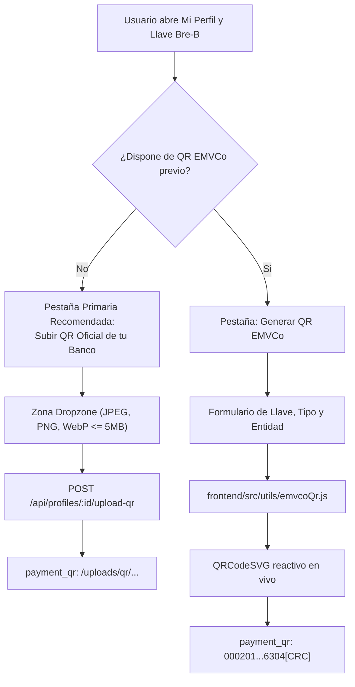
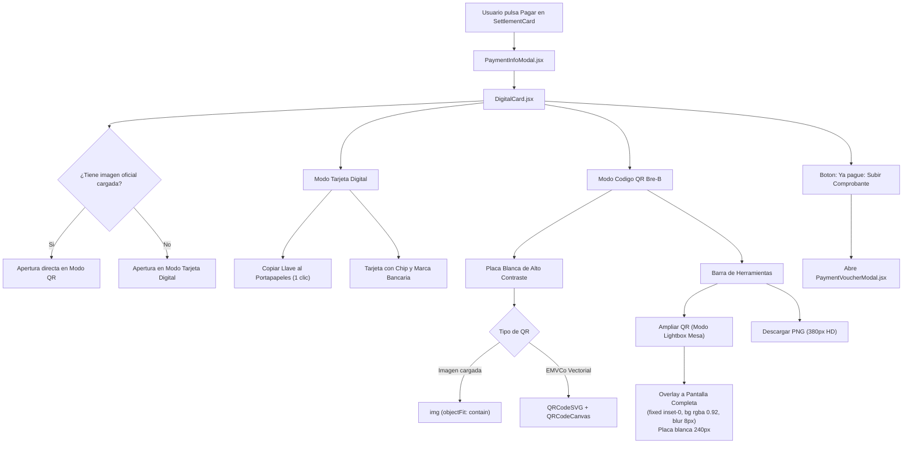
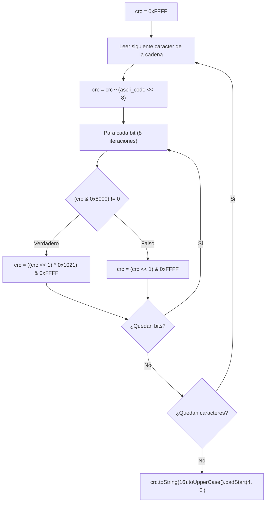
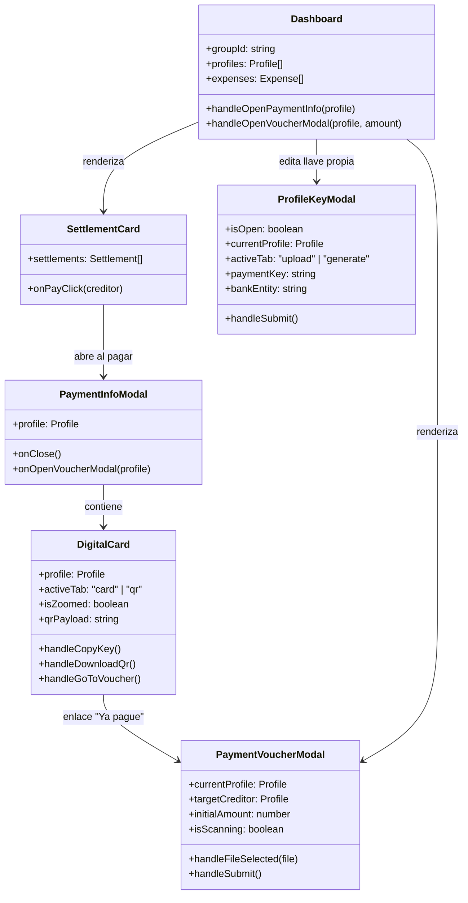

# Generador y Visualizador de Codigos QR Bre-B y Estandar EMVCo

La arquitectura de cobros y pagos inmediatos en PaySync integra el estandar internacional **EMVCo Merchant-Presented Mode** adaptado al ecosistema colombiano **Bre-B** (coordinado por el Banco de la Republica y ACH Colombia), combinando generacion vectorial dinamica con sumas de verificacion CRC-16, soporte prioritario para capturas de pantalla oficiales emitidas por entidades bancarias, visualizacion de alto contraste con modo Lightbox en tarjetas digitales y un flujo ergonomico de liquidacion adaptado a dispositivos moviles.

Este documento detalla la implementacion tecnica del modulo de generacion EMVCo, los componentes cliente en React 19 y Tailwind CSS, y las decisiones de arquitectura de interfaz de usuario.

---

## 1. Configuración de Llave y Generador Vectorial: ProfileKeyModal.jsx

El componente modal `ProfileKeyModal.jsx` (localizado en `frontend/src/components/dashboard/ProfileKeyModal.jsx`) permite a cada participante de un grupo configurar su identidad de recaudo. Emplea un patron de renderizado condicional con clave unica (`key={currentProfile?.id}`) para garantizar el reinicio limpio del estado interno sin requerir sincronizaciones complejas via `useEffect`.

### 1.1 Nueva Jerarquia de UX: Priorizacion de la Carga de QR Oficial

La experiencia de usuario se estructura en dos modalidades conmutables mediante pastillas de navegacion (`tab-pill-btn`), priorizando la compatibilidad sobre la generacion sintetica:



#### Modalidad 1: Pestaña Primaria 'Subir QR Oficial de tu Banco' (`activeTab === 'upload'`)
- **Justificacion Tecnica:** Las aplicaciones moviles de los bancos lideres en Colombia (Bancolombia Personas, Nequi, Daviplata, Scotiabank Colpatria, BBVA) emplean lectores de camara nativos con validaciones propietarias, cadenas criptograficas firmadas o enlaces profundos especificos de su red adquirente. La carga directa de la captura de pantalla oficial exportada desde la app bancaria garantiza una tasa de compatibilidad del 100% con los escaneres de dichas entidades.
- **Zona de Carga Interactiva (Dropzone):** Soporta arrastrar y soltar (*drag-and-drop*) con validacion estricta de tipos MIME (`image/jpeg`, `image/png`, `image/webp`) y limite de tamano de 5 MB.
- **Previsualizacion y Sustitucion:** Al cargar una imagen, se presenta en una placa blanca contenida con opcion de reemplazo en un clic o eliminacion completa via boton con icono `Trash2`.
- **Llave de Respaldo Opcional:** Campo de texto complementario que permite almacenar la llave alfanumerica o numerica (`payment_key`), habilitando el copiado manual por parte de usuarios cuyos dispositivos no dispongan de camara o presenten fallas de escaneo.
- **Persistencia Multipart:** El archivo se envia al endpoint `POST /api/profiles/:id/upload-qr`, retornando la ruta servible bajo `/uploads/qr/`.

#### Modalidad 2: Pestaña 'Generar QR EMVCo' (`activeTab === 'generate'`)
- Diseñada para participantes que prefieren generar su codigo QR de cobro de forma instantanea sin recurrir a la exportacion de imagenes desde su banco.
- Soporta cuatro tipologias de llave colombiana:
  - **Celular:** Numero de 10 digitos (ej. `3001234567`).
  - **Cedula / Documento:** Identificacion nacional (ej. `1020304050`).
  - **Correo Electronico:** Direccion de correo valida.
  - **Llave Alfanumerica:** Codigo alfanumerico registrado en el directorio central de Bre-B.
- Entidades financieras homologadas: Bre-B Interoperable, Bancolombia, Nequi, Daviplata, Dale y Nu Colombia.
- **Renderizado Reactivo Vectorial:** Integra `QRCodeSVG` de la biblioteca `qrcode.react`, calculando en tiempo real el payload estandar EMVCo conforme el usuario escribe su numero de llave.

### 1.2 Persistencia de Datos de Pago
Al confirmar el formulario, los datos se almacenan en SQLite a traves del endpoint `PUT /api/profiles/:id`:
- Si se utilizo el generador EMVCo, el campo `payment_qr` almacena la cadena estandar `000201...`.
- Si se utilizo la carga de imagen, el campo `payment_qr` almacena la ruta relativa del archivo en el servidor (`/uploads/qr/qr-...png`).

---

## 2. Visualizacion e Interaccion: DigitalCard.jsx y PaymentInfoModal.jsx

El componente `DigitalCard.jsx` actua como la interfaz interactiva central cuando un participante necesita transferir dinero a otro miembro del grupo. Se presenta encapsulado dentro del dialogo `PaymentInfoModal.jsx`.



### 2.1 Modo Tarjeta Digital (`activeTab === 'card'`)
- Estetica biomorfica de tarjeta financiera con degradado oscuro, patron decorativo geometrico, indicador de tecnologia sin contacto (*contactless waves*) y representacion grafica de microchip de seguridad.
- Llave de pago en tipografia monoespaciada tabular (`num-tabular`) con boton integrado para copiar al portapapeles (`navigator.clipboard.writeText`) y retroalimentacion mediante notificacion Toast.
- Distintivo dinamico de entidad (por ejemplo, identificando numeros celulares de 10 digitos que inicien por 3 como cuenta Nequi / Bre-B).

### 2.2 Modo Codigo QR Bre-B (`activeTab === 'qr'`)
- **Deteccion y Apertura Inteligente:** Si el participante acreedor registro previamente una imagen oficial de banco, el componente conmuta por defecto directamente a la pestaña `qr`, acelerando el escaneo sin pasos adicionales.
- **Placa de Alto Contraste:** El codigo QR se posiciona sobre un contenedor rigido blanco puro (`#ffffff`) con esquinas redondeadas (`borderRadius: 20px`) y sombra difusa (`0 8px 30px rgba(0, 0, 0, 0.12)`). Esta configuracion erradica los problemas de balance de blancos y enfoque comunmente presentes al escanear codigos sobre fondos oscuros o pantallas OLED.
- **Doble Renderizado Vectorial y Canvas:**
  - Renderiza `QRCodeSVG` a 184 px con correccion de error nivel `M` para una nitidez vectorial perfecta e independiente de la densidad de pixeles del monitor.
  - Mantiene un nodo oculto `QRCodeCanvas` (`display: none`, tamano de 380 px, correccion de error nivel `M`, `includeMargin: true`) empleado para la exportacion limpia a PNG (`handleDownloadQr`) sin requerir round-trips al servidor.
- **Modo Lightbox para Escaneo de Alto Contraste (`isZoomed`):**
  - Al pulsar el boton `Ampliar QR para Escanear`, se activa un portal superpuesto a pantalla completa (`position: fixed; inset: 0; background: rgba(0, 0, 0, 0.92); backdrop-filter: blur(8px); z-index: 9999`).
  - Despliega una tarjeta central reforzada con una placa blanca de 240 px, maximizando el contraste fotonico.
  - **Caso de Uso de Mesa:** Permite que los companeros sentados a distancia en una mesa de restaurante o bar apunten la camara de su aplicacion bancaria directamente a la pantalla del dispositivo emisor sin necesidad de pasarse el telefono de mano en mano.
  - Cierre intuitivo mediante boton `X`, tecla de escape o toque sobre el fondo oscurecido.

### 2.3 Acceso Rapido hacia Liquidacion
En la base de la tarjeta digital se ubica el boton destacado:
```
[ Ya pague: Subir Comprobante ]
```
Este acceso directo transfiere el contexto del perfil receptor (`profile`), emite el callback `onOpenVoucherModal(profile)` y cierra la tarjeta para desplegar sin friccion el modal de comprobantes.

---

## 3. Ergonomía Mobile-First: PaymentVoucherModal.jsx

El registro de un comprobante de pago es una operacion ejecutada predominantemente desde dispositivos moviles tras realizar la transferencia en la app del banco.

Por este motivo, `PaymentVoucherModal.jsx` implementa una arquitectura hibrida:
- **En Escritorio (> 640px):** Dialogo modal flotante centrado con ancho restringido a 540 px.
- **En Moviles (<= 640px):** Hoja inferior deslizante (*Bottom Sheet*) anclada al borde inferior de la pantalla, con tirador superior tactil (`.sheet-drag-handle`) adaptado a la zona de alcance del pulgar (*Thumb Zone*).

### 3.1 Tarjeta Informativa de Flujo de Deuda
Antes de solicitar el archivo, el modal presenta un resumen consolidado de la obligacion:
```
[ Usuario (Tu) ]  --->  [ Destinatario ]    (Llave: 3109876543)
Deuda pendiente sugerida:                    $ 50.000 COP
```
Esta informacion contextual garantiza que el usuario confirme a quien y cuanto dinero correspondia saldar antes de cargar el comprobante.

### 3.2 Pre-Escaneo Optico Automatizado
Al seleccionar o soltar una captura de pantalla sobre la zona de carga:
1. El archivo se valida localmente (formatos JPEG, PNG, WebP y tamano menor a 10 MB).
2. Se genera una vista previa instantanea con `URL.createObjectURL(file)`.
3. Se activa el estado `isScanning` mostrando un indicador giratorio (`Loader2 animate-spin`) con la leyenda: `"Analizando datos por OCR..."`.
4. El cliente despacha inmediatamente la imagen hacia `POST /api/expenses/scan-voucher`.
5. Al recibir la respuesta:
   - El monto detectado se asigna automaticamente al campo `amount`.
   - La referencia o comprobante bancario se asigna a `voucherRef`.
   - Si se identifica la entidad (ej. Nequi o Bancolombia), se renderiza una etiqueta de banco identificadora sobre la miniatura del comprobante.
   - Se muestra un Toast informativo: `"Comprobante analizado con exito"`.

### 3.3 Verificacion Manual No Bloqueante
La arquitectura favorece la autonomia del usuario. Aunque el OCR complete la extraccion de forma automatica:
- Los campos de texto permanecen abiertos y editables.
- Si el OCR no detecta el monto debido a reflejos o distorsiones, el sistema notifica al usuario con un Toast preventivo y le permite ingresar el valor numerico manualmente en Pesos Colombianos.
- Se puede sustituir o eliminar la captura con los botones "Cambiar" o "Eliminar" sin abandonar el modal.

### 3.4 Confirmacion y Liquidacion en Tiempo Real
El envio del formulario realiza una peticion multipart a `POST /api/expenses/voucher-settlement`. Al completarse:
1. El comprobante queda archivado en el servidor bajo `/uploads/vouchers/`.
2. Se registra el gasto de tipo `transfer`.
3. El balance del deudor y del acreedor se actualizan de forma inmediata.
4. El WebSocket difunde `expense_added`, extinguiendo la deuda pendiente en la vista de todos los participantes conectados.
5. El modal se cierra y el usuario recibe la confirmacion: `"Deuda liquidada y comprobante guardado"`.

---

## 4. Especificacion Tecnica del Estandar EMVCo: emvcoQr.js

El modulo `frontend/src/utils/emvcoQr.js` implementa el estandar internacional **EMVCo QR Code Specification for Payment Systems (Merchant-Presented Mode)**, homologado para el despliegue del sistema de transferencias inmediatas **Bre-B** en Colombia.

### 4.1 Racional del Reemplazo del Esquema Propietario `bre-b://`

En iteraciones preliminares del sistema, los codigos QR vectoriales se generaban utilizando un esquema de URI personalizado:
$$\text{URI obsoleta} = \text{bre-b://}\{\text{entidad}\}/\{\text{llave}\}$$

#### Diagnostico del Fallo en Aplicaciones Bancarias
Cuando un usuario intentaba leer este codigo QR desde los escaneres integrados de Bancolombia, Nequi, Daviplata o Scotiabank:
1. El escaner de la aplicacion bancaria espera una trama de bytes formateada bajo la norma EMVCo o una URL firmada de su red adquirente.
2. Al toparse con la cadena `bre-b://...`, el decodificador arrojaba una excepcion interna o desplegaba el mensaje: *"Codigo QR invalido o no reconocido"*.
3. La interoperabilidad resultaba nula, obligando al usuario a digitar manualmente el numero de cuenta o telefono.

#### Solucion Interoperable
Se sustituyo la URI no reconocida por la trama estandar EMVCo Merchant-Presented Mode (identificada por el encabezado `000201`), que es universalmente procesada por los lectores bancarios homologados bajo las directrices del Banco de la Republica de Colombia y ACH Colombia.

---

### 4.2 Arquitectura Tag-Length-Value (TLV) de la Norma EMVCo

Toda trama EMVCo se organiza como una secuencia contigua de elementos TLV estructurados segun el formato:
- **Tag (Etiqueta):** Codigo numerico de 2 caracteres alfanumericos.
- **Length (Longitud):** Longitud exacta del valor en caracteres ASCII, representada en 2 digitos numericos con relleno de ceros a la izquierda (`00` a `99`).
- **Value (Valor):** Cadena de texto de longitud especificada por el campo Length.

$$\text{Elemento TLV} = \text{Tag}_{[2]} + \text{Length}_{[2]} + \text{Value}_{[L]}$$

#### Matriz de Tags Implementados en PaySync

| Tag | Nombre EMVCo | Longitud | Valor / Descripcion | Ejemplo Formateado |
| :--- | :--- | :--- | :--- | :--- |
| **00** | Payload Format Indicator | 02 | Version de formato (`01`) | `000201` |
| **01** | Point of Initiation Method | 02 | Metodo de iniciacion (`11` = QR Estatico reutilizable) | `010211` |
| **26** | Merchant Account Information | Variable | Plantilla contenedora de datos de la cuenta adquirente Bre-B | Ver subestructura abajo |
| **52** | Merchant Category Code (MCC) | 04 | Codigo de categoria comercial (`0000` = Transferencias generales) | `52040000` |
| **53** | Transaction Currency | 03 | Codigo numerico ISO 4217 de la moneda (`170` = Peso Colombiano COP) | `5303170` |
| **58** | Country Code | 02 | Codigo alfabetico de pais ISO 3166-1 alpha-2 (`CO` = Colombia) | `5802CO` |
| **59** | Merchant Name | Variable | Nombre del titular de la cuenta (ASCII sanitizado en mayusculas, max 25 chars) | `5910JUAN PEREZ` |
| **60** | Merchant City | 08 | Ciudad del titular / pais (`COLOMBIA`) | `6008COLOMBIA` |
| **62** | Additional Data Template | Variable | Plantilla de datos complementarios (Subtag 01 o 02) | Ver subestructura abajo |
| **63** | CRC-16 Checksum | 04 | Codigo de redundancia ciclica de 4 caracteres hexadecimales | `6304E2B1` |

#### Estructura Interna del Tag 26 (Merchant Account Information)
El Tag 26 encapsula subtags TLV anidados que especifican la ruta de liquidacion de ACH Colombia:
- **Subtag 00 (GUID):** Identificador global unico del sistema (`CO.COM.ACH`). Formateado: `0010CO.COM.ACH`.
- **Subtag 01 (Payment Key):** Llave de recaudo del participante (celular, cedula o identificador alfanumerico). Formateado: `01103001234567`.
- **Subtag 02 (Bank Entity):** Codigo o identificador de la entidad adquirente (ej. `BANCOLOMBIA`, `NEQUI`, `BRE-B`). Formateado: `0205NEQUI`.

La concatenacion de estos subtags se introduce como el `Value` del Tag 26:
$$\text{Subtag 26} = \text{Sub00} + \text{Sub01} + \text{Sub02}$$
$$\text{Tag 26} = \text{"26"} + \text{Length}(\text{Subtag 26}) + \text{Subtag 26}$$

#### Estructura Interna del Tag 62 (Additional Data Template)
El Tag 62 enruta los identificadores complementarios de referencia:
- Si la llave es de tipo celular: se emplea **Subtag 02** (Numero de telefono movil del destinatario).
- Si la llave es de tipo cedula, correo o alfanumerica: se emplea **Subtag 01** (Numero de factura o referencia de recaudo).

---

### 4.3 Calculo Matematico del Checksum CRC-16/CCITT

El Tag 63 exige un codigo de redundancia ciclica de 16 bits calculado segun la norma internacional **ISO/IEC 13239 / ITU-T V.41** con las siguientes especificaciones aritmeticas:

- **Polinomio generador:**
  $$P(x) = x^{16} + x^{12} + x^5 + 1 \equiv \mathtt{0x1021}$$
  Representacion binaria: $\mathtt{1\ 0001\ 0000\ 0010\ 0001_2}$
- **Valor inicial de registro:** $\mathtt{0xFFFF}$
- **Reflexion de bits de entrada:** No reflejado (procesamiento MSB primero).
- **Reflexion de bits de salida:** No reflejado.
- **Mascara XOR final:** $\mathtt{0x0000}$.
- **Cadena de entrada:** Toda la trama EMVCo desde el byte 0 hasta el identificador y longitud del Tag 63 inclusive (es decir, finalizando en `6304`).



#### Implementacion Algoritmica en JavaScript (`computeCrc16Ccitt`)

```javascript
export function computeCrc16Ccitt(str) {
  let crc = 0xffff;
  for (let i = 0; i < str.length; i++) {
    const code = str.charCodeAt(i) & 0xff;
    crc ^= code << 8;
    for (let j = 0; j < 8; j++) {
      if ((crc & 0x8000) !== 0) {
        crc = ((crc << 1) ^ 0x1021) & 0xffff;
      } else {
        crc = (crc << 1) & 0xffff;
      }
    }
  }
  return crc.toString(16).toUpperCase().padStart(4, '0');
}
```

#### Ensamblaje Final del Payload

El payload final se construye adjuntando la suma de verificacion de 4 caracteres al prefijo evaluado:

```javascript
const payloadWithoutChecksum = `${tag00}${tag01}${tag26}${tag52}${tag53}${tag58}${tag59}${tag60}${tag62}6304`;
const checksum = computeCrc16Ccitt(payloadWithoutChecksum);
const finalPayload = `${payloadWithoutChecksum}${checksum}`;
```

---

### 4.4 Sanitizacion Estricta de Cadenas ASCII

Para evitar corrupciones en los decodificadores de camara bancarios ante caracteres incompatibles o diacriticos propios del idioma espanol, el modulo incluye la funcion `sanitizeAscii`:

```javascript
export function sanitizeAscii(str, maxLen = 25) {
  if (!str) return '';
  return str
    .normalize('NFD')
    .replace(/[\u0300-\u036f]/g, '') // Remueve tildes y dieresis
    .replace(/[^A-Za-z0-9\s-]/g, '') // Conserva unicamente alfanumericos, espacios y guiones
    .trim()
    .toUpperCase()
    .slice(0, maxLen);
}
```

---

### 4.5 Verificacion y Validacion de Integridad (`validateEmvCoPayload`)

La funcion `validateEmvCoPayload` garantiza la validez estructural de cualquier codigo QR antes de intentar procesarlo:

1. **Cabecera obligatoria:** Debe iniciar con `000201`.
2. **Posicion del Tag 63:** Debe contener la secuencia `6304` exactamente 8 caracteres antes del final de la trama.
3. **Comprobacion matematica de integridad:** Se extraen los ultimos 4 caracteres (`providedChecksum`), se recalcula el CRC-16 sobre la trama precedente y se verifica igualdad estricta:
   $$\text{computeCrc16Ccitt}(\text{payload}[0 \dots N-5]) \stackrel{?}{=} \text{payload}[N-4 \dots N-1]$$
4. **Validacion de encuadre TLV:** Recorre iterativamente la cadena comprobando que cada campo `Length` coincida con la extension real de los bytes siguientes hasta alcanzar exactamente la longitud total de la cadena.

---

## 5. Jerarquia de Componentes Frontend



---

## 6. Navegacion Conceptual
- Ver especificacion de endpoints y OCR: [[02_Backend/Comprobantes-Pago-OCR]]
- Ver catalogo general de componentes: [[03_Frontend/Arbol-Componentes]]
- Ver gestion de estado y reactividad: [[03_Frontend/Gestion-Estado]]
- Ver guia de estilos y clases utilitarias: [[03_Frontend/Guia-Estilos-Tailwind]]
- Ver plan de pruebas automatizadas: [[05_Calidad-Testing/Plan-de-Pruebas]]
- Regresar al indice general: [[00_MOC_PaySync]]
