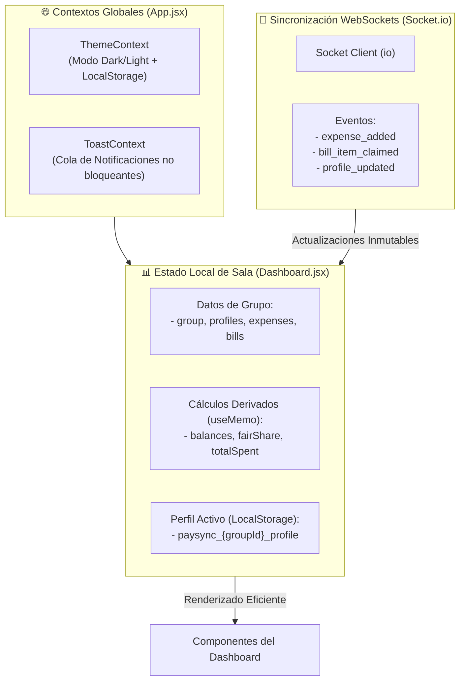

# 🔄 Gestión de Estado, Context API y Reactividad

PaySync adopta un enfoque de gestión de estado ligero y puramente basado en los hooks nativos de **React 19** (`useState`, `useMemo`, `useCallback`, `useContext`), prescindiendo de dependencias externas pesadas como Redux o MobX.

---

## 🏗️ Arquitectura de Estado Unificada



---

## 🎨 1. ThemeContext (`src/context/ThemeContext.jsx`)

Controla la identidad visual del usuario con persistencia en `localStorage`.

- **Detección Automática:** Si el usuario no ha elegido tema explícito, evalúa la preferencia del sistema operativo:
  `window.matchMedia('(prefers-color-scheme: light)').matches`.
- **Sincronización con el DOM:** Aplica tanto el atributo `data-theme="dark|light"` como las clases estándar de TailwindCSS (`classList.add('dark')`).
- **Hook de Consumo:** `useTheme()` retorna `{ theme, toggleTheme, isDark }`.

---

## 🔔 2. ToastContext (`src/context/ToastContext.jsx`)

Proporciona un sistema de retroalimentación inmediata, accesible y no invasivo para notificaciones transaccionales.

- **Identificadores Únicos:** Generación con `Math.random().toString(36).substring(2, 9)`.
- **Descarte Temporizado:** Desaparición automática configurable (por defecto 3.5 segundos).
- **Tipado Semántico:** Métodos de conveniencia expuestos: `toast.success()`, `toast.info()`, `toast.warning()`, `toast.error()`.
- **Patrón a Prueba de Fallos (*Safe Fallback*):** Si un componente invoca `useToast()` fuera del proveedor, se devuelve un objeto con stubs a `console.log/warn` para evitar caídas imprevistas de la UI.
- **Accesibilidad:** Contenedor montado con `aria-live="polite"` para compatibilidad con lectores de pantalla.

---

## ⚡ 3. Sincronización Reactiva en `Dashboard.jsx`

El orquestador central coordina el ciclo de vida de los datos del grupo y los eventos en vivo de [[02_Backend/WebSockets-Eventos|Socket.io]]:

### Flujo de Inicialización y Persistencia de Perfil
1. Al ingresar a `/group/:id/dashboard`, se lee el perfil seleccionado previamente desde `localStorage.getItem("paysync_${id}_profile")`.
2. Si no existe perfil activo, se redirige inmediatamente a la pantalla de selección de participantes (`/group/:id`).
3. Se establece la conexión con el servidor Socket.io y se emite `join_group` con el identificador del grupo.

### Procesamiento Inmutable de Eventos en Tiempo Real

```javascript
// Adición reactiva de gastos
newSocket.on('expense_added', (newExpense) => {
  setExpenses((prev) => [newExpense, ...prev]);
  fetchSettlements();
  toast.info(`Nuevo movimiento: ${newExpense.description} (${formatCOP(newExpense.amount)})`);
});

// Actualización colaborativa de comanda viva
newSocket.on('bill_item_claimed', ({ itemId, profileId, selected }) => {
  setActiveLiveBill((prev) => {
    if (!prev) return prev;
    const currentClaims = prev.assignments || {};
    const curList = currentClaims[itemId] || [];
    const updatedList = selected
      ? (curList.includes(profileId) ? curList : [...curList, profileId])
      : curList.filter((id) => id !== profileId);
    return {
      ...prev,
      assignments: { ...currentClaims, [itemId]: updatedList }
    };
  });
});
```

### Optimización del Rendimiento con Hooks
- **`useMemo` para Cálculos Financieros:** El cálculo de saldos individuales, gasto acumulado y proporciones para los gráficos de Recharts se memoriza en función de `[expenses, bills, profiles]`. De este modo, cambios en estados secundarios (como abrir o cerrar modales) no provocan costosos recalculos matemáticos.
- **`useCallback` en Operaciones Clave:** Funciones como `fetchSettlements` se estabilizan para evitar renderizados redundantes al pasarse como props a componentes hijos.

---

## 🔗 Navegación Rápida
- Regresar a: [[00_MOC_PaySync]]
- Siguiente: [[03_Frontend/Guia-Estilos-Tailwind|Sistema de Diseño y Guía de Estilos]]
- Relacionado: [[03_Frontend/Arbol-Componentes|Árbol de Componentes]] | [[02_Backend/WebSockets-Eventos|Catálogo de Eventos WebSockets]]
