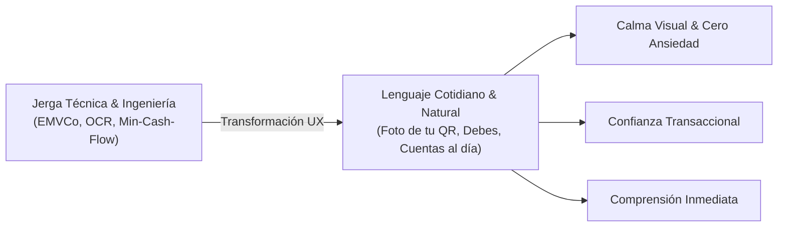
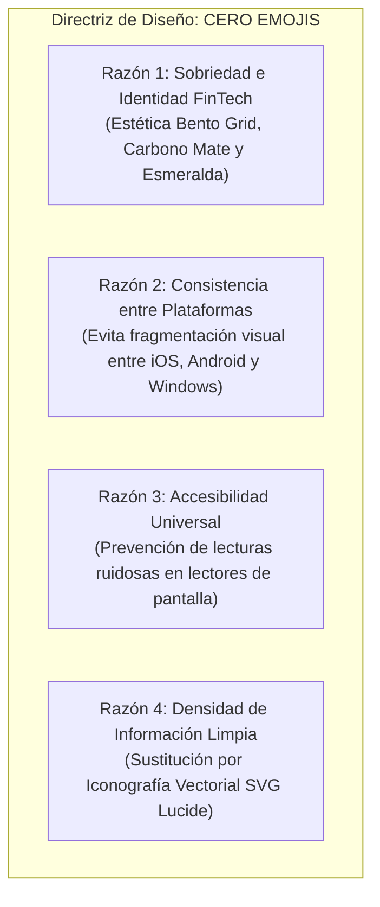
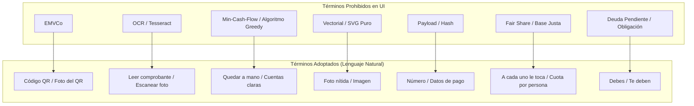

# Guía de Copywriting y Lenguaje Natural UX

La experiencia de usuario en **PaySync** se rige por un principio fundamental de diseño comunicativo: **el dinero genera fricción y estrés en las relaciones humanas; la interfaz debe aportar calma, transparencia y cercanía**. Toda jerga técnica, acrónimos de ingeniería y tecnicismos algorítmicos han sido erradicados de la capa visual en favor de un lenguaje cotidiano, directo y comprensible para cualquier persona.

---

## 1. Filosofía de Voz y Tono

### 1.1 De la Complejidad Algorítmica a la Conversación Cotidiana
En las capas internas del sistema operan modelos matemáticos de optimización (*Min-Cash-Flow Greedy*), transformaciones matriciales de visión artificial (*Jimp + Tesseract.js*), esquemas de cobro interoperable (*EMVCo TLV / CRC-16*) y túneles dúplex (*WebSockets*). Sin embargo, **el usuario final nunca debe enfrentarse a estos conceptos técnicos**. 

Cuando un grupo de amigos cena en un restaurante o unos compañeros de piso pagan los servicios del mes, necesitan saber tres cosas con certeza inmediata:
1. ¿A quién le toca pagar qué?
2. ¿Cuánto debo o cuánto me deben?
3. ¿Cómo pago o cómo me transfieren sin enredos?

### 1.2 Pilares de Copywriting
1. **Hablar de Tú con Respeto y Claridad:** Uso de segunda persona singular directa (`Tú`, `Debes`, `Te deben a favor`, `Tu Nombre`).
2. **Acciones Basadas en Verbos Reales:** Botones con verbos contextuales que describen el desenlace de la acción (`Pagar`, `Subir Comprobante`, `Guardar Datos`, `Cambiar foto`).
3. **Cero Culpabilización:** En caso de fallas de lectura o de conexión, el mensaje orienta proactivamente sin culpar al usuario ni arrojar nombres de librerías o códigos de error (`No pudimos leer los datos automáticamente. Puedes escribirlos tú mismo.`).
4. **Estados de Espera Humanizados:** En lugar de describir procesos de computación, se comunica la acción observable (`Leyendo comprobante...`, `Leyendo código...`, `Creando sala...`).

---

## 2. Regla Estricta: Cero Emojis en Interfaz y Documentación

En PaySync rige una política terminante de **CERO EMOJIS** en todos los componentes de la interfaz gráfica, notificaciones y documentación técnica.

### Razones Técnicas y de Diseño:
- **Sobriedad FinTech y Calma:** La identidad de PaySync se basa en un diseño minimalista de alto contraste (*Carbono Mate*, *Porcelana Pura* y *Acentos Esmeralda*). Los emojis saturan la interfaz con paletas cromáticas descontroladas y restan seriedad a operaciones financieras.
- **Fragmentación Multiplataforma:** Un emoji renderiza de forma disímil en Apple iOS, Google Android, Samsung One UI, Microsoft Windows y Linux. Esto genera desalineaciones en la altura de línea (`line-height`), desfases en tarjetas métricas y alteraciones en el espaciado tipográfico.
- **Accesibilidad y Lectores de Pantalla (Screen Readers):** Los sintetizadores de accesibilidad leen las cadenas de emojis literalmente (por ejemplo, "cara sonriente con ojos sonrientes y sudor frío"), interrumpiendo la fluidez de usuarios con discapacidad visual.
- **Reemplazo por Iconografía Vectorial (`lucide-react`):** Toda intención visual se canaliza exclusivamente mediante iconos vectoriales geométricos de trazo uniforme (`Wallet`, `Receipt`, `QrCode`, `ArrowRight`, `ShieldCheck`, `CheckCircle2`, `ImagePlus`).

---

## 3. Matriz Comparativa: Términos Técnicos vs. Lenguaje Natural

A continuación se detalla la sustitución integral de términos adoptada en todo el frontend de PaySync:

| Contexto / Componente | Término Técnico Anterior (Deprecado) | Nuevo Término Natural (Adoptado) | Justificación de UX y Lenguaje |
| :--- | :--- | :--- | :--- |
| **Configuración de Perfil** (`ProfileKeyModal.jsx`) | `Generar QR EMVCo` | **`Foto de tu Código QR`** | El usuario común reconoce la captura de pantalla de su app de Bancolombia o Nequi, no el estándar EMVCo. |
| **Subida de QR bancario** (`ProfileKeyModal.jsx`) | `Subir QR Oficial / Vectorización cliente` | **`Sube una captura de tu código QR de Bancolombia, Nequi o Daviplata`** | Instrucción empática, familiar y contextualizada a los bancos de uso real. |
| **Identificador bancario** (`ProfileKeyModal.jsx`) | `Llave Interoperable Bre-B` | **`Número de Celular o Cédula`** | Especifica con precisión los datos que el usuario efectivamente tiene en mente. |
| **Instrucción de llave** (`ProfileKeyModal.jsx`) | `Alias adquirente para enrutamiento ACH` | **`Opcional. Quien te vaya a pagar podrá copiar este número.`** | Explica el beneficio real para la persona en lugar de conceptos bancarios. |
| **Estado de carga de QR** (`ProfileKeyModal.jsx`) | `Decodificando matriz jsQR en canvas...` | **`Leyendo código...`** | Micro-copy breve y humano mientras transcurre el escaneo. |
| **Confirmación de QR** (`ProfileKeyModal.jsx`) | `Payload vectorial EMVCo compilado` | **`Código QR listo`** | Estado afirmativo que transmite tranquilidad y finalización. |
| **Balances del Grupo** (`SettlementCard.jsx`) | `Base justa: $...` / `Fair share` | **`A cada uno le toca: $...`** | Frase popular y cotidiana con la que las personas dividen gastos en el mundo real. |
| **Estado de Deuda** (`SettlementCard.jsx`) | `Tu deuda pendiente` / `Obligación deudora` | **`Debes`** | Palabra clara, directa y libre de ambigüedades en la tarjeta de liquidación. |
| **Plan de Liquidación** (`SettlementCard.jsx`) | `Algoritmo Min-Cash-Flow de compensación greedy` | **`La forma más rápida de quedar a mano con la menor cantidad de transferencias.`** | Explica el propósito práctico del algoritmo sin nombrar la teoría de grafos. |
| **Cuentas Saldadas** (`SettlementCard.jsx`) | `Estado compensado: deudas en cero` | **`¡Cuentas al Día!`**  `No hay deudas pendientes entre los miembros del grupo.` | Tono positivo y de alivio cuando no existen saldos por pagar. |
| **Acceso a datos de cobro** (`SettlementCard.jsx`) | `Ver tarjeta EMVCo / Consultar clave` | **`Ver QR / Número`** | Expresión concreta de los dos elementos que el pagador necesita visualizar. |
| **Usuario sin datos** (`SettlementCard.jsx`) | `Sin llave adquirente registrada` | **`Sin datos de pago`** | Estado neutro que clarifica que la persona aún no configuró su QR o celular. |
| **Métricas Bento** (`DashboardSummaryCards.jsx`) | `Mi Balance Neto` | **`Tu Estado Personal`** | Etiqueta más humana y orientada a la posición del participante. |
| **Estado acreedor** (`DashboardSummaryCards.jsx`) | `Superávit a favor` | **`Te deben a favor`** | Claridad absoluta sobre el dinero que la persona recibirá. |
| **Estado deudor** (`DashboardSummaryCards.jsx`) | `Déficit pendiente` | **`Debes abonar al grupo`** | Llamado a la acción sin agresividad financiera. |
| **Estado en cero** (`DashboardSummaryCards.jsx`) | `Equilibrio de balance` | **`¡Estás al día, cuota saldada!`** | Celebración verbal de no deber ni tener cobros pendientes. |
| **Cuota equitativa** (`DashboardSummaryCards.jsx`) | `Cuota Equitativa Fair Share` | **`Cuota por Persona`** | Término estándar y comprensible para todos los miembros. |
| **Subtítulo de cuota** (`DashboardSummaryCards.jsx`) | `Distribución proporcional N=X` | **`División entre X participantes`** | Comprensión inmediata del cálculo de división. |
| **Modal de Cobro** (`PaymentInfoModal.jsx`) | `Visualizador Vectorial EMVCo` | **`Datos de Pago`** | Título simple y orientado a la tarea en el encabezado modal. |
| **Pestaña QR** (`DigitalCard.jsx`) | `Render SVG Dinámico Bre-B` | **`Código QR`** | Identificación limpia de la pestaña sin tecnicismos de renderizado. |
| **Subtítulo QR** (`DigitalCard.jsx`) | `Transacción interoperable sin contacto` | **`Escanea para pagar`** | Llamado a la acción instructivo. |
| **Acción de copia** (`DigitalCard.jsx`) | `Copiar Payload / Key` | **`Copiar número`** | Acción tangible y común en apps bancarias móviles. |
| **Acción de descarga** (`DigitalCard.jsx`) | `Exportar SVG a PNG Canvas` | **`Guardar foto`** | Término cotidiano que comprende cualquier usuario de celular. |
| **Ampliar tarjeta** (`DigitalCard.jsx`) | `Modo Lightbox Fullscreen` | **`Ampliar QR`** | Descripción de la interacción óptica en pantalla grande. |
| **Carga de Comprobante** (`PaymentVoucherModal.jsx`) | `Analizando con OCR...` | **`Leyendo comprobante...`** | Comunica la actividad sin mencionar siglas tecnológicas especializadas. |
| **Zona de Soltar** (`PaymentVoucherModal.jsx`) | `Dropzone de vouchers bancarios` | **`Toca o arrastra la foto de tu comprobante`** | Instrucción bimodal clara (aplica a móviles con toque y escritorio con arrastre). |
| **Campo de Valor** (`PaymentVoucherModal.jsx`) | `Monto a liquidar / Importe transaccional` | **`Valor pagado`** | Término natural usado al consultar transferencias en Colombia. |
| **Campo de Referencia** (`PaymentVoucherModal.jsx`) | `ID de transacción / Hash del voucher` | **`Número de comprobante`** | Nombre exacto que figura al pie de los recibos de Nequi y Bancolombia. |
| **Éxito en Escaneo** (`PaymentVoucherModal.jsx`) | `Parser OCR ejecutado con éxito` | **`Comprobante leído con éxito`** | Notificación gratificante tras procesar la imagen. |
| **Falla en Escaneo** (`PaymentVoucherModal.jsx`) | `Fallo en el motor tesseract / OCR timeout` | **`No pudimos leer los datos automáticamente. Puedes escribirlos tú mismo.`** | Notificación amable con alternativa inmediata de escritura manual. |
| **Añadir Gasto** (`AddTransactionModal.jsx`) | `Escanear comprobante con OCR` | **`Escanear comprobante de pago`** | Título limpio y sin siglas en la zona de carga. |
| **Subtítulo de Gasto** (`AddTransactionModal.jsx`) | `Extracción automática de variables vía OCR` | **`Sube la foto de tu comprobante para detectar el monto`** | Explicación del beneficio real en un solo paso. |
| **Comanda Viva** (`LiveBillClaimModal.jsx`) | `Plato sin asignación en memoria distribuida` | **`Sin asignar aún • Toca para reclamar`** | Guía visual interactiva directa sobre los platos de la cuenta. |

---

## 4. Guía de Redacción para Nuevos Componentes y Mensajes

Al diseñar o modificar nuevas vistas, modales o notificaciones en PaySync, todo desarrollador y redactor de UX debe seguir esta lista de verificación:

### 4.1 Glosario de Reemplazo Mandatorio

### 4.2 Lista de Verificación (Checklist) para Nuevas Vistas
- [ ] **¿Contiene emojis?** Si contiene alguno, retirarlo de inmediato y usar un icono de `lucide-react`.
- [ ] **¿Aparece alguna sigla o acrónimo técnico?** Verificar que no figuren `OCR`, `EMVCo`, `API`, `DB`, `UUID`, `WebSocket`, `TLV` o `CRC`.
- [ ] **¿El verbo es concreto?** Emplear acciones tangibles: *Guardar*, *Pagar*, *Copiar*, *Subir*, *Cambiar*, *Eliminar*.
- [ ] **¿Los errores ofrecen una salida?** Cuando falle una lectura o proceso, dar la opción inmediata de completar el dato manualmente.
- [ ] **¿El tono es calmado?** Evitar signos de exclamación excesivos o colores de alerta roja para situaciones normales de uso.

---

## 5. Referencias Cruzadas y Navegación

- [[00_MOC_PaySync|Mapa Central de Conocimiento (MOC PaySync)]]
- [[03_Frontend/Arbol-Componentes|Jerarquía y Árbol de Componentes React 19]]
- [[03_Frontend/Guia-Estilos-Tailwind|Sistema de Diseño, Minimalismo y TailwindCSS]]
- [[03_Frontend/Generador-QR-Bre-B|Generador y Visualizador de Códigos QR Bre-B]]
- [[03_Frontend/Gestion-Estado|Gestión de Estado y Notificaciones Toast]]
- [[02_Backend/Algoritmo-Liquidacion|Algoritmo de Liquidación de Deudas (Backend)]]
- [[02_Backend/Comprobantes-Pago-OCR|Procesamiento de Comprobantes de Pago (Backend)]]
