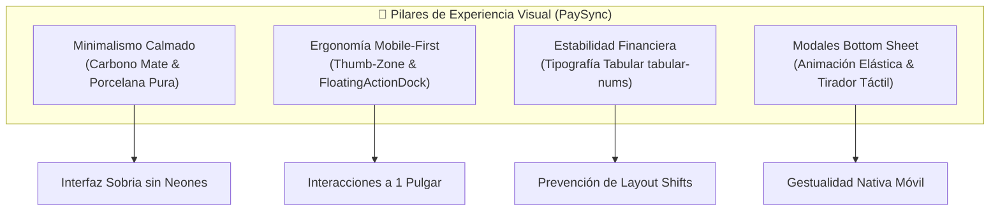
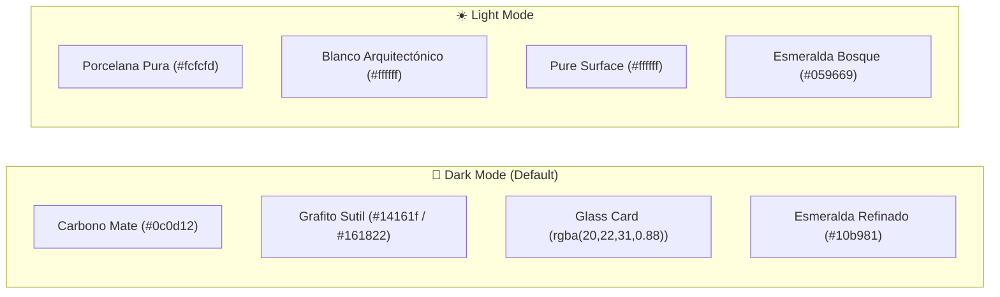
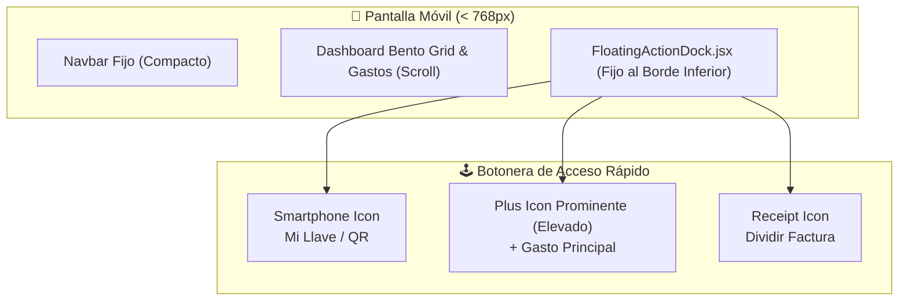
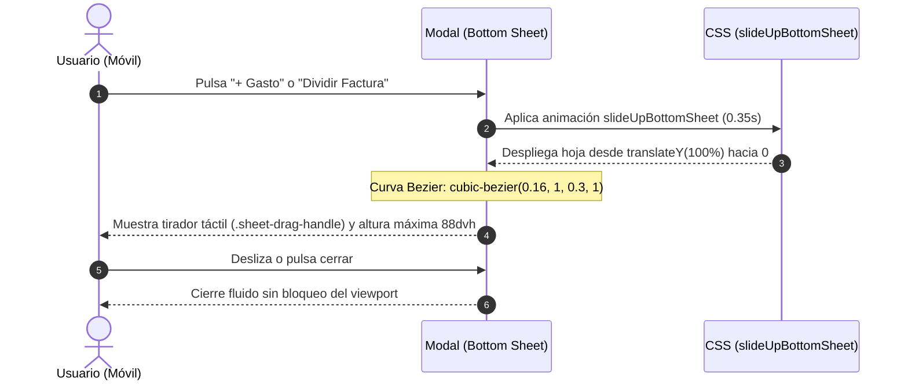

# 🎨 Sistema de Diseño y Guía de Estilos TailwindCSS

PaySync implementa una arquitectura visual **minimalista, fluida y mobile-first**, rediseñada para ofrecer máxima legibilidad, calma visual y rendimiento táctil superior tanto en dispositivos móviles de una mano como en pantallas de escritorio. La interfaz combina el paradigma **Bento Grid** con un **Glassmorphism sutil**, bordes milimétricos y microinteracciones de amortiguación elástica.

---

## 🧭 Principios Fundamentales del Rediseño



1. **Sobriedad y Descanso Visual:** Eliminación categórica de neones estridentes y saturaciones excesivas en favor de superficies oscuras mates y luces esmeralda controladas.
2. **Ergonomía del Pulgar (*Thumb Zone*):** Todos los puntos de interacción crítica en dispositivos móviles se sitúan al alcance natural del pulgar en la parte inferior de la pantalla.
3. **Estabilidad en Cifras Financieras:** Garantía de alineación monoespaciada para balances y gastos que se actualizan dinámicamente vía WebSockets.
4. **Física Táctil Natural:** Respuestas elásticas con curvas Bezier calculadas (`cubic-bezier(0.16, 1, 0.3, 1)`) que emulan el comportamiento de aplicaciones nativas iOS y Android.

---

## 🎨 Paleta de Colores y Tokens Visuales Dual-Theme

El sistema cuenta con un motor dual de temas (*Dual-Theme Engine*) gestionado mediante variables CSS nativas vinculadas al atributo `data-theme="dark"` o `data-theme="light"` en el elemento raíz:



### Tabla de Tokens y Variables CSS

| Token | Propósito / Semántica | Dark Mode (Carbono Mate) | Light Mode (Porcelana Pura) | Clase de Utilidad |
| :--- | :--- | :--- | :--- | :--- |
| **`--bg-canvas`** | Fondo principal general | `#0c0d12` (Carbono Mate) | `#fcfcfd` (Porcelana Pura) | `body`, `bg-[var(--bg-canvas)]` |
| **`--bg-surface`** | Superficie base de componentes | `#14161f` | `#ffffff` | `bg-[var(--bg-surface)]` |
| **`--bg-surface-elevated`** | Superficies elevadas y Docks flotantes | `#161822` | `#ffffff` | `.floating-action-dock` |
| **`--bg-card`** | Contenedores modulares Bento | `rgba(20, 22, 31, 0.88)` | `#ffffff` | `.glass-card`, `.glass-panel` |
| **`--brand-primary`** | Acento primario refinado (sin neón) | `#10b981` (Emerald-500) | `#059669` (Emerald-600) | `.btn-primary`, `.text-brand` |
| **`--brand-gradient`** | Gradiente corporativo suave | `linear-gradient(135deg, #10b981 0%, #059669 100%)` | `linear-gradient(135deg, #059669 0%, #047857 100%)` | `.btn-primary`, `.dock-primary-icon-wrap` |
| **`--brand-accent-glow`** | Resplandor sutil no estridente | `rgba(16, 185, 129, 0.15)` | `rgba(16, 185, 129, 0.08)` | `.btn-success-glow` |
| **`--border-subtle`** | Bordes milimétricos estructurales | `rgba(255, 255, 255, 0.07)` | `rgba(15, 23, 42, 0.07)` | `border-[var(--border-subtle)]` |
| **`--border-hover`** | Borde al enfocar o situar cursor | `rgba(255, 255, 255, 0.14)` | `rgba(15, 23, 42, 0.14)` | `hover:border-[var(--border-hover)]` |
| **`--text-primary`** | Títulos y valores numéricos clave | `#f8fafc` (Slate-50) | `#0f172a` (Slate-900) | `.text-primary` |
| **`--text-secondary`** | Subtítulos, botones e iconos neutros | `#94a3b8` (Slate-400) | `#64748b` (Slate-500) | `.text-secondary` |
| **`--text-muted`** | Metadatos y fechas | `#64748b` (Slate-500) | `#94a3b8` (Slate-400) | `.text-muted` |
| **`--danger` / Deuda** | Deudor / Gastos / Alertas rojas | `#f43f5e` (`rgba(244, 63, 94, 0.10)`) | `#e11d48` (`rgba(225, 29, 72, 0.08)`) | `.text-danger`, `.bento-balance-negative` |
| **`--modal-backdrop`** | Fondo difuminado de modales | `rgba(6, 7, 10, 0.82)` | `rgba(15, 23, 42, 0.42)` | `.modal-backdrop` |

> [!NOTE]
> **Eliminación de Neones:** Se descartaron deliberadamente los verdes radioactivos (`#00ff66` o `#10ff99`) que fatigan la vista en ambientes nocturnos. El esmeralda `#10b981` ofrece una relación de contraste WCAG AAA sobre `#0c0d12`, manteniendo la legibilidad sin deslumbramientos.

---

## 🔢 Tipografía y Estabilidad Numérica (`tabular-nums`)

En una plataforma de división de gastos y saldos en vivo, los números cambian con regularidad conforme ingresan transacciones por [[02_Backend/WebSockets-Eventos|WebSockets]] o liquidaciones del [[02_Backend/Algoritmo-Liquidacion|Algoritmo Greedy]]. 

Si la tipografía utiliza proporciones estándar (caracteres proporcionales), el ancho del dígito `1` es significativamente menor al del `8` o `0`, provocando **layout shifts** y sacudidas visuales (*jitter*) en tarjetas, saldos y tablas.

```css
/* Inclusión en el Root & Clases Utilitarias */
body {
  font-variant-numeric: tabular-nums;
  font-feature-settings: 'tnum' 1;
}

.num-tabular,
.tabular-nums {
  font-variant-numeric: tabular-nums;
  font-feature-settings: 'tnum' 1;
}
```

### Ventajas de `tabular-nums`:
- **Alineación Vertical Inquebrantable:** Puntos decimales, centavos y columnas monetarias se alinean milimétricamente.
- **Transiciones Calmas:** Al cambiar el saldo personal (ej. de `$111.11` a `$888.88`), la caja contenedora no oscila en anchura.
- **Integración con Plus Jakarta Sans:** Preserva las proporciones geométricas de los textos alfabéticos aplicando monoespaciado únicamente a los dígitos numéricos.

---

## 📱 Ergonomía Mobile: `FloatingActionDock.jsx`

Para satisfacer el principio de uso con una sola mano (*One-Handed Mobile UX*), se integró el componente flotante `FloatingActionDock.jsx`, anclado a la zona del pulgar:



### Características Técnicas del Dock:
1. **Posicionamiento y Safe Areas:**
   ```css
   .floating-action-dock {
     position: fixed;
     bottom: calc(1rem + env(safe-area-inset-bottom, 0px));
     left: 1rem;
     right: 1rem;
     z-index: 40;
     pointer-events: none;
   }
   ```
   Garantiza que la barra no colisione con el indicador de inicio de iOS ni con barras de navegación por gestos en Android.
2. **Botón Central Elevado (`+ Gasto`):**
   - El botón central sobresale visualmente del dock (`margin-top: -0.65rem`), contando con un contenedor circular con gradiente esmeralda (`dock-primary-icon-wrap`) y sombra proyectada `0 4px 14px rgba(16, 185, 129, 0.3)`.
   - Incorpora micro-escala táctil `active:scale-[0.92]`.
3. **Aislamiento de Eventos de Puntero:**
   - `.floating-action-dock` tiene `pointer-events: none`, permitiendo hacer scroll o clic en el contenido que se sitúa detrás en los márgenes libres.
   - `.dock-container` reactiva `pointer-events: auto` únicamente sobre la superficie de los botones.
4. **Ocultamiento en Desktop (`md:hidden`):**
   - A partir de `768px`, el dock se oculta automáticamente, cediendo la botonera de acciones completas al `DashboardHeader.jsx`.

---

## 🪟 Modales Fluidos Tipo Bottom Sheet

En smartphones, los modales centrados flotantes tradicionales resultan incómodos, requieren estirar los dedos hacia la parte superior y suelen sufrir recortes con los teclados virtuales. PaySync convierte automáticamente todos los modales en **Bottom Sheets táctiles** en resoluciones `< 768px`:



### Especificación de Estilos de la Hoja Inferior:

```css
@media (max-width: 768px) {
  .modal-backdrop {
    padding: 0 !important;
    align-items: flex-end !important; /* Ancla el contenido a la base */
    background: var(--modal-backdrop);
    backdrop-filter: blur(8px);
  }

  .modal-container,
  .bottom-sheet {
    width: 100% !important;
    max-height: 88dvh !important;
    margin: 0 !important;
    border-top-left-radius: 1.25rem !important; /* rounded-t-2xl */
    border-top-right-radius: 1.25rem !important;
    border-bottom: none !important;
    border-top: 1px solid var(--border-subtle) !important;
    padding: 1.25rem 1.25rem calc(1.5rem + env(safe-area-inset-bottom, 0px)) 1.25rem !important;
    animation: slideUpBottomSheet 0.35s cubic-bezier(0.16, 1, 0.3, 1) forwards;
    box-shadow: 0 -12px 48px rgba(0, 0, 0, 0.5) !important;
  }

  .sheet-drag-handle {
    display: block !important;
    width: 38px;
    height: 4px;
    border-radius: 2px;
    background: var(--border-hover);
    margin: 0 auto 0.75rem auto;
  }
}
```

### Beneficios Clave:
- **Tirador Táctil (`.sheet-drag-handle`):** Proporciona una señal visual inmediata de interactividad y arrastre, visible únicamente en móviles (`hidden md:block` inverso).
- **Animación con Curva Resorte:** La curva `cubic-bezier(0.16, 1, 0.3, 1)` desacelera suavemente al llegar a la cima, eliminando transiciones rígidas o lineales.
- **Scroll Aislado (`overscroll-behavior-y: contain`):** Evita que el scroll interno del formulario arrastre el fondo de la página de forma errática.

---

## ✨ Microinteracciones y Respuesta Háptica Visual

- **Active State Scale (`active:scale-[0.98]`):** Depresión sutil de 2% en botones, tarjetas clicables e items de liquidación que confirma el toque en pantallas táctiles sin retraso perceptivo.
- **Transición de Tema sin Destellos:** Cambios de tema (Oscuro $\leftrightarrow$ Claro) con interpolación de color en 250ms (`var(--transition-normal)`).
- **Backdrop Blur Gradual:** Desenfoque dinámico (`backdrop-filter: blur(16px)`) en la barra de navegación (`Navbar`) y en el `FloatingActionDock` para conservar la continuidad espacial de la vista.

---

## 🔗 Navegación Rápida
- Regresar a: [[00_MOC_PaySync]]
- Componentes: [[03_Frontend/Arbol-Componentes|Árbol de Componentes React 19]]
- Estado y Reactividad: [[03_Frontend/Gestion-Estado|Gestión de Estado]]
- Backend: [[02_Backend/WebSockets-Eventos|WebSockets y Eventos en Tiempo Real]]
