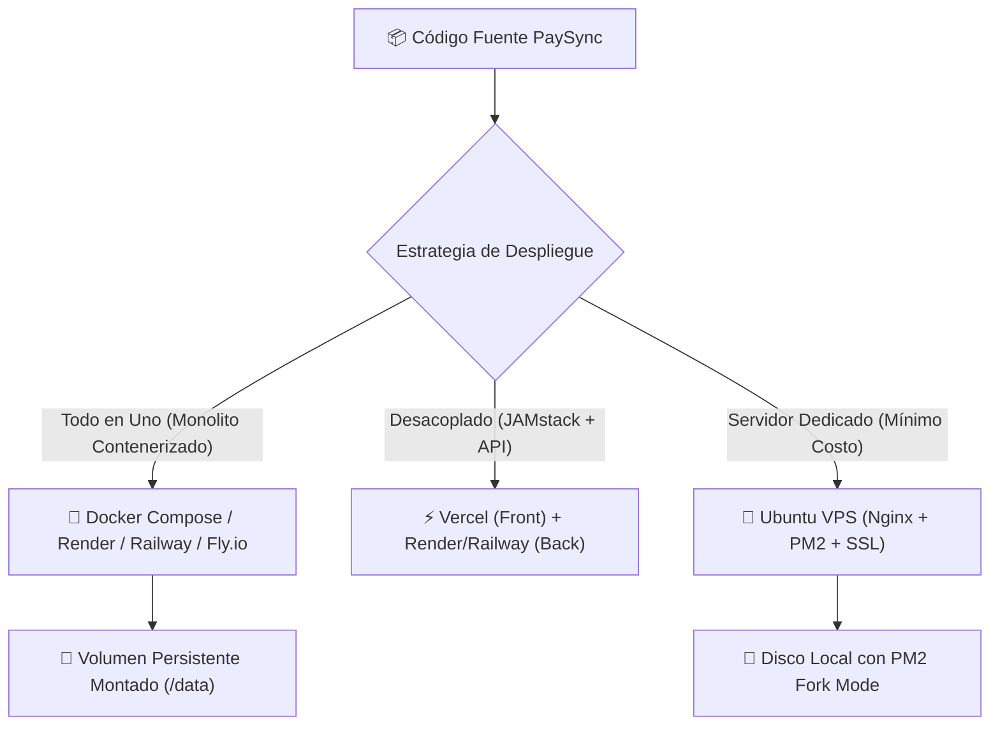

# 🚀 Guía de Despliegue Multi-Cloud y Producción

PaySync está optimizado para ejecutarse en diversos entornos de nube e infraestructura propia (VPS). Su arquitectura ligera con SQLite3 elimina la necesidad de servidores de base de datos administrados costosos (como PostgreSQL o MySQL), requiriendo únicamente almacenamiento en disco persistente.

---

## 🗺️ Matriz de Plataformas Homologadas



---

## 1. 🐳 Despliegue Local y con Docker

### Opción A: Contenedor Unificado (Fullstack en puerto 3001)
Compila el frontend de React y lo sirve directamente a través de Express:
```bash
# Iniciar contenedor unificado
docker compose up -d --build

# Verificar logs y estado
docker compose logs -f
```

### Opción B: Arquitectura Desacoplada (Nginx Frontend + Express Backend)
```bash
# Levantar backend en 3001 y frontend en Nginx puerto 80
docker compose -f docker-compose.decoupled.yml up -d --build
```

---

## 2. 🟣 Render (`render.yaml`)

PaySync cuenta con un archivo de Blueprint homologado para Render (`render.yaml`):

1. Conecta el repositorio de GitHub en el panel de **Render**.
2. Selecciona **New +** ➔ **Blueprint** y apunta a `render.yaml`.
3. **Persistencia Obligatoria:** El blueprint define un disco persistente de 1 GB (`paysync-db-disk`) montado en `/data`.
4. Variables de entorno indispensables:
   - `DATABASE_PATH`: `/data/app_data.db`
   - `PORT`: `10000`
   - `NODE_ENV`: `production`
   - `GEMINI_API_KEY`: Tu clave de Google AI Studio (marcar como secret).
5. **Health Check:** Render validará la salud del contenedor en `/api/health`.

---

## 3. ▲ Vercel (Frontend Estático Desacoplado)

Ideal si deseas alojar la SPA de React en la red global de Vercel y el backend en Render o Railway:

1. Importa el subdirectorio `frontend/` en Vercel.
2. **Framework Preset:** Vite.
3. **Build Command:** `npm run build`.
4. **Output Directory:** `dist`.
5. **Variables de Entorno en Vercel:**
   - `VITE_API_URL`: `https://tu-backend-paysync.onrender.com/api`
   - `VITE_SOCKET_URL`: `https://tu-backend-paysync.onrender.com`
6. Asegúrate de configurar la variable `CORS_ORIGIN` en el backend apuntando a tu dominio de Vercel (`https://tu-app.vercel.app`).

---

## 4. 🚂 Railway (`railway.json`)

1. Crea un proyecto en Railway y selecciona **Deploy from GitHub Repo**.
2. Railway detectará automáticamente el archivo `railway.json` y el `Dockerfile` raíz.
3. Agrega un **Volume** persistente en Railway y móntalo en `/app/data`.
4. Define la variable `DATABASE_PATH=/app/data/app_data.db`.
5. El healthcheck interno verificará `/api/health` antes de conmutar el tráfico.

---

## 5. 🎈 Fly.io (`fly.toml`)

PaySync incluye configuración optimizada para Fly.io con despliegue en la región de Bogotá (`bog`):

```bash
# 1. Crear volumen persistente de 1GB en Fly.io
fly volumes create paysync_data --region bog --size 1

# 2. Desplegar la aplicación
fly deploy
```

La configuración en `fly.toml` asegura:
- Auto-arranque de máquinas virtuales (`auto_start_machines = true`).
- Límites de concurrencia optimizados para WebSockets (250 conexiones simultáneas).
- Chequeo de salud recurrente cada 30 segundos en `/api/health`.

---

## 6. 🐧 VPS Ubuntu / Debian con PM2 y Nginx

Para despliegues en servidores privados virtuales (Hetzner, DigitalOcean, Linode, AWS EC2):

### Paso A: Clonar y compilar
```bash
git clone https://github.com/tu-usuario/Control-Gastos.git /var/www/paysync
cd /var/www/paysync
npm run install:all
npm run build
```

### Paso B: Iniciar con PM2 (`ecosystem.config.js`)
> [!IMPORTANT]
> SQLite requiere ejecutarse en modo `fork` (`exec_mode: 'fork'`) con una única instancia (`instances: 1`) para evitar colisiones de bloqueo en escritura en el archivo `.db`.

```bash
pm2 start ecosystem.config.js --env production
pm2 save
pm2 startup
```

### Paso C: Configurar Nginx (`nginx-vps.conf`)
Copia la plantilla `nginx-vps.conf` en `/etc/nginx/sites-available/paysync` y habilítala.
Características clave incluidas en la plantilla:
- Soporte para WebSockets bidireccionales con cabeceras `Upgrade $http_upgrade` y `Connection "upgrade"`.
- Límite de carga de imágenes ampliado: `client_max_body_size 20M;`.
- Certificados SSL automáticos mediante Certbot Let's Encrypt:
  ```bash
  sudo certbot --nginx -d tu-dominio.com
  ```

---

## 🔗 Navegación Rápida
- Regresar a: [[00_MOC_PaySync]]
- Siguiente: [[04_DevOps-Despliegue/Guia-Docker-Compose|Orquestación con Docker Compose]]
- Relacionado: [[04_DevOps-Despliegue/Variables-Entorno|Matriz de Variables de Entorno]]
