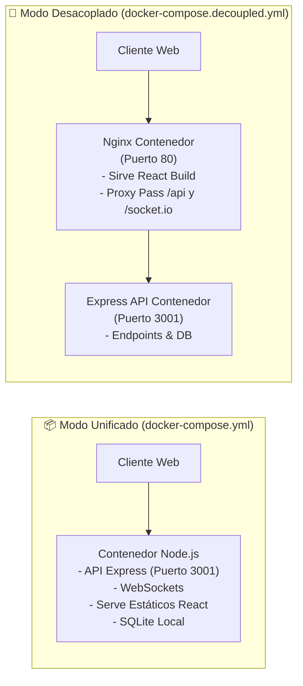

# 🐳 Orquestación con Docker y Docker Compose

PaySync ofrece dos modelos de contenerización listos para usar según las necesidades de rendimiento, simplicidad y arquitectura del equipo:

1. **Modo Unificado (`docker-compose.yml`):** Un único contenedor ligero que construye la SPA de React y la sirve a través de Express.
2. **Modo Desacoplado (`docker-compose.decoupled.yml`):** Dos contenedores independientes: Nginx optimizado para estáticos y Express para la API y WebSockets.

---

## 🏗️ Comparativa de Arquitecturas Contenerizadas



---

## 1. Modo Unificado (Recomendado para simplicidad)

Ubicado en `docker-compose.yml`:

```yaml
services:
  app:
    build:
      context: .
      dockerfile: Dockerfile
    container_name: paysync_app
    restart: unless-stopped
    ports:
      - "${PORT:-3001}:3001"
    environment:
      - NODE_ENV=production
      - PORT=3001
      - DATABASE_PATH=/app/data/app_data.db
      - CORS_ORIGIN=${CORS_ORIGIN:-*}
      - GEMINI_API_KEY=${GEMINI_API_KEY}
      - OPENAI_API_KEY=${OPENAI_API_KEY}
    volumes:
      - paysync_data:/app/data
      - paysync_uploads:/app/backend/uploads
    healthcheck:
      test: ["CMD", "wget", "--no-verbose", "--tries=1", "--spider", "http://localhost:3001/api/health"]
      interval: 30s
      timeout: 5s
      retries: 3
      start_period: 15s

volumes:
  paysync_data:
    driver: local
  paysync_uploads:
    driver: local
```

### Comandos de Operación
```bash
# Iniciar en segundo plano compilando imágenes
docker compose up -d --build

# Ver logs continuos
docker compose logs -f app

# Detener sin perder los datos de SQLite
docker compose down
```

---

## 2. Modo Desacoplado (Recomendado para alto tráfico)

Ubicado en `docker-compose.decoupled.yml`:

- **Servicio `frontend`:** Imagen ultraligera `nginx:alpine` sirviendo el contenido estático de React compilado.
- **Servicio `backend`:** Servidor Express 5 con volumen para SQLite. Depende de la condición de salud del backend (`condition: service_healthy`).

### Comandos de Operación
```bash
# Iniciar arquitectura desacoplada
docker compose -f docker-compose.decoupled.yml up -d --build

# Monitorear estado de salud de ambos contenedores
docker compose -f docker-compose.decoupled.yml ps
```

---

## 💾 Persistencia de Datos y Volúmenes

> [!CAUTION]
> Dado que la base de datos es un archivo SQLite (`app_data.db`), es imprescindible que el directorio donde reside esté vinculado a un volumen persistente (`paysync_data:/app/data`). De lo contrario, cualquier recreación del contenedor borrará los registros de los grupos.

---

## 🔗 Navegación Rápida
- Regresar a: [[00_MOC_PaySync]]
- Siguiente: [[04_DevOps-Despliegue/Variables-Entorno|Matriz de Variables de Entorno]]
- Relacionado: [[04_DevOps-Despliegue/Despliegue-Cloud|Guía de Despliegue Multi-Cloud]]
