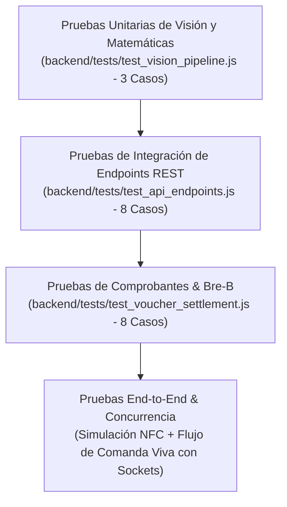

# Plan de Pruebas y Estrategia QA

PaySync cuenta con una batería de pruebas de integración y unitarias automatizadas que garantizan la estabilidad de los endpoints REST, el ciclo de vida de las sesiones en vivo, la precisión matemática del pipeline de visión artificial y la reconciliación transaccional de comprobantes de pago.

---

## Pirámide y Niveles de Testing


```mermaid
flowchart TD
    E2E["Pruebas End-to-End & Concurrencia\n(Simulación NFC + Flujo de Comanda Viva con Sockets)"]
    Vouch["Pruebas de Comprobantes & Bre-B\n(backend/tests/test_voucher_settlement.js - 8 Casos)"]
    Integ["Pruebas de Integración de Endpoints REST\n(backend/tests/test_api_endpoints.js - 8 Casos)"]
    Unit["Pruebas Unitarias de Visión y Matemáticas\n(backend/tests/test_vision_pipeline.js - 3 Casos)"]

    Unit --> Integ
    Integ --> Vouch
    Vouch --> E2E
```

---

## 1. Suite de Pruebas del Pipeline de Visión (`test_vision_pipeline.js`)

Valida la robustez del motor OCR y las reglas de reconciliación monetaria:

```bash
node backend/tests/test_vision_pipeline.js
```

### Casos de Prueba Verificados
1. **Sanitización de Facturas Complejas:**
   - Evalúa comprobantes colombianos con propina voluntaria (10%), impuesto al consumo (8%) y precios con separador de miles.
   - **Criterio de Éxito:** `mathVerified: true`, `confidence: "high"`, cuadre exacto de `subtotal + tip + tax - discount == total`.
2. **Autocálculo de Precios y Cantidades Faltantes:**
   - Inyecta datos incompletos (cantidades en cero o precios unitarios omitidos por el POS).
   - **Criterio de Éxito:** La cantidad nula se normaliza a 1 y el precio unitario se calcula automáticamente a partir del subtotal.
3. **Preprocesamiento de Imágenes con Jimp:**
   - Procesa un búfer sintético de alta resolución (2400x1600 px).
   - **Criterio de Éxito:** Se redimensiona por debajo de 1800 px de ancho/alto y se rota 90° sin degradar la memoria.

---

## 2. Suite de Integración de la API REST (`test_api_endpoints.js`)

Se ejecuta en un entorno aislado con base de datos SQLite en memoria (`DATABASE_PATH=:memory:`) y puerto TCP efímero (`PORT=0`):

```bash
node backend/tests/test_api_endpoints.js
```

### Casos de Integración Validados

| # | Módulo / Escenario | Endpoints Involucrados | Aserción Principal |
| :-: | :--- | :--- | :--- |
| **1** | Chequeo de Salud y Disponibilidad | `GET /api/health`, `GET /health` | Estado HTTP 200, `"status": "healthy"`, `"service": "PaySync API"`. |
| **2** | Estado del Servicio de Visión | `GET /api/vision-status` | Detección de claves de API activas en el servidor. |
| **3** | Creación de Grupo y Resolución NFC | `POST /api/groups`, `POST /api/nfc/resolve` | Resolución exitosa tanto por código crudo (`VIAJE2026`) como por URL (`https://paysync.app/group/VIAJE2026`). |
| **4** | Gestión de Participantes (CRUD) | `POST /api/profiles`, `PUT /api/profiles/:id` | Creación de participantes y actualización de llaves de cobro. |
| **5** | Gastos, Transferencias y Borrado | `POST /api/expenses`, `DELETE /api/expenses/:id` | Creación con HTTP 201, transferencia entre perfiles y supresión controlada. |
| **6** | Ciclo de Vida de Comanda Viva | `POST /api/bill-sessions`, `GET /api/bill-sessions/active/:id`, `PUT /api/bill-sessions/:id/close` | Creación de sesión activa, consulta en vivo y cierre formal. |
| **7** | Factura Detallada con Ítems y Splits | `POST /api/bills`, `GET /api/bills/:id` | Persistencia y recuperación con desglose individual de platos por comensal. |
| **8** | Resumen y Algoritmo Greedy | `GET /api/groups/:id`, `GET /api/groups/:id/settlement` | Cálculo del `fairShare` y generación de matriz de saldos minimizada. |

---

## 3. Suite de Liquidación con Comprobantes y Bre-B (`test_voucher_settlement.js`)

Valida la extracción heurística de comprobantes colombianos, la persistencia de imágenes y la extinción transaccional de saldos:

```bash
node backend/tests/test_voucher_settlement.js
```

### Casos Validados en Fase 4 QA

| # | Escenario Evaluado | Entidades / Endpoints | Resultado QA |
| :-: | :--- | :--- | :--- |
| **1** | Heurísticas OCR para Bancos Colombianos | `voucherParserService.js` (Nequi, Bancolombia, Daviplata, Bre-B) | Aprobado (100% acierto en banco, monto y referencia) |
| **2** | Configuración de Grupo y Perfiles | `POST /api/groups`, `POST /api/profiles` | Aprobado (Participantes acreedor y deudor creados) |
| **3** | Almacenamiento de QR Bre-B (Payload e Imagen) | `PUT /api/profiles/:id`, `POST /api/profiles/:id/upload-qr` | Aprobado (Persistencia en SQLite y en `uploads/qr/`) |
| **4** | Generación de Deuda Inicial | `POST /api/expenses`, `GET /api/groups/:id/settlement` | Aprobado (Deuda neta de $50.000 COP verificada) |
| **5** | Liquidación con Comprobante (Modo JSON) | `POST /api/expenses/voucher-settlement` | Aprobado (Transacción de tipo `transfer` registrada) |
| **6** | Recálculo Instantáneo de Balances | `GET /api/groups/:id/settlement` | Aprobado (Deuda extinguida: 0 transferencias pendientes) |
| **7** | Liquidación con Carga Multipart de Imagen | `POST /api/expenses/voucher-settlement` (Multipart) | Aprobado (Archivo en `uploads/vouchers/` y balance a 0) |
| **8** | Endpoint de Escaneo Efímero de Comprobante | `POST /api/expenses/scan-voucher` | Aprobado (Detección exitosa y eliminación de archivo temporal) |

---

## 4. Verificación de Calidad Frontend

- **Motor de Vectorización QR y Decodificación (`qrDecoder.js`):**
  - Validación de decodificación en canvas en memoria con `jsQR` (`decodeQrFromImage`).
  - Extracción regex de llaves Redeban Bre-B (`CO.COM.RBM.LLA...`), cédulas y celulares (`extractKeyFromPayload`).
  - Renderizado vectorial matemático puro (`QRCodeSVG`) y exportación HD a PNG vía serialización XML.
  - Validación de tolerancia a fallos: respaldo dual en SQLite (`profiles.payment_qr`) y almacenamiento en disco (`uploads/qr/`).
- **Compilación de Producción:**
  ```bash
  cd frontend && npm run build
  ```
  Asegura que no existan errores de sintaxis, dependencias faltantes o problemas de empaquetado en Vite y React 19.
- **Análisis Estático (Linter):**
  ```bash
  cd frontend && npm run lint
  ```
  Supervisa buenas prácticas de código y previene advertencias de hooks en React.

---

## 5. Criterios de Aceptación para Producción

Un despliegue a producción solo se considera aprobado si cumple simultáneamente con:
1. `test_vision_pipeline.js`: 100% de aserciones aprobadas sin errores.
2. `test_api_endpoints.js`: 8 de 8 pruebas de integración pasadas con éxito.
3. `test_voucher_settlement.js`: 8 de 8 pruebas de liquidación y escaneo aprobadas al 100%.
4. Compilación de Vite limpia sin advertencias de dependencias circulares.
5. Cobertura funcional documentada en la [[05_Calidad-Testing/Matriz-de-Trazabilidad|Matriz de Trazabilidad QA]].

---

## Navegación Rápida
- Regresar a: [[00_MOC_PaySync]]
- Siguiente: [[05_Calidad-Testing/Matriz-de-Trazabilidad|Matriz de Requisitos vs. Cobertura QA]]
- Comprobantes Backend: [[02_Backend/Comprobantes-Pago-OCR|Comprobantes de Pago Bancario y OCR]]
- Módulo Frontend: [[03_Frontend/Generador-QR-Bre-B|Generador QR Bre-B]]
